# Dachshund Dash Changelog

## 2026-05-25
### Daily improvement: level intro start prompt
- Added a visible **start prompt bar** inside the new level-intro preview card so players no longer have to guess how to leave the intro overlay and begin the level.
- The prompt explicitly calls out **Space**, **jump**, and **touch ▲** input paths, which makes the transition from reading the preview to actually playing much clearer.
- Kept the prompt animated and integrated with the existing preview card so the instruction feels like part of the game UI instead of a stray status line.

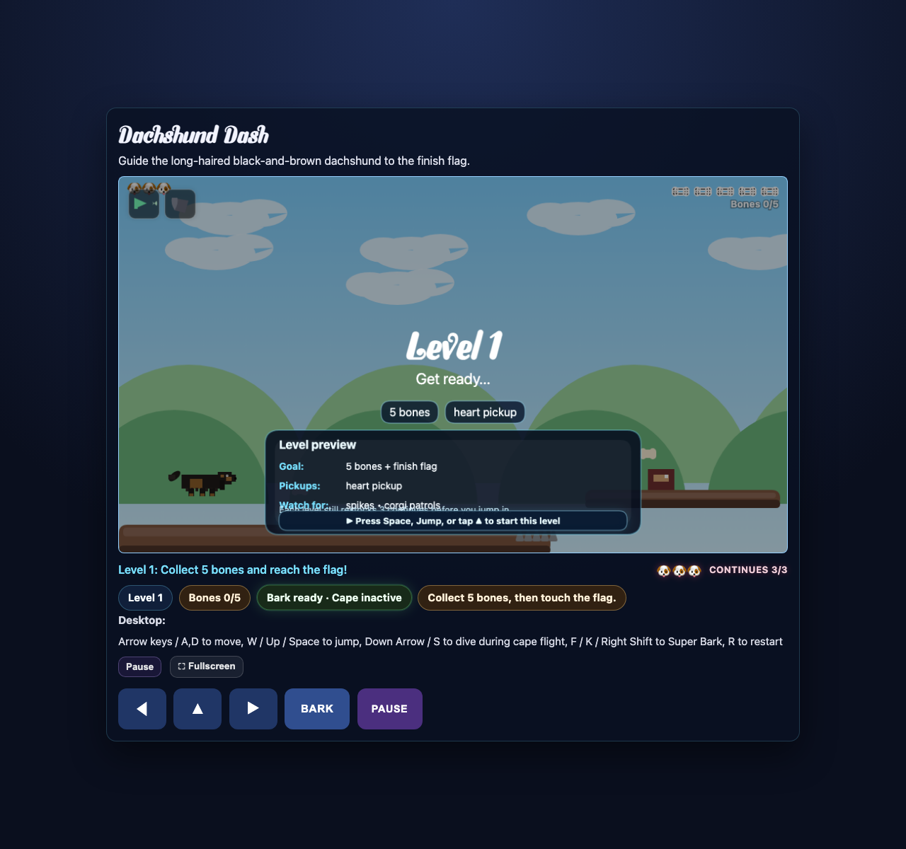

### Daily improvement: level intro preview card
- Added a new **Level preview** card to the level-intro overlay so players get a readable summary before they start moving.
- The card now spells out the current level's **goal**, available **pickups**, and the main **threats** waiting in the run, instead of leaving that context split across small badges.
- Also surfaced a quick **continues restock** reminder there, which makes each level start feel more intentional for quick retries.

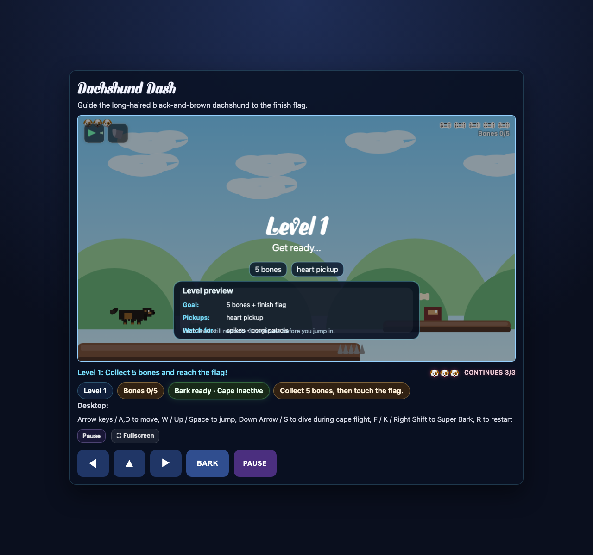

## 2026-05-24
### Daily improvement: pause menu keyboard selection
- Fixed a real pause-menu UX gap: the overlay already told players to use **↑/↓ to select**, but those keys did not actually move between **Continue** and **Options**.
- The pause menu cards now support proper **Up/Down selection** and **Enter/Space confirmation**, so the on-screen hint finally matches the controls.
- This makes the pause overlay feel intentional instead of misleading, especially for keyboard-first players stopping mid-run.

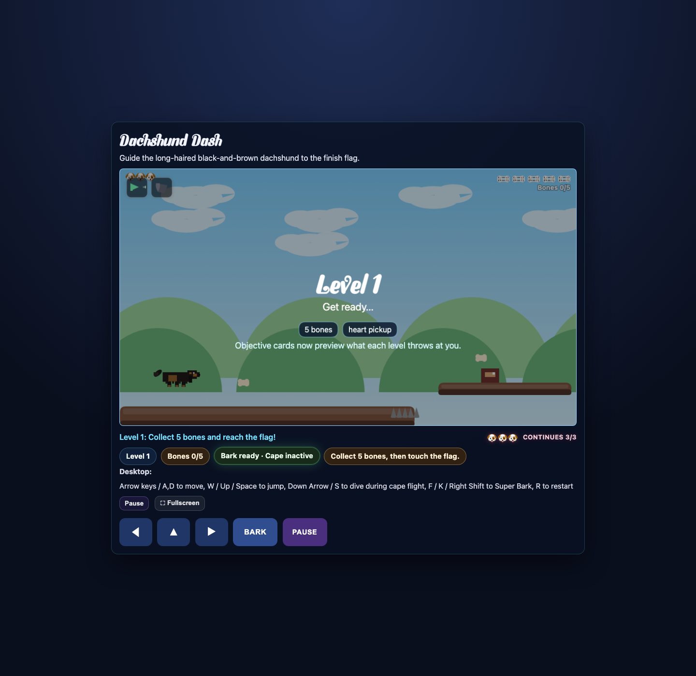

### Daily improvement: run summary ability pill
- Added a new **run summary ability pill** below the canvas so players can read core power state without relying on the in-canvas HUD alone.
- The pill now reports **Super Bark ready vs cooldown**, **toy held** for siren levels, and **cape active vs inactive** in one glanceable line.
- This keeps moment-to-moment ability status visible in the page chrome, which is especially helpful on quick restarts and for players scanning below the playfield.

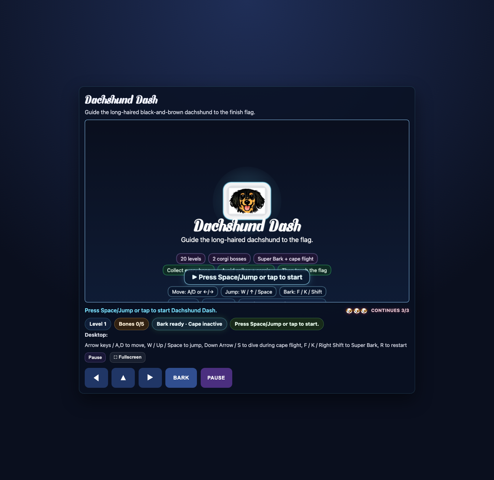

## 2026-05-23
### Daily improvement: stateful run summary strip
- Upgraded the new **run summary strip** so each pill now changes color with its current state instead of reading like static chrome.
- The strip now highlights **bone collection** in amber, **boss objectives** in warm danger tones, **paused / continue / restart** states in distinct warning colors, and **flag-ready / clear** states in bright green.
- This makes the summary easier to scan peripherally during quick resets and mid-run pauses without adding new gameplay complexity.

### Daily improvement: live run summary strip
- Added a visible **run summary strip** below the canvas that mirrors the current **level**, **bone count**, and **next objective** outside the canvas-only HUD.
- The goal pill now updates with context like **start prompt**, **bones remaining**, **boss defeat required**, **touch the flag**, and **paused / restart** states, making progress easier to read at a glance.
- This is especially helpful for accessibility and quick scanning because the key objective no longer lives only inside the animated playfield.

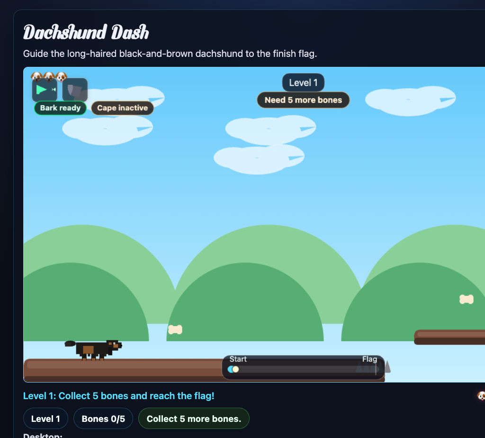

## 2026-05-22
### Daily improvement: start prompt call-to-action card
- Replaced the plain start-screen **"Press Space/Jump or tap to start"** line with a more readable **rounded call-to-action card** so the first input prompt stands out immediately.
- Added a subtle glow pulse and play-arrow treatment to make the starting action easier to spot without changing any gameplay rules.

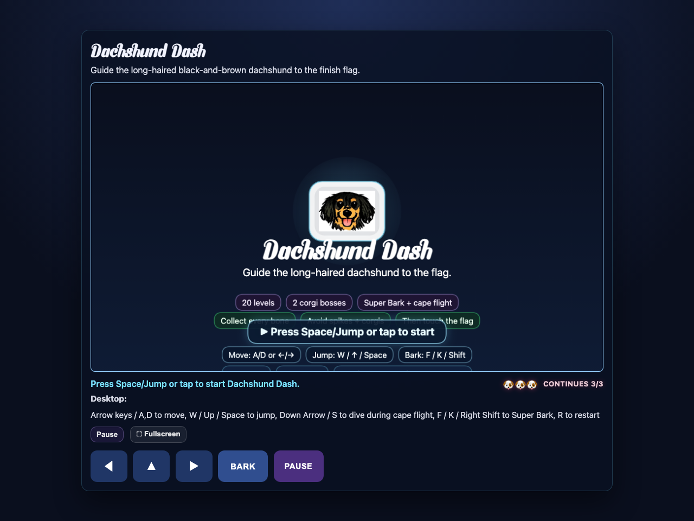

### Daily improvement: pause menu option cards
- Reworked the pause overlay's main menu from plain text into readable **selection cards** for **Continue** and **Options**, making the current choice easier to scan when stopping mid-run.
- Added short helper subtitles and a clear active chevron/highlight so the pause flow feels more like an intentional game menu than a debug overlay.

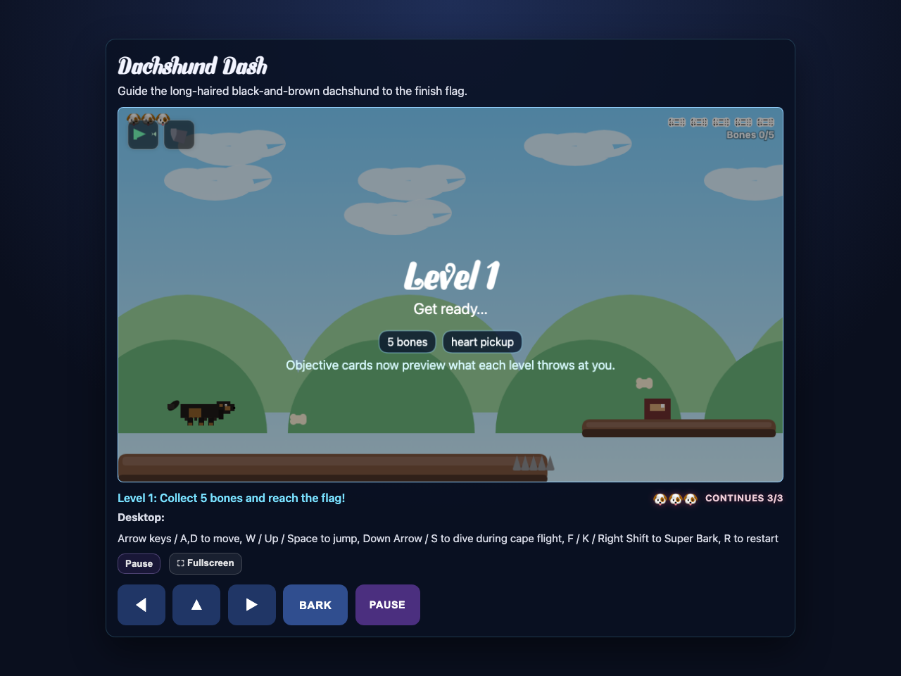

## 2026-05-21
### Daily improvement: start-screen objective chips
- Added a highlighted **goal chip row** to the title screen that spells out the real win condition: **collect every bone**, **survive hazards**, and **then touch the flag**.
- This gives first-time players the objective before they begin, instead of learning mid-run that the flag alone is not enough.

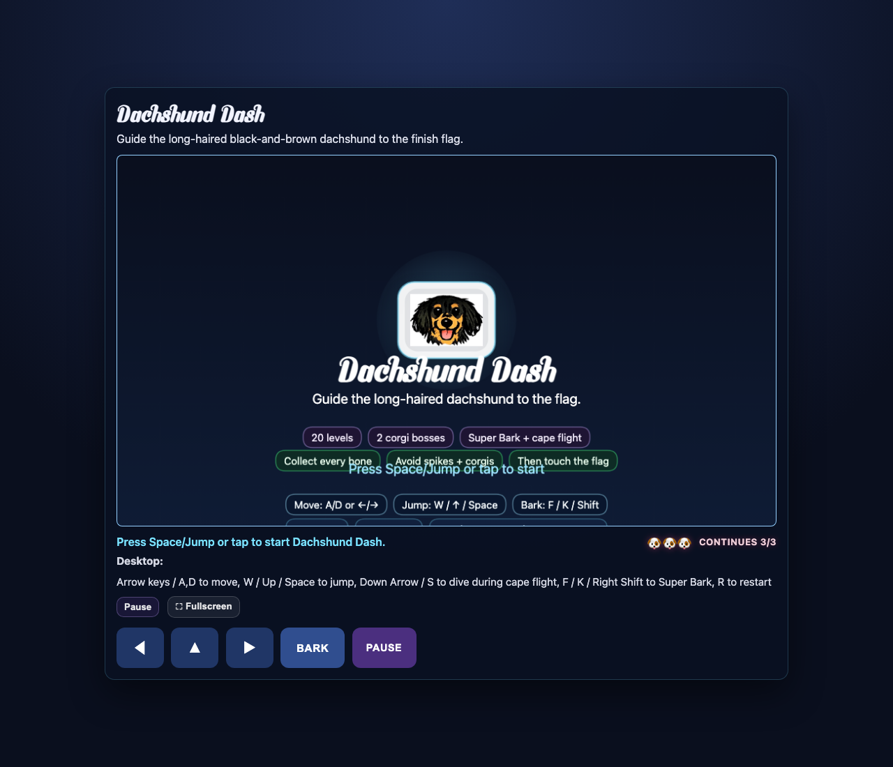

### Daily improvement: start-screen Henry portal hint
- Added a visible **secret hint** to the start screen that tells players to type **`HENRY`** for the level-select portal, so the existing cheat unlock is discoverable without needing the README or source.
- Kept the hint small and in-theme so it helps curious players without crowding the core start prompt.

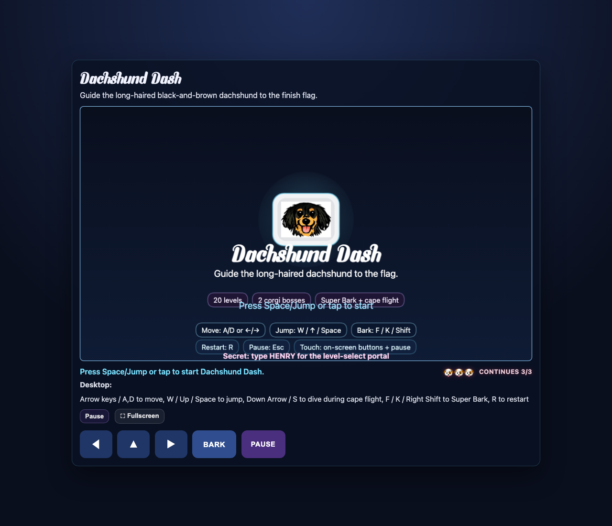

## 2026-05-20
### Daily improvement: readable continues counter
- Upgraded the shell HUD's lives area from emoji-only output to a clearer **Continues X/Y** counter alongside the dog icons, so players can tell how many retries remain without counting symbols.
- Added matching accessibility text on the lives widget so screen readers announce the same retry state explicitly.

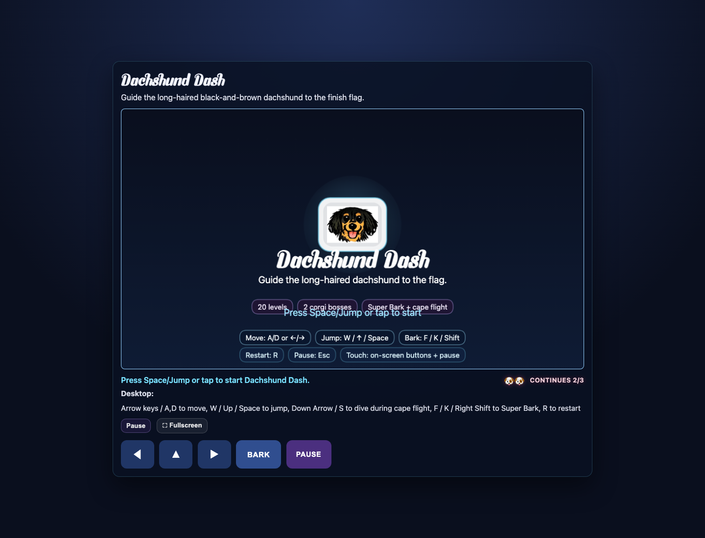

### Daily improvement: desktop pause button
- Added a visible **Pause / Resume** button beside **Fullscreen** in the desktop controls row so mouse-first players can stop and restart a run without remembering keyboard shortcuts.
- Wired the button into the existing pause system and matching paused styling, so it flips to **Resume** while the overlay is active.

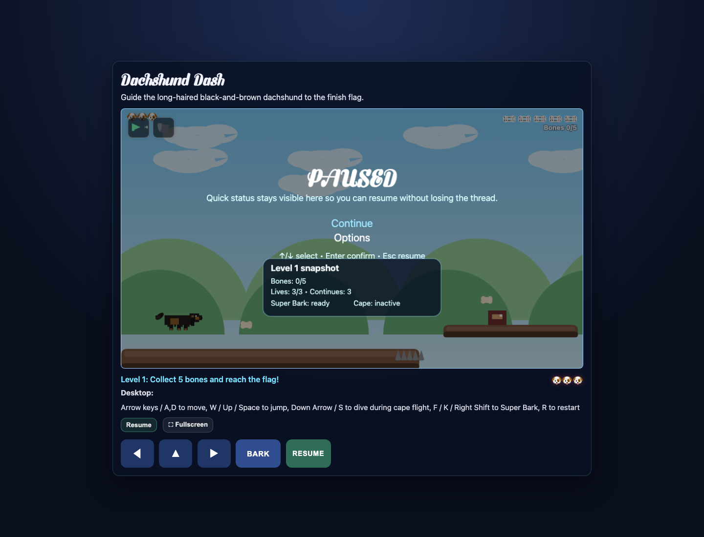

## 2026-05-19
### Daily improvement: touch faint-screen recovery
- Fixed a mobile recovery gap on the **YOU FAINTED** screen: touch players can now tap **▲** to continue from a lost life or **BARK** to quit back out, instead of getting stranded behind keyboard-only controls.
- Updated the death status copy and overlay hint so the touch path is visible right where players need it.

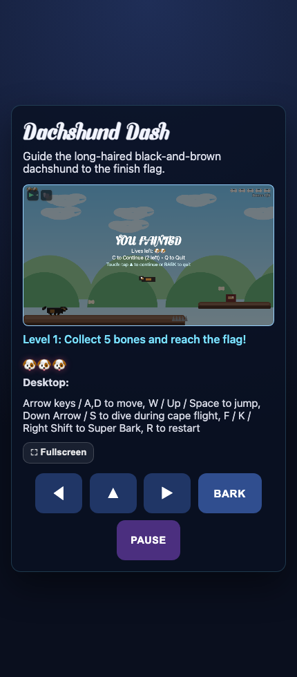

### Daily improvement: touch pause button
- Added a dedicated **PAUSE / RESUME** button to the on-screen touch controls so mobile players can stop and restart a run without needing a keyboard.
- Updated the start-screen touch hint to mention the new pause control, keeping the feature discoverable before the first level begins.

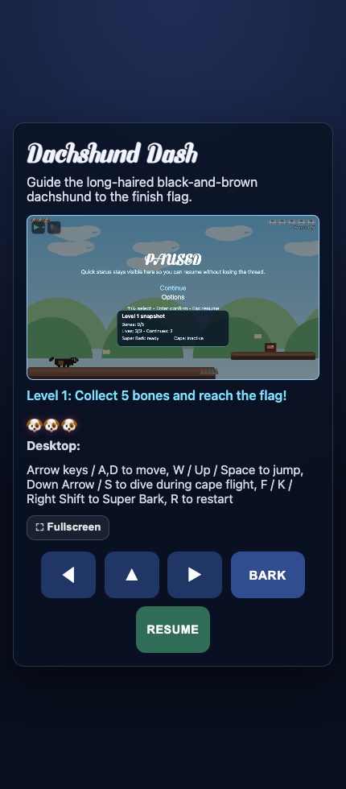

## 2026-05-18
### Daily improvement: title screen feature badges
- Added a compact **feature-badge row** to the title screen that calls out **20 levels**, **2 corgi bosses**, and **Super Bark + cape flight** before the run starts.
- This gives first-time players a quick read on the game's scale and signature mechanics without making them dig through the README.

### Daily improvement: start screen logo badge
- Styled the start screen's dachshund portrait as a **framed logo badge** with a soft glow, rounded card, and border so it feels intentional against the dark title backdrop.
- This keeps the existing art asset but makes the opening screen read more like a polished game menu instead of a floating rectangular image.

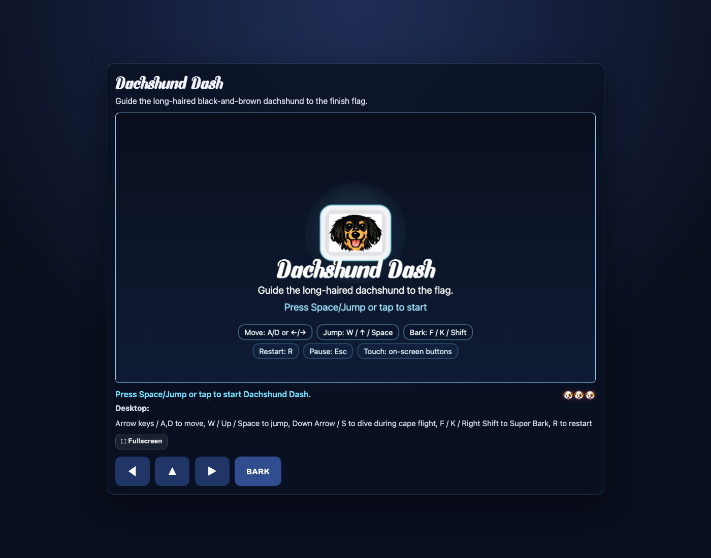

## 2026-05-17
### Daily improvement: in-run ability status strip
- Added a compact **top-left ability status strip** during gameplay so players can read **Super Bark** and **cape** state without decoding the icons alone.
- The new pills show **`Bark ready`** vs a live cooldown countdown, plus **`Cape inactive`** vs remaining cape time when flight is active.
- Kept the treatment small and color-coded so it stays readable without pulling focus away from jumps and hazards.

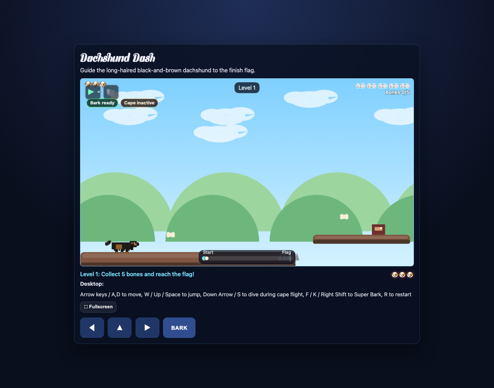

### Daily improvement: objective guidance chip
- Added a compact **top-center objective guidance chip** during gameplay so the next win condition stays explicit instead of living only in the status line.
- The chip now updates dynamically to show **bones remaining**, **boss defeat required**, or **`Flag ready!`** once the exit conditions are met.
- This keeps mid-level goals readable during movement-heavy sections and makes long runs easier to parse at a glance.

## 2026-05-16
### Daily improvement: in-run level progress tracker
- Added a compact **bottom-center progress tracker** during gameplay so players can see how far they are through the current level at a glance.
- The tracker shows the dachshund marker moving from **Start** toward the **Flag**, which makes long levels and quick restarts easier to read without opening menus.
- Kept it lightweight and translucent so it adds orientation without blocking platforming visibility.

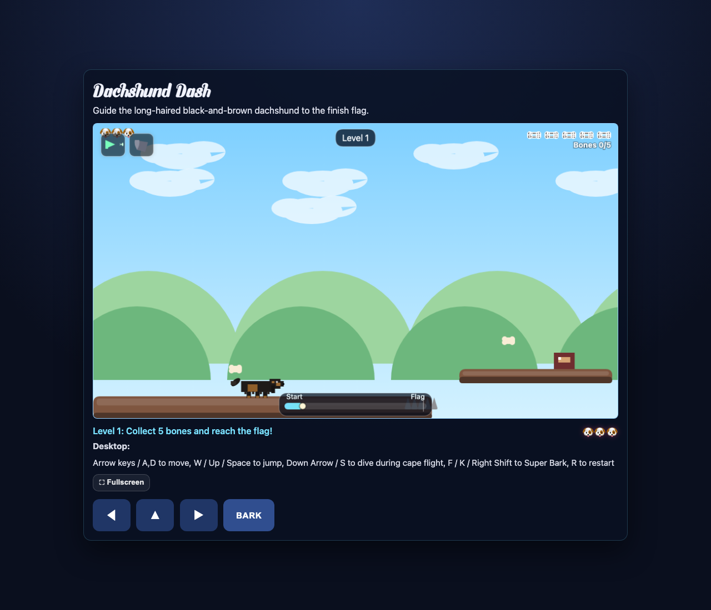

### Daily improvement: pause overlay status snapshot
- Added a compact **status snapshot card** to the pause overlay so players can quickly check level progress before resuming.
- The pause screen now shows the current level, bones collected, hearts, continues, and whether **Super Bark** or the **cape** are ready or still active.
- Also added a small pause-controls hint line so the overlay is easier to use at a glance.

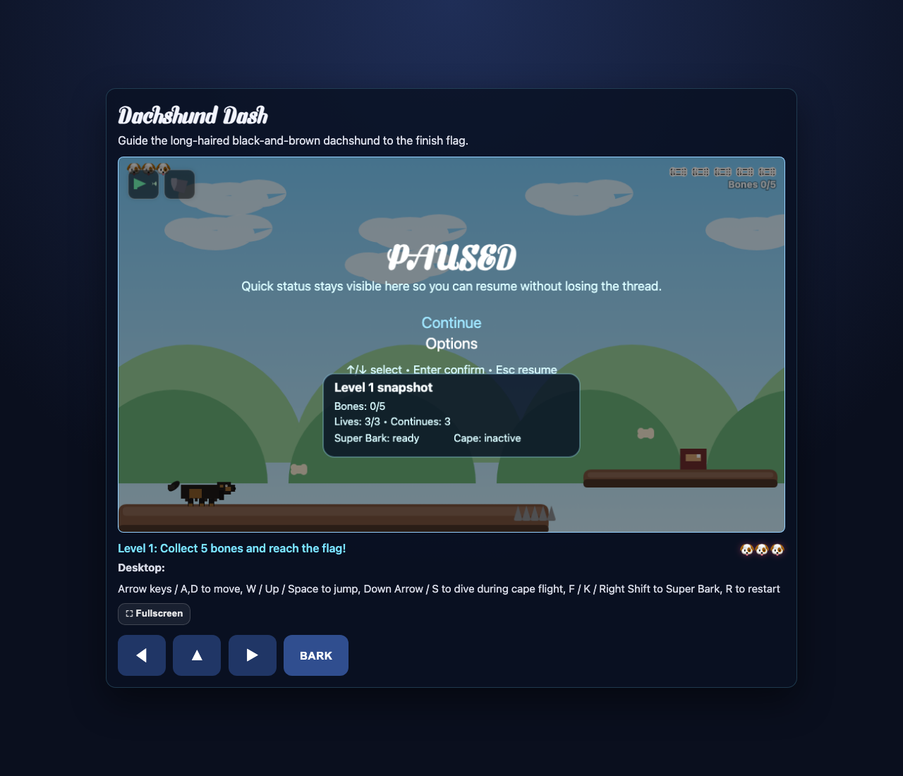

## 2026-05-15
### Daily improvement: restored centered game shell layout
- Fixed a CSS regression where the page background and layout styles were sitting outside the `body` rule and getting ignored by the browser.
- The game now loads inside its intended centered shell again, with the dark gradient backdrop and breathing room around the canvas.

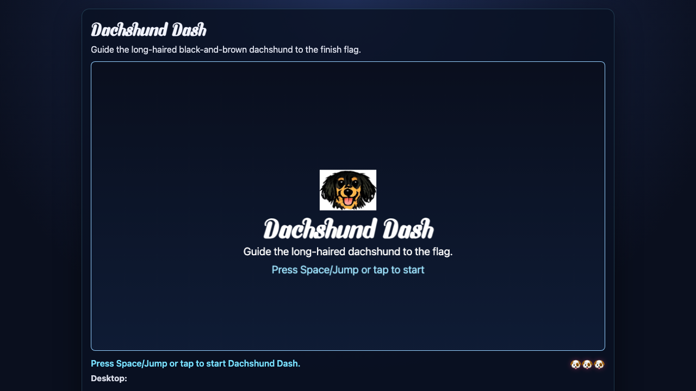

### Daily improvement: start screen controls legend
- Added a compact two-row **controls legend** to the title screen so desktop and touch players see the core inputs before the first jump.
- The new chips call out movement, jump, bark, restart, pause, and touch controls without adding a separate menu.

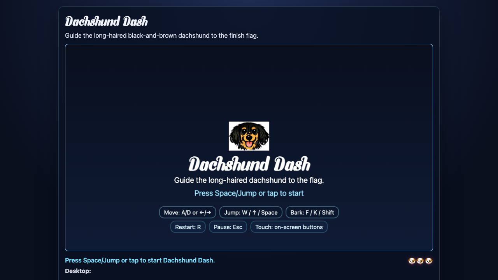

## 2026-05-14
- Improved jump feel with **coyote time** and **jump buffering**.
- Ground jumps now still trigger for a brief moment after stepping off a platform, and slightly-early jump presses now fire on landing.
- Jump SFX now plays when the jump actually happens, so timing stays consistent across keyboard and touch.

### Daily improvement: level objective cards
- Added **objective cards** to the in-level title overlay so each stage previews its key goals and threats before play begins.
- The intro card now calls out collectible count plus special features like **heart pickups**, **super cape**, **toy vs siren**, and **boss encounters**.
- Boss badges get a warmer highlight so high-stakes stages read faster at a glance.

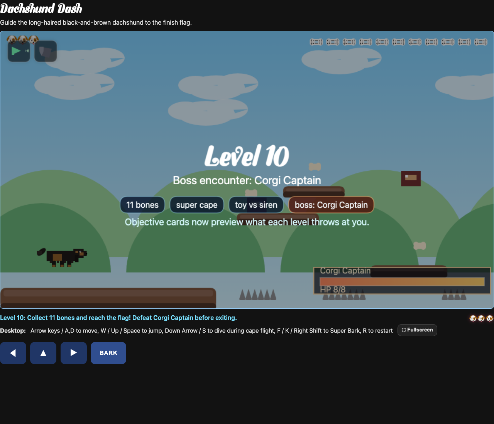

### Daily improvement: persistent in-run level chip
- Added a small **top-center level chip** during gameplay so the current stage stays visible without relying on the larger intro overlay or status text below the canvas.
- This makes quick restarts and mid-level context a little clearer, especially on mobile-sized layouts.

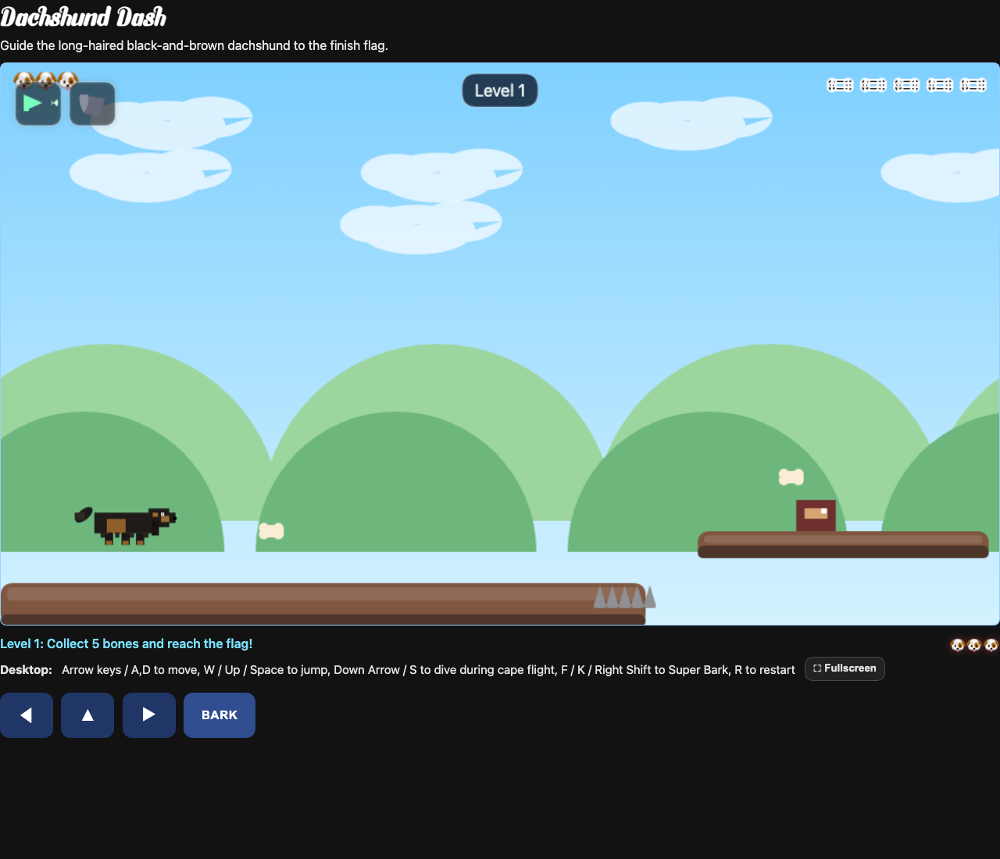

### Daily improvement: readable bone counter text
- Added a clear **`Bones X/Y`** label beneath the bone icons in the top-right HUD during gameplay.
- This keeps collectible progress readable at a glance, especially on later levels where icon-only counting gets harder.

