# Dachshund Dash Changelog

## 2026-07-31
### Daily improvement: muted audio now keeps the queued soundtrack visible
- Updated the visible **Audio** utility button so muting no longer collapses to a generic off label — it now keeps the selected soundtrack name visible, for example **🔇 Boss mix**, which makes queued special-stage music easier to confirm at a glance.
- Kept the change safe and local in `game.js` by reusing the existing soundtrack-profile metadata for the muted label, title, and accessibility copy without touching gameplay or audio playback logic.
- Verified with `node --check game.js` and `node tmp/verify-audio-button-muted-mix.js`, which confirmed the default **🔊 Intro mix** state, switched the launch preview to **Level 10**, muted audio, verified the **🔇 Boss mix** label plus restore hint, and captured the screenshot.

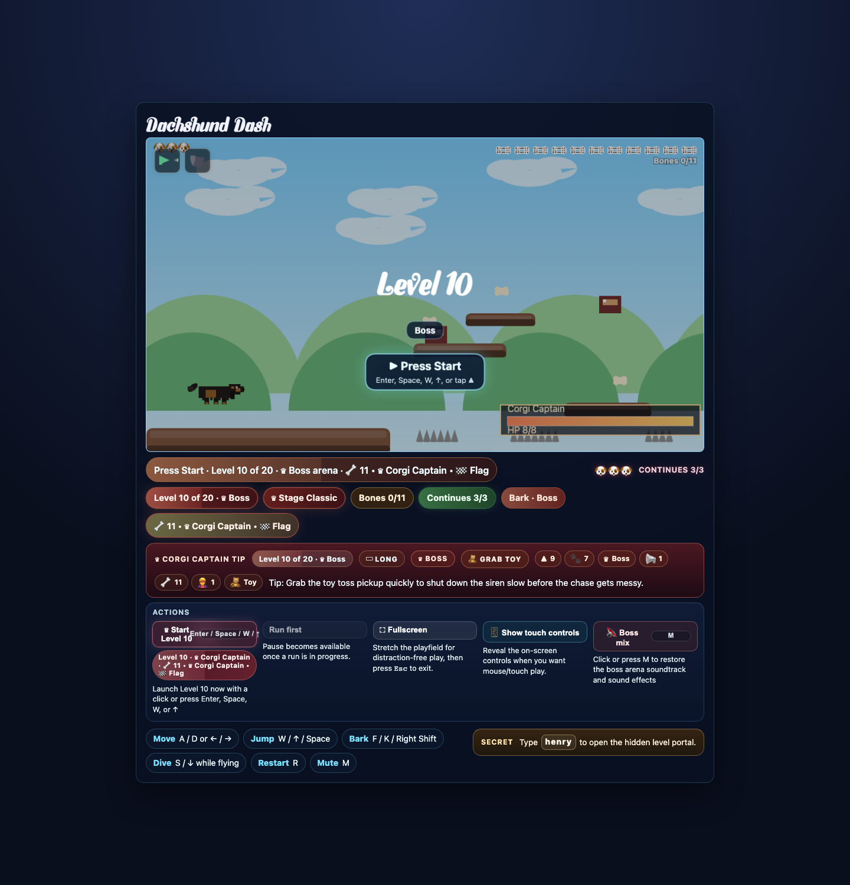

### Daily improvement: audio toggle now previews the current soundtrack mix
- Updated the visible **Audio** utility button so it now previews the current soundtrack mix — for example **🔊 Intro mix** on the default Level 1 start and **🔊 Boss mix** when a boss checkpoint is queued from the HENRY portal.
- Kept the change safe and local by centralizing the soundtrack selection in `game.js`, reusing that metadata for the button label/aria/hint text, and adding a matching theme tint in `styles.css` without touching gameplay.
- Verified with `node --check game.js` and `node tmp/verify-audio-button-mix-preview.js`, which confirmed the default **Intro mix** state, switched the launch preview to **Level 10**, verified the boss-themed **Boss mix** label/hint/tint, and captured the screenshot.

## 2026-07-30
### Daily improvement: launch-ready status now shows campaign progress fill
- Added a live progress fill inside the title-screen launch/status pill, so queued starts now show how deep into the 20-level run they begin without adding any extra text.
- Kept the change safe and local by reusing the existing launch preview progress in `game.js` and layering a theme-aware fill treatment onto the new status pill in `styles.css`.
- Verified with `node --check game.js` and `node tmp/verify-launch-status-progress.js`, which confirmed the default **Level 1** pill exposes `--status-progress: 5%`, switched the HENRY portal to **Level 10**, verified the boss preview pill reaches `50%`, and captured the screenshot.

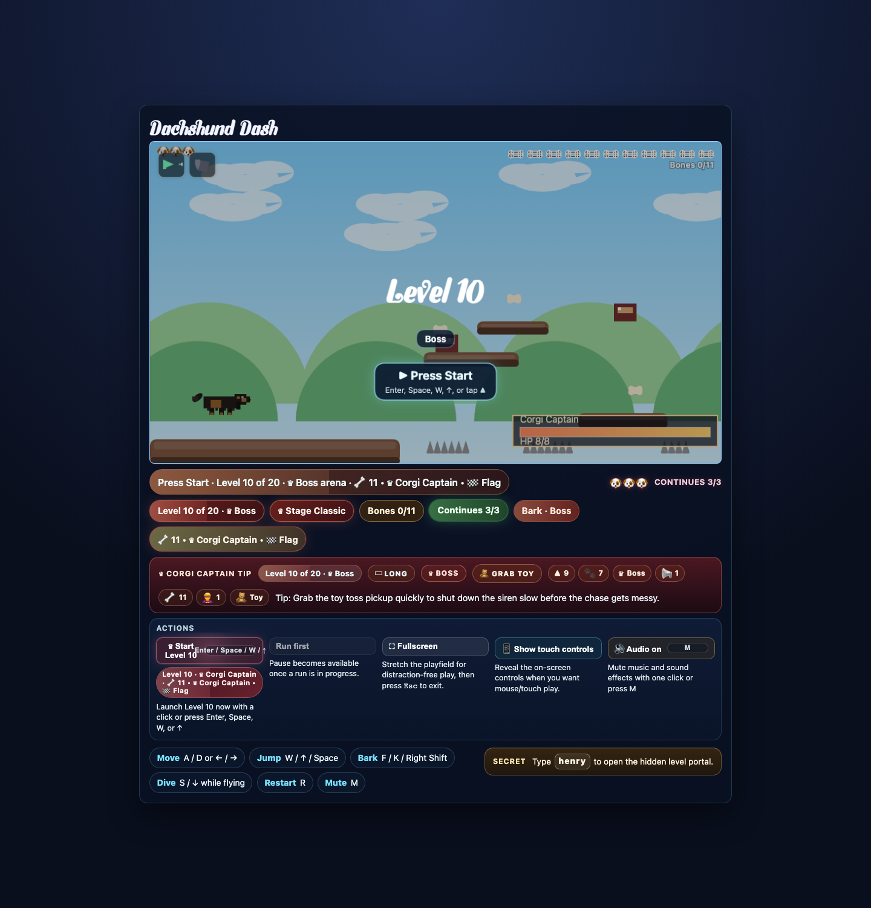

### Daily improvement: launch-ready status now previews the selected start
- Turned the top-left launch/status text into a theme-aware preview pill on the title screen, so it now shows the exact queued start at a glance — for example **Press Start · Level 10 of 20 · ♛ Boss arena · 🦴 11 • ♛ Corgi Captain • 🏁 Flag**.
- Kept the change safe and local by reusing the existing level/theme/goal preview metadata in `game.js`, then adding a small launch-only pill treatment in `styles.css` without touching gameplay.
- Verified with `node --check game.js` and `node tmp/verify-launch-status-preview.js`, which confirmed the default **Level 1** preview pill, switched the HENRY portal to **Level 10**, verified the boss preview text/theme/title state, and captured the screenshot.

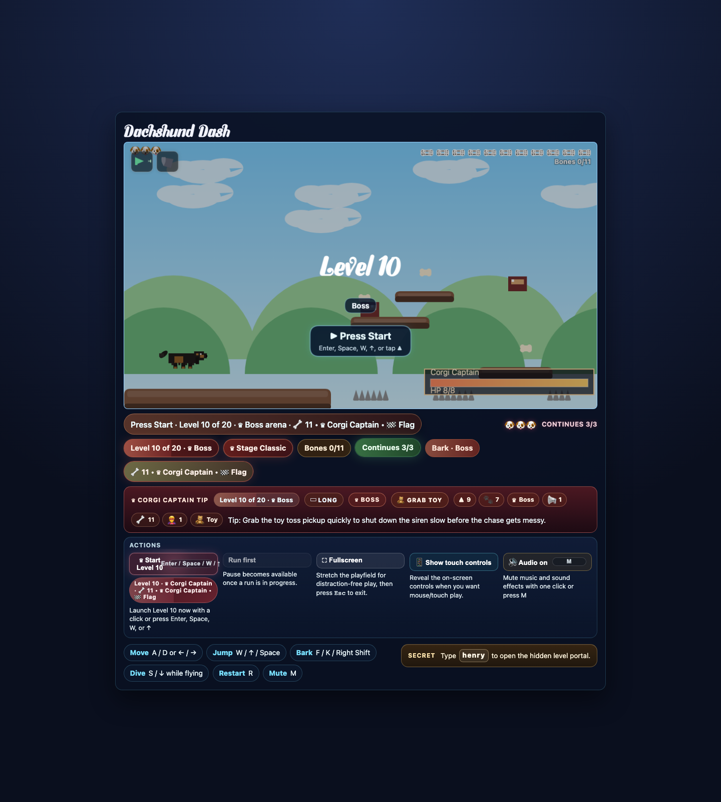

## 2026-07-29
### Daily improvement: launch-state goal previews now use compact objective icons
- Reworked the visible start/title goal preview surfaces so they now use compact objective icons — for example **🦴 8 • ⬒ Dig • 🏁 Flag** — instead of the older wordier `Goal: ...` phrasing, keeping objectives easier to scan with less reading.
- Applied the tighter goal preview to the start-screen **Goal** pill, the **Start run** context pill, the hidden **HENRY** progress goal pill, and the matching **HENRY** level-card goal line while preserving full accessible labels/titles like **Goal: 8 bones • dig dirt • flag**.
- Verified with `node --check game.js` and `node tmp/verify-goal-preview-icons.js`, which forced the **Level 9** tunnel preview, confirmed all four launch-state goal surfaces render **🦴 8 • ⬒ Dig • 🏁 Flag** while keeping the descriptive accessibility text, and captured the screenshot.

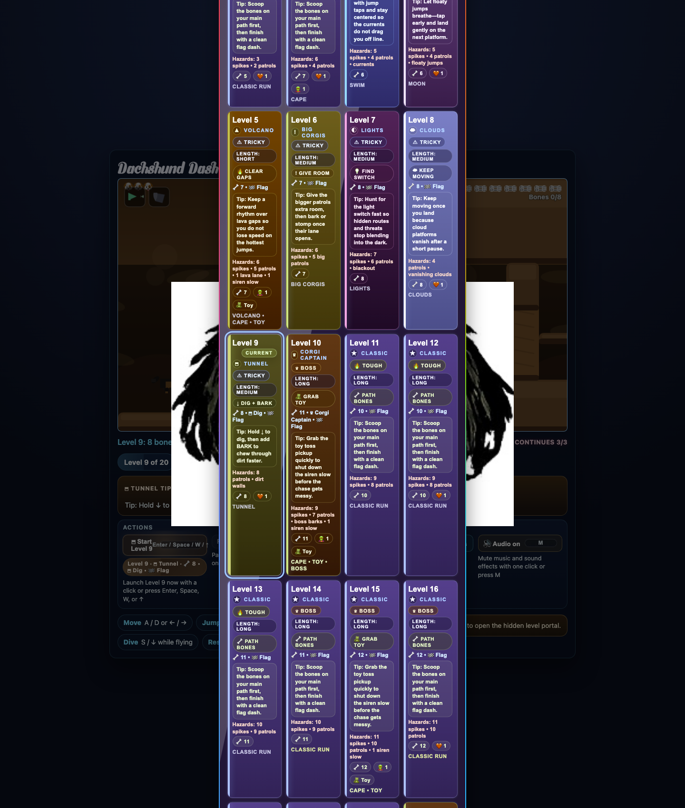

### Daily improvement: challenge badges now include quick-scan icons
- Updated the visible **stage-tip challenge badge**, the hidden **HENRY** progress challenge pill, and the matching **HENRY** level-card challenge tags so they now prepend compact icons — **☀ Warmup**, **⚠ Tricky**, **🔥 Tough**, and **♛ Boss** — making run difficulty faster to scan at a glance.
- Kept the change safe and local by reusing the existing challenge scoring in `game.js`, then layering the icon text only onto the pre-run challenge badges without touching gameplay, balance, or progression.
- Verified with `node --check game.js` and `node tmp/verify-challenge-badge-icons.js`, which forced a **Level 10** boss preview, confirmed the start-screen badge, portal summary pill, and current level card each render **♛ Boss** while keeping the accessible **Challenge: Boss** label/title, and captured the screenshot.

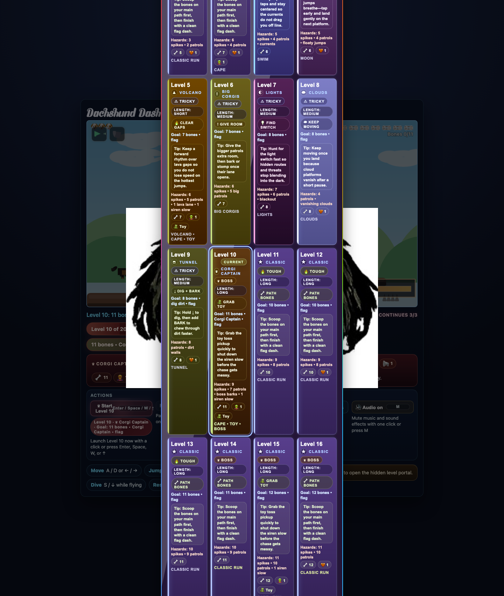

## 2026-07-28
### Daily improvement: launch-state length badges now include quick-scan icons
- Updated the visible **Stage tip** length badge and matching hidden **HENRY** progress length badge so they now prepend compact size icons — **⚡ Short**, **↔ Medium**, and **▭ Long** — making run length easier to scan at a glance with less reading.
- Kept the change safe and local by reusing the existing length metadata in `game.js`, applying the new badge text only to the launch-state summary surfaces, and refreshing the static placeholder text in `index.html`.
- Verified with `node --check game.js` and `node tmp/verify-length-badge-icons.js`, which forced a **Level 10** boss preview, confirmed both `#summary-tip-length` and `#henry-progress-length` render **▭ Long** with `data-theme="boss"`, matching accessibility text/title, and captured the screenshot.

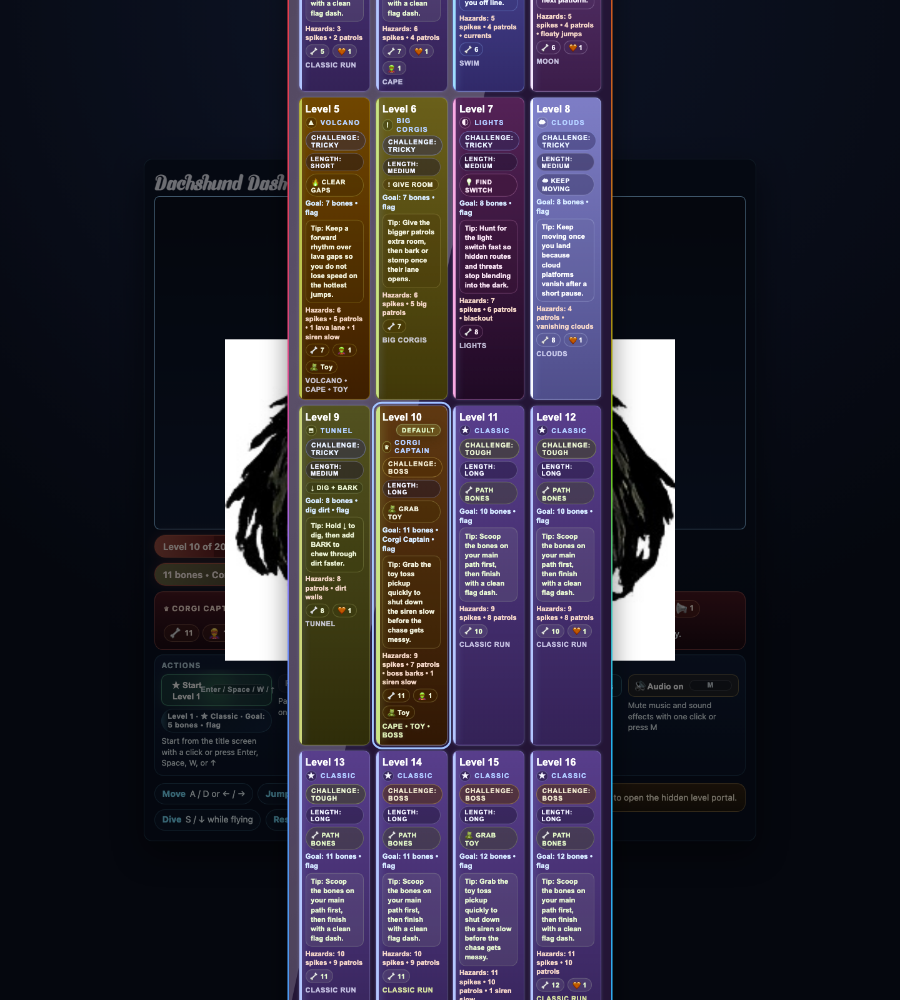

### Daily improvement: the stage-tip level badge now shows campaign progress
- Added a live progress fill to the **Level** badge inside the title/start **Stage tip** callout, so portal starts and boss checkpoints show how far into the 20-level campaign they begin without adding more copy.
- Kept the change safe and local by reusing the existing campaign progress calculation in `game.js`, then layering a small theme-aware fill treatment onto `.stage-tip-level` in `styles.css`.
- Verified with `node --check game.js` and `node tmp/verify-stage-tip-level-progress.js`, which forced a **Level 10** boss preview, confirmed `#summary-tip-level` renders **Level 10 of 20 · ♛ Boss** with `data-theme="boss"`, `--stage-tip-level-progress: 50%`, the new progress gradient, and captured the screenshot.

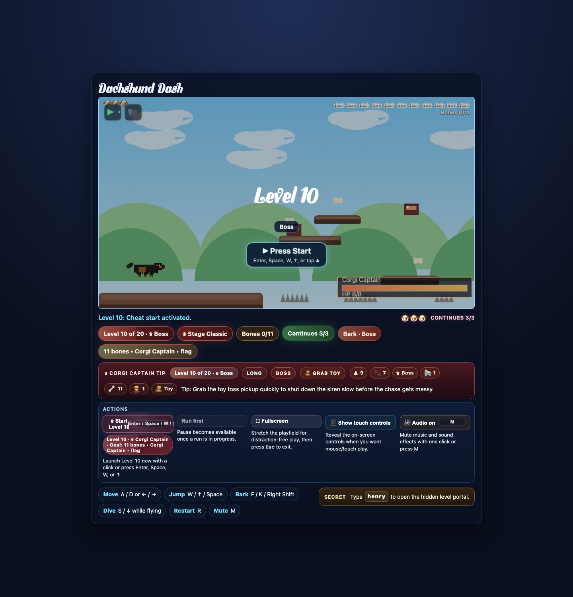

## 2026-07-27
### Daily improvement: start preview pill now shows campaign progress
- Added a progress fill to the start-screen **Level / Stage / Goal** preview pill beneath **Start run**, so special starts now show how far into the 20-level campaign they begin without adding more text.
- Kept the change safe and local by wiring the existing level index into `#start-action-context` in `game.js` and layering a theme-aware fill treatment in `styles.css`.
- Verified with `node --check game.js` and `node tmp/verify-start-action-context-progress.js`, which forced a **Level 10** boss preview, confirmed `#start-action-context` renders **Level 10 · ♛ Corgi Captain · Goal: 11 bones • Corgi Captain • flag** with `data-theme="boss"`, `--context-progress: 50%`, the new fill width, and captured the screenshot.

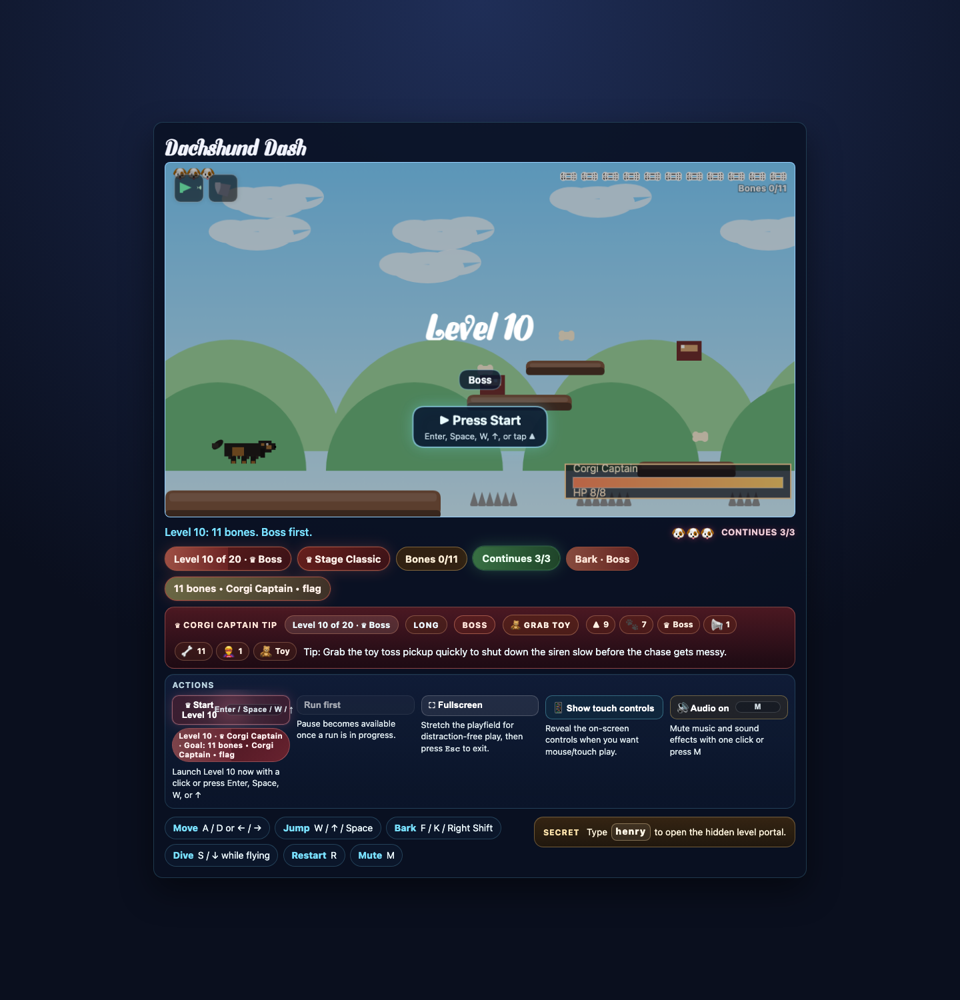

### Daily improvement: start button now gets a clearer launch halo on title screens
- Added a subtle animated halo behind the **Start run** button while the game is waiting at the title/start state, so the main action is easier to spot at a glance without changing gameplay.
- Kept the change safe and local in `styles.css`, including theme-aware glow colors so special starts like **Moon** keep a matching accent.
- Verified with `node tmp/verify-start-button-launch-halo.js`, which opened the HENRY portal on **Level 4 Moon**, confirmed `#btn-start-desktop` stays on the moon theme and its `::before` pseudo-element is running the new `startButtonReadyHalo` animation, then captured the screenshot.

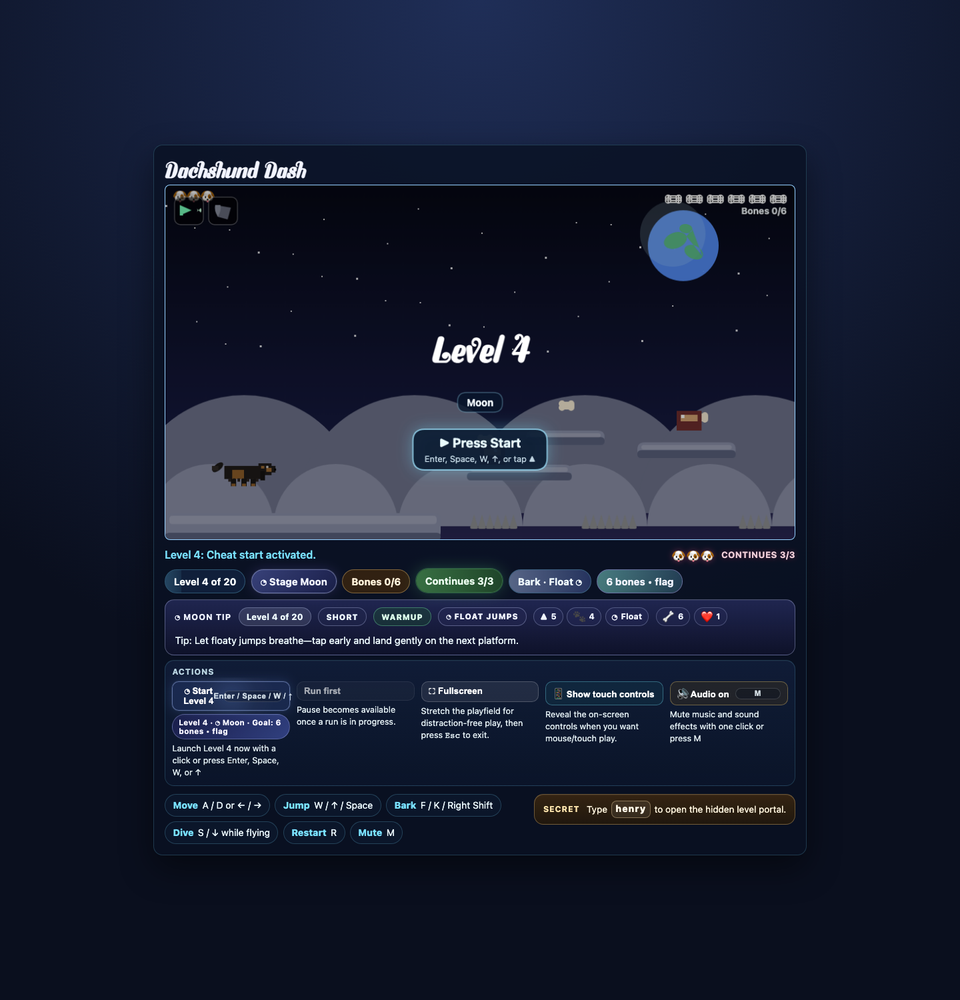

## 2026-07-26
### Daily improvement: boss levels now get a clearer run-summary level pill
- Updated the top-row **Level** pill so boss checkpoints now read as **`Level 10 of 20 · ♛ Boss`** and get a dedicated boss treatment, making Levels 10 and 20 easier to spot at a glance during a run or preview.
- Kept the change safe and local by reusing the existing level-progress fill, then layering the boss-only text/accent polish in `game.js` and `styles.css` without touching gameplay logic.
- Verified with `node --check game.js` and `node tmp/verify-summary-level-boss-pill.js`, which forced **Level 10**, confirmed `#summary-level` renders **Level 10 of 20 · ♛ Boss** with `data-tone="boss-level"`, `--summary-progress: 50%`, the boss progress-fill gradient, and captured the screenshot.

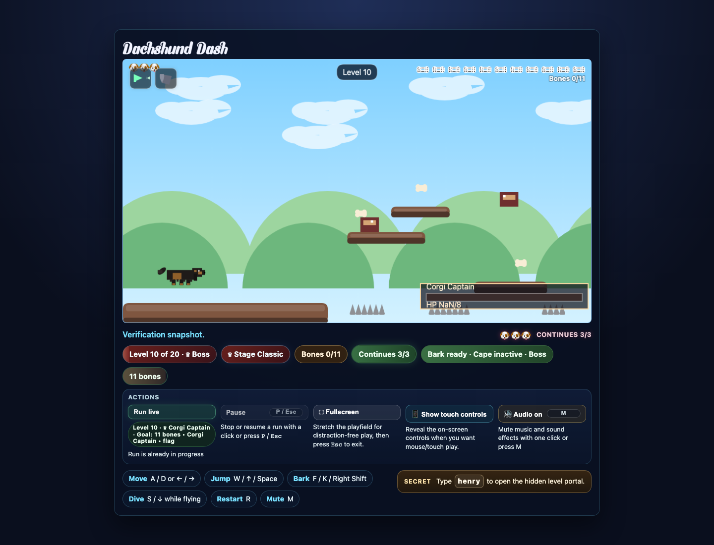

### Daily improvement: run summary continues pill now shows remaining retries at a glance
- Added a live fill meter to the top-row **Continues** pill so the remaining level retries read visually at a glance instead of relying on the number alone.
- Kept the change safe and local by reusing the existing summary-pill fill treatment in `game.js` and `styles.css`, plus a matching accessibility label/title for the updated retry state.
- Verified with `node --check game.js` and `node tmp/verify-summary-continues-meter.js`, which forced an in-run **Continues 2/3** state, confirmed `#summary-continues` renders `data-continues-state="mid"`, `data-tone="warning"`, `--summary-progress: 66.66666666666666%`, the new amber fill gradient, and captured the screenshot.

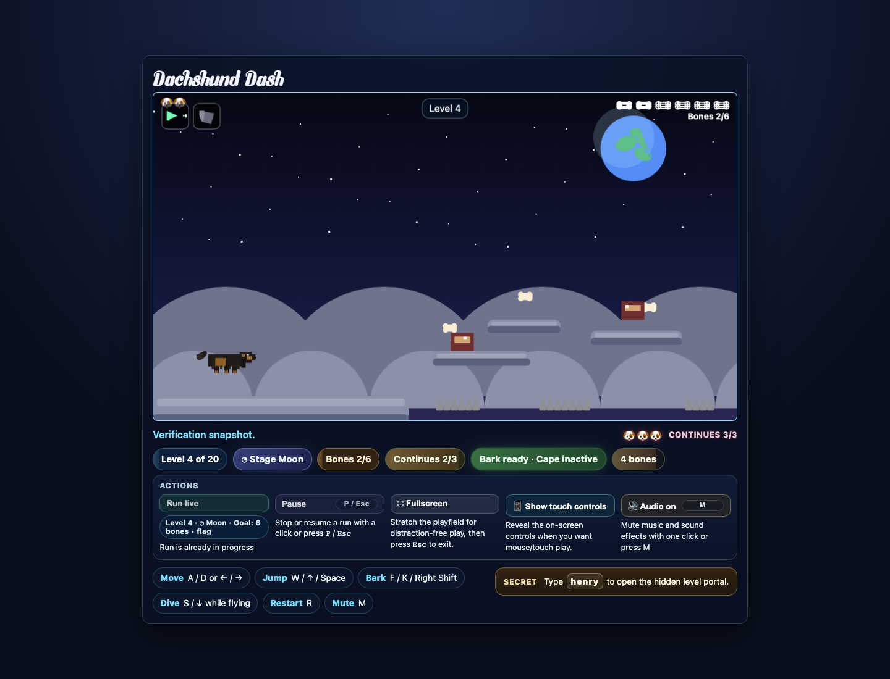

## 2026-07-25
### Daily improvement: run summary goal pill now shows live objective progress
- Added a live fill meter to the top-row **Goal** pill so players can read objective progress at a glance during a run instead of only seeing the remaining-text state.
- The pill now fills through **bone collection**, switches to **boss-damage progress** on boss stages after the bones are cleared, and keeps a matching accessibility label/title for the current objective status.
- Verified with `node --check game.js` and `node tmp/verify-summary-goal-meter.js`, which forced an in-run **3 bones** state on a 6-bone level and confirmed `#summary-goal` renders `data-goal-state="bones"`, `--summary-progress: 50%`, and the new progress-fill gradient.

### Daily improvement: run summary bones pill now shows collection progress
- Added a live fill meter to the top-row **Bones** pill so bone collection progress reads at a glance during a run instead of relying on the text counter alone.
- Kept the change safe and local by reusing the existing summary pill fill treatment in `game.js` and `styles.css`, plus a matching accessibility label/title for the updated pill.
- Verified with `node --check game.js` and `node tmp/verify-summary-bones-meter.js`, which forced an in-run **Bones 3/6** state, confirmed `#summary-bones` renders `data-tone="collect"`, `--summary-progress: 50%`, the new gold progress gradient, and captured the screenshot.

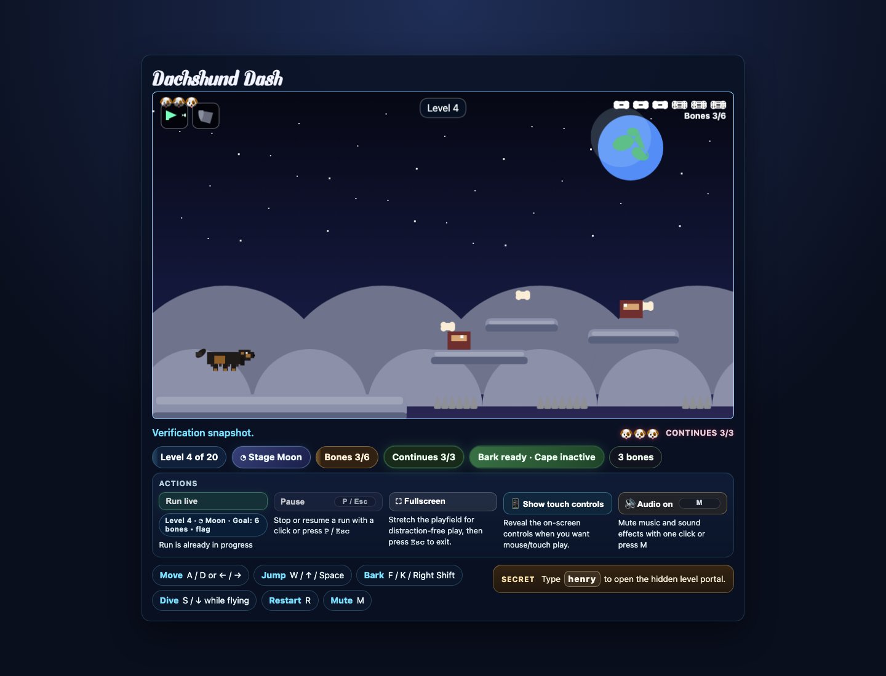

## 2026-07-24
### Daily improvement: run summary stage pill now carries the full stage accent
- Tightened the top-row **stage** pill so its **border, text color, and glow** now follow the selected stage accent too, instead of stopping at the background tint alone. Special starts like **Moon**, **Water**, **Tunnel**, and **Boss** now read more consistently at a glance.
- Kept the change safe and local by reusing the existing stage theme key, adding a small accent helper in `game.js`, and applying the visual polish only to `#summary-theme`.
- Verified with `node --check game.js` and `node tmp/verify-summary-theme-pill-theme.js`, which forced the title screen onto **Level 4 Moon**, confirmed `#summary-theme` renders **◔ Stage Moon** with the moon accent border/text/glow values plus the moon gradient, and captured the screenshot.

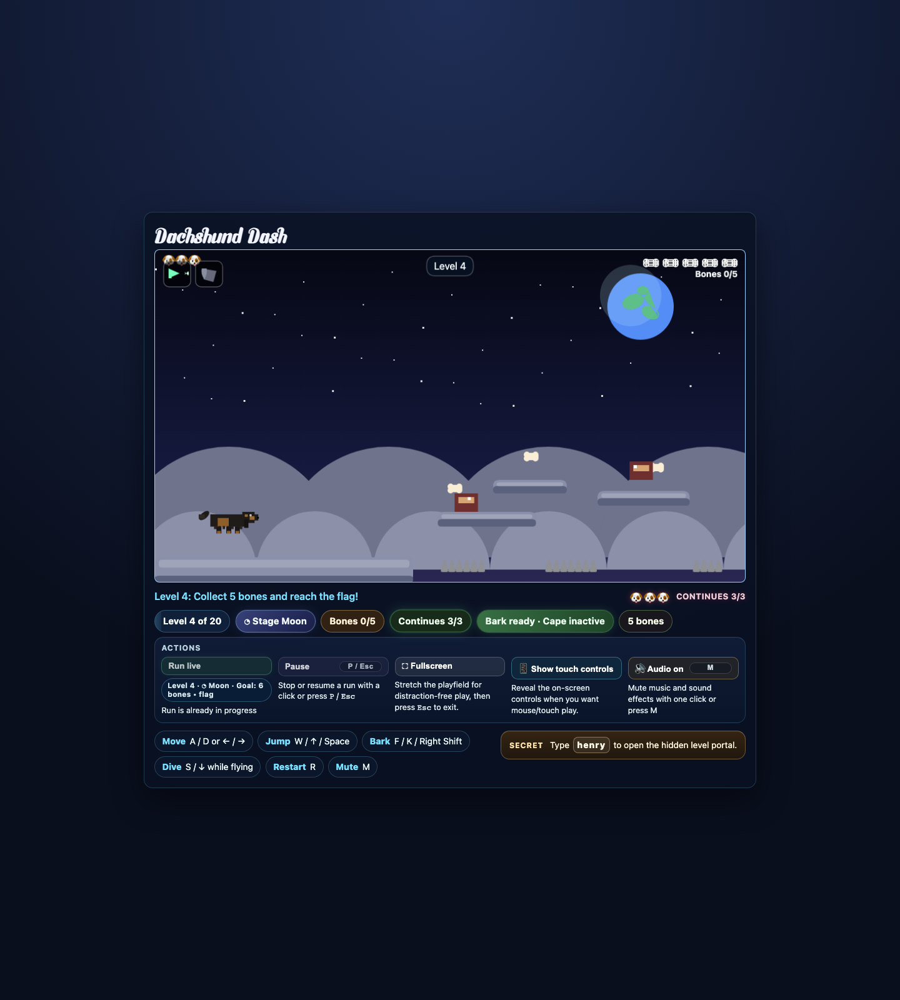

### Daily improvement: run summary stage pill now matches each stage theme
- Updated the top-row **stage** pill in the run summary so it now inherits the selected level’s stage theme instead of staying on a generic treatment, making special starts like **Moon**, **Water**, **Tunnel**, and **Boss** easier to recognize at a glance.
- Kept the change safe and local by wiring the existing stage theme key into `#summary-theme` in `game.js` and adding matching theme gradients in `styles.css`, without touching gameplay logic.
- Verified with `node --check game.js` and `node tmp/verify-summary-theme-pill-theme.js`, which forced the title screen onto **Level 4 Moon**, confirmed `#summary-theme` renders **◔ Stage Moon** with `data-theme="moon"`, the new moon gradient, and captured the screenshot.

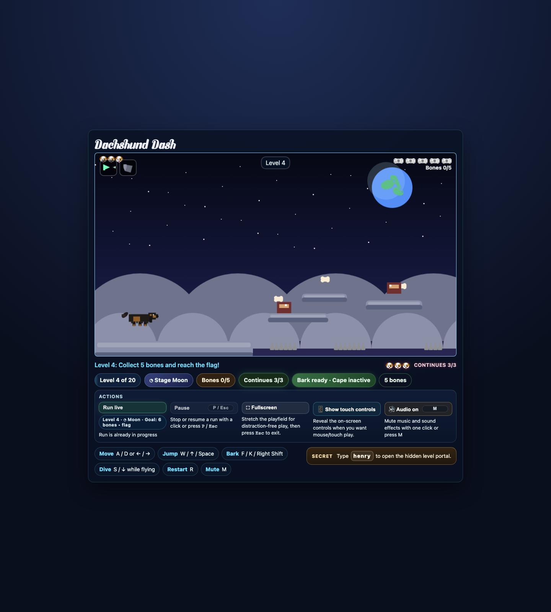

## 2026-07-23
### Daily improvement: launch-state power pill now previews the stage mechanic
- Updated the visible start/title **power** pill so it now previews the selected stage’s real mechanic instead of always saying **Bark · Cape**. Tunnel starts now show **Bark · Dig ↓**, water starts show **Bark · Swim ↑**, moon starts show **Bark · Float ◔**, boss starts show **Bark · Boss**, and cape stages still preview the cape pickup.
- Kept the change safe and local by reusing the existing run-summary power component, adding a small launch-preview helper in `game.js`, and tinting the pill fill by preview state in `styles.css` rather than touching gameplay logic.
- Verified with `node --check game.js` and `node tmp/verify-launch-power-preview.js`, which forced the title screen onto **Level 9**, confirmed `#summary-power` renders **Bark · Dig ↓** with `data-power-state="preview-dig"`, `data-tone="warning"`, a full preview fill, the warm dig gradient, and captured the screenshot.

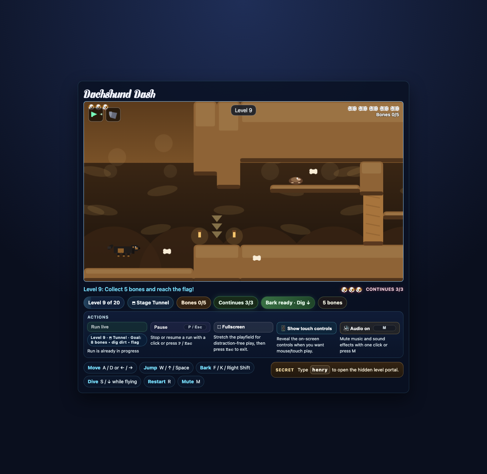

### Daily improvement: run summary power pill now fills as bark recharges
- Added a live fill meter to the **run summary** power pill so the top-row **Bark / Cape** status is easier to scan at a glance during play instead of making you read the cooldown text alone.
- Kept the change safe and local by reusing the existing summary pill fill treatment, then tinting `#summary-power` by state so **recharging**, **ready**, **cape active**, and **toy ready** each read more clearly without touching gameplay balance.
- Verified with `node --check game.js` and `node tmp/verify-summary-power-meter.js`, which forced an in-run **50% bark cooldown**, confirmed `#summary-power` renders **Bark 10s · Cape inactive** with `data-power-state="recharge"`, `--summary-progress: 50%`, the warm recharge gradient, and captured the screenshot.

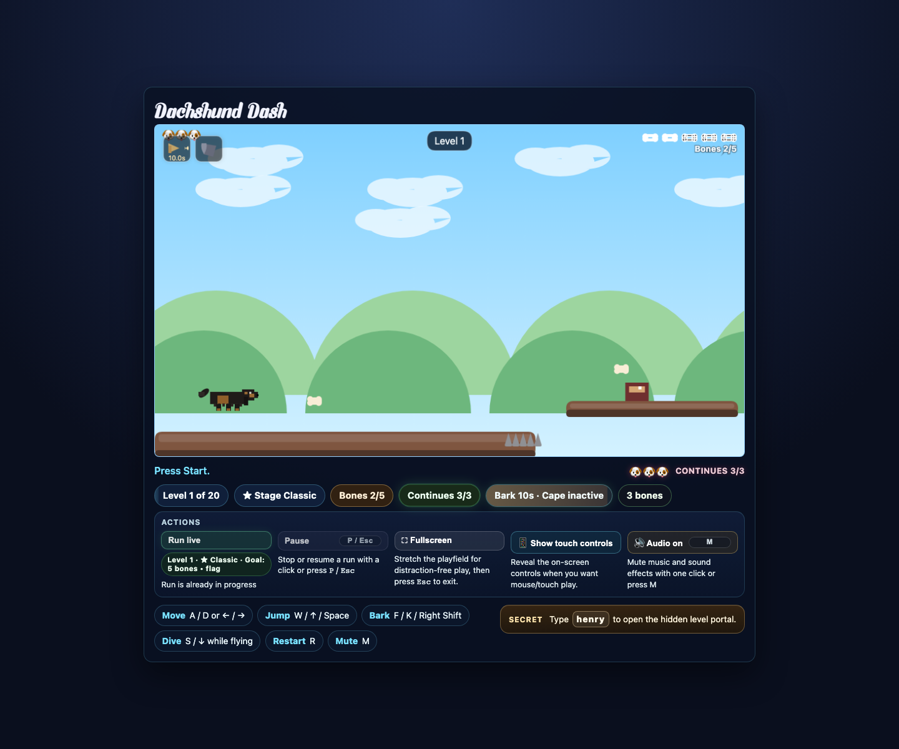

## 2026-07-22
### Daily improvement: start action preview now matches the selected stage theme
- Updated the start-screen **Level / Stage / Goal** preview pill beneath **Start run** so it now inherits the selected stage theme too, making special starts like **Moon** easier to trust at a glance instead of leaving that pill on a generic treatment.
- Kept the change safe and local by wiring the existing stage theme key into `#start-action-context` and adding matching theme gradients for classic, water, moon, cloud, tunnel, volcano, giant, dark, and boss starts.
- Verified with `node --check game.js` and `node tmp/verify-start-action-context-theme.js`, which forced a **Level 4 Moon** preview, confirmed `#start-action-context` renders **Level 4 · ◔ Moon · Goal: 6 bones • flag** with `data-theme="moon"` plus the moon-tinted gradient, and captured the screenshot.

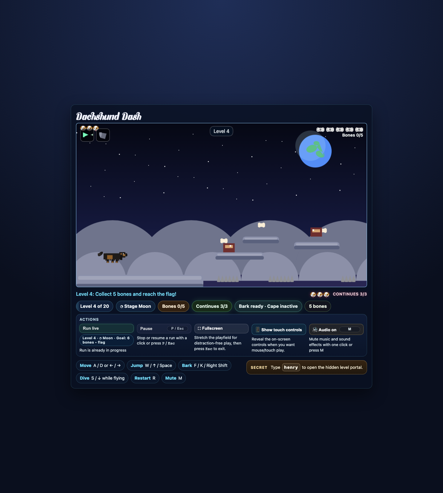

### Daily improvement: action helper text is easier to read on the start screen
- Improved the small helper text under the **Actions** buttons by slightly increasing its size, contrast, line spacing, and wrap width so the keyboard/control hints stay readable without changing gameplay or layout structure.
- Kept the change safe and local to `.utility-btn-hint`, so it only affects the descriptive helper copy beneath buttons like **Start run**, **Pause**, and **Fullscreen**.
- Verified with `node tmp/verify-utility-hints-readability.js`, which loaded the start screen, confirmed the updated helper-text computed styles, and captured the refreshed screenshot.

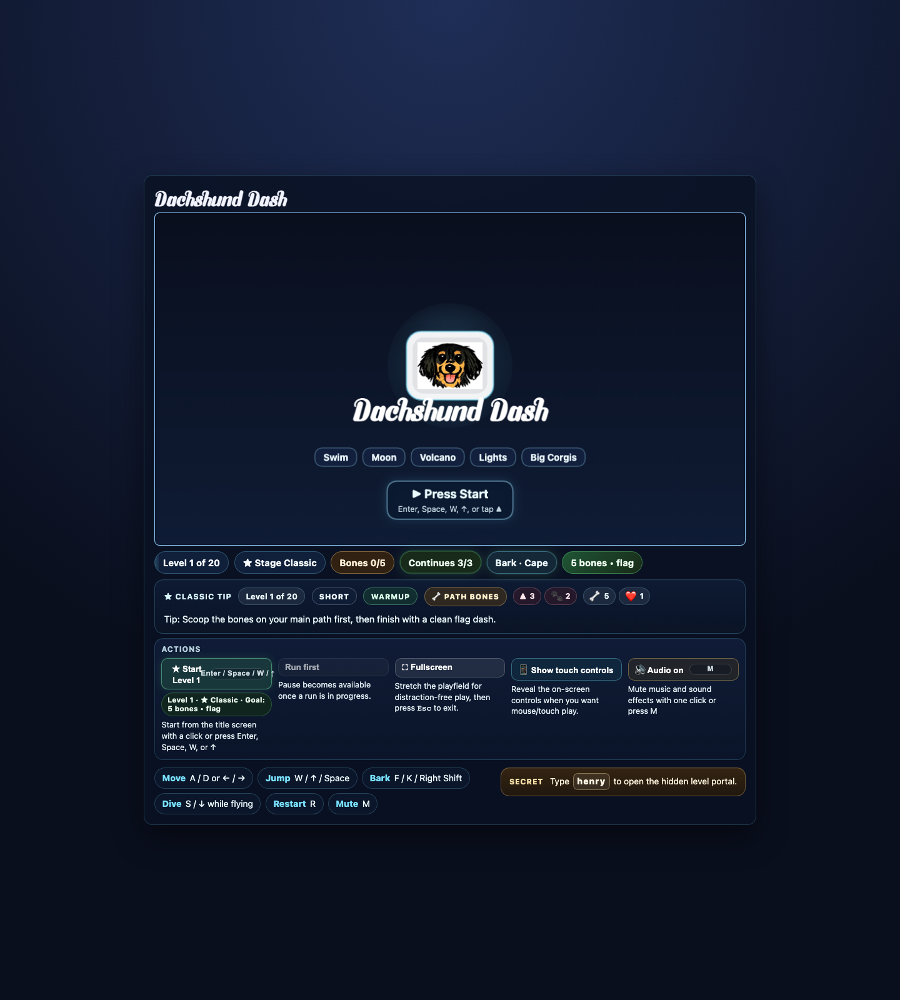

## 2026-07-21
### Daily improvement: HENRY boss labels now name the boss
- Updated the hidden **HENRY** portal’s boss-stage labels so they now name the actual boss — for example **Corgi Captain** — instead of the vaguer **Classic • Boss** wording.
- This now carries through the portal summary theme pill, the quick-jump stage badge, and the active boss level card, making secret boss starts easier to trust at a glance.
- Verified with `node --check game.js` and `node tmp/verify-henry-boss-stage-name.js`, which confirmed the Level 10 portal renders **♛ Boss · Corgi Captain**, a **♛ Corgi Captain** quick-jump badge, and the matching **Corgi Captain** level-card stage text.

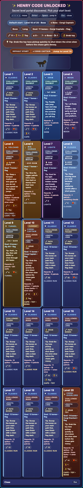

### Daily improvement: HENRY quick jump button now shows default-vs-resume mode
- Updated the hidden **HENRY** portal’s quick jump action so it now carries a compact **Default start** or **Current run** badge and switches the main label to **Resume Level N** when you’re jumping back into a live run.
- This keeps secret portal jumps clearer at a glance, especially when the same button can either start fresh or drop you back into an in-progress stage.
- Verified with `node --check game.js` and `node tmp/verify-henry-progress-run-mode.js`, which confirmed the button renders **Default start / Jump to Level 1** on the title flow, **Current run / Resume Level 10** for a paused run, and captured the updated screenshot.

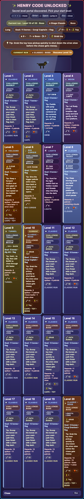

## 2026-07-20
### Daily improvement: HENRY portal progress summary now shows the stage tip
- Added a compact **stage tip pill** to the hidden **HENRY** portal progress summary so secret starts now carry the same tactical hint the main start screen already provides, instead of making players infer the best first move from the other pills alone.
- Kept the change local and safe by reusing the existing `levelSelectTipText()` helper plus the portal’s current theme tinting, so every secret start inherits the right tip without touching gameplay rules.
- Verified with `node --check game.js` and a headless Playwright check (`node tmp/verify-henry-progress-tip.js`) that forced **Level 10**, opened the **HENRY** portal, confirmed `#henry-progress-tip` renders **💡 Tip: Grab the toy toss pickup quickly to shut down the siren slow before the chase gets messy.** with `aria-label="Tip: Grab the toy toss pickup quickly to shut down the siren slow before the chase gets messy."`, boss-tinted styling, and captured the updated screenshot.

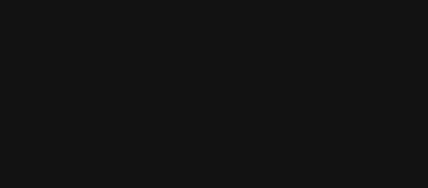

### Daily improvement: HENRY level-select card tips now tint to each stage theme
- Updated the hidden **HENRY** portal’s per-level tip lines so they now inherit each stage theme instead of using one generic gold treatment for every secret start card.
- This keeps special starts like **Moon**, **Water**, **Tunnel**, and **Boss** easier to scan at a glance while staying tightly local to the existing secret-start UI.
- Verified with `node --check game.js` and a headless Playwright check (`node tmp/verify-henry-level-card-tip-theme.js`) that forced **Level 4**, opened the **HENRY** portal, confirmed the current moon card’s `.level-btn-tip` renders **Tip: Let floaty jumps breathe—tap early and land gently on the next platform.** with the expected moon-tinted border/background colors, and captured the updated screenshot.

## 2026-07-19
### Daily improvement: HENRY portal progress level pill now shows campaign progress fill
- Upgraded the hidden **HENRY** portal progress level pill with a compact campaign-progress fill, so secret starts now show how deep into the 20-level run the selected entry point sits without adding more reading-heavy UI.
- Kept the change tightly local to the existing level pill by reusing the current level index and tone styling, while also adding an accessibility label/title that spells out the exact percentage.
- Verified with `node --check game.js` and a headless Playwright check (`node tmp/verify-henry-progress-level-fill.js`) that forced **Level 20**, opened the **HENRY** portal, confirmed `#henry-progress-level` renders **Default start · Level 20 of 20 · Boss** with `--henry-progress-level-fill: 100%`, the expected gradient background, and captured the updated screenshot.

### Daily improvement: HENRY portal progress summary now shows a hazards pill
- Added a compact **hazards pill** to the hidden **HENRY** portal progress summary so secret starts now preview the biggest threats — spikes, patrols, boss barks, siren slow zones, and other stage-specific dangers — before players jump in.
- Reused the existing hazard metadata that already powers the visible start-screen stage tips, keeping the change local to the portal summary UI while making tougher starts easier to scan at a glance.
- Verified with `node --check game.js` and a headless Playwright check (`node tmp/verify-henry-progress-hazards.js`) that forced **Level 20**, opened the **HENRY** portal, confirmed `#henry-progress-hazards` renders **▲ 14 • 🐾 12 • ♛ Boss • 📢 1** with `aria-label="Hazards: 14 spikes, 12 patrols, boss barks, 1 siren slow"`, the expected boss-tinted styling, and captured the updated screenshot.

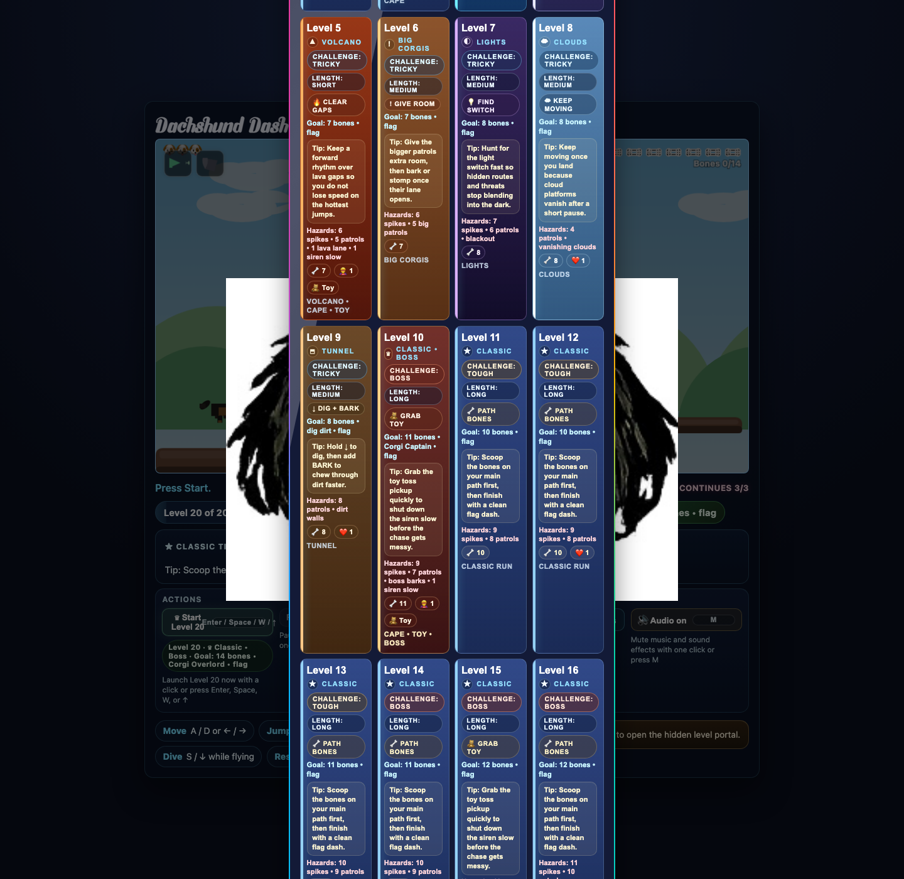

## 2026-07-18
### Daily improvement: HENRY portal progress summary now shows a pickups pill
- Added a compact **pickups pill** to the hidden **HENRY** portal progress summary so secret starts now preview the full collectible loadout — bones, hearts, capes, and toy toss pickups — before players jump in.
- Reused the existing pickup metadata that already powers the visible stage tips and level cards, keeping the change local to the portal summary UI while making boss and special-start runs easier to scan at a glance.
- Verified with `node --check game.js` and a headless Playwright check (`node tmp/verify-henry-progress-pickups.js`) that forced **Level 20**, opened the **HENRY** portal, confirmed `#henry-progress-pickups` renders **🦴 14 • ❤️ 1 • 🦸 1 • 🧸 Toy** with `aria-label="Pickups: 14 bones, 1 heart, 1 cape, toy toss"`, the expected boss-tinted styling, and captured the updated screenshot.

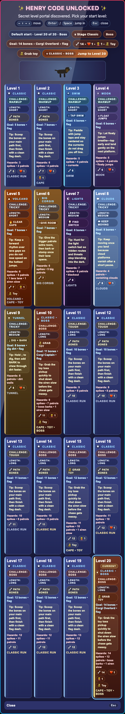

### Daily improvement: HENRY portal progress summary now shows a length pill
- Added a compact **length pill** to the hidden **HENRY** portal progress summary so secret starts now preview whether the chosen run is **Short**, **Medium**, or **Long** before players jump in.
- Reused the game’s existing level-length helper and stage-theme tinting, keeping the change local to the portal summary UI while making long boss runs easier to spot at a glance without adding heavier text.
- Verified with `node --check game.js` and a headless Playwright check (`node tmp/verify-henry-progress-length.js`) that forced **Level 20**, opened the **HENRY** portal, confirmed `#henry-progress-length` renders **Long** with `aria-label="Length: Long"`, the expected boss-tinted styling, and captured the updated screenshot.

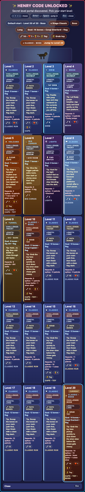

## 2026-07-17
### Daily improvement: HENRY portal progress summary now shows a challenge pill
- Added a compact **challenge pill** to the hidden **HENRY** portal progress summary so secret starts now surface whether the selected run is **Warmup**, **Tricky**, **Tough**, or **Boss** before players jump in.
- Reused the game’s existing level-difficulty scoring, keeping the change local to the portal summary UI while making high-pressure starts easier to scan without adding heavier text.
- Verified with `node --check game.js` and a headless Playwright check (`node tmp/verify-henry-progress-challenge.js`) that forced **Level 10**, opened the **HENRY** portal, confirmed `#henry-progress-challenge` renders **Boss** with `data-challenge-tone="boss"` and the expected boss-tinted styling, and captured the updated screenshot.

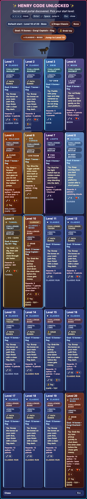

### Daily improvement: HENRY portal progress theme pill now matches the selected stage
- Updated the hidden **HENRY** portal progress summary so its **stage theme pill** now inherits the selected stage tint instead of staying on the same generic blue treatment for every secret start.
- This keeps special starts like **Moon**, **Water**, **Tunnel**, and **Boss** runs easier to scan at a glance while staying local to the existing portal summary UI and not touching gameplay logic.
- Verified with `node --check game.js` and a headless Playwright check (`node tmp/verify-henry-progress-theme.js`) that forced **Level 4**, opened the **HENRY** portal, confirmed `#henry-progress-theme` renders **◔ Stage Moon** with `data-theme="moon"` and the expected moon-tinted background, and captured the updated screenshot.

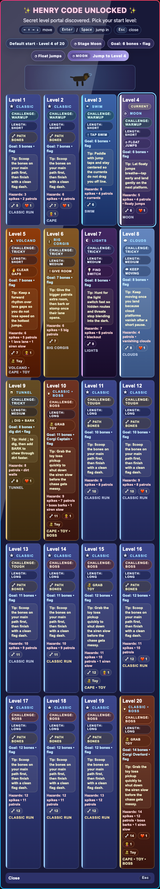

## 2026-07-16
### Daily improvement: HENRY portal progress summary now shows the stage focus pill
- Added a compact **focus pill** to the hidden **HENRY** portal progress summary so the secret start panel now surfaces the most important action for the selected stage at a glance instead of leaving that cue only in the larger level cards.
- Reused the existing stage-focus metadata that already powers the visible start-screen tip card, which keeps the change local and safe while making quick portal jumps easier to trust.
- Verified with `node --check game.js` and a headless Playwright check (`node tmp/verify-henry-progress-focus.js`) that opened the **HENRY** portal, confirmed `#henry-progress-focus` renders **🦴 Path bones** with the expected focus accessibility label, and captured the updated screenshot.

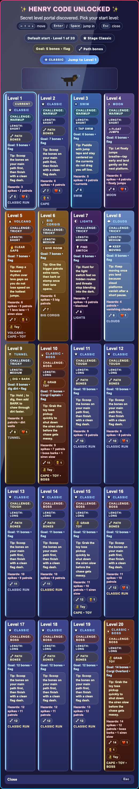

### Daily improvement: HENRY portal progress goal pill now theme-tints to the selected stage
- Updated the hidden **HENRY** portal progress summary so its **goal pill** now inherits the selected stage theme instead of keeping the same generic gold styling for every secret start.
- This keeps special starts like **Moon**, **Water**, **Tunnel**, **Volcano**, and **Boss** runs easier to scan at a glance while staying local to the existing portal summary UI.
- Verified with `node --check game.js` and a headless Playwright check (`node tmp/verify-henry-progress-goal-theme.js`) that forced **Level 4**, opened the **HENRY** portal, confirmed `#henry-progress-goal` renders with `data-theme="moon"` and the expected moon-tinted background, and captured the updated screenshot.

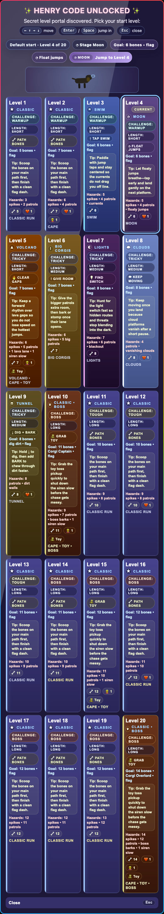

## 2026-07-15
### Daily improvement: stage-tip hazard and pickup pills now match each stage theme
- Updated the visible **start-screen stage-tip pills** so the hazard and pickup chips now inherit the current stage theme instead of keeping the same generic colors on every run.
- This keeps special starts like **Moon**, **Tunnel**, **Water**, and **Boss** runs easier to scan at a glance while staying local to the existing pre-run guidance UI.
- Verified with `node --check game.js` and a headless Playwright check that forced **Level 4**, confirmed the rendered `.stage-tip-hazard-pill` and `.stage-tip-pickup-pill` both carry `data-theme="moon"`, and captured the updated screenshot.

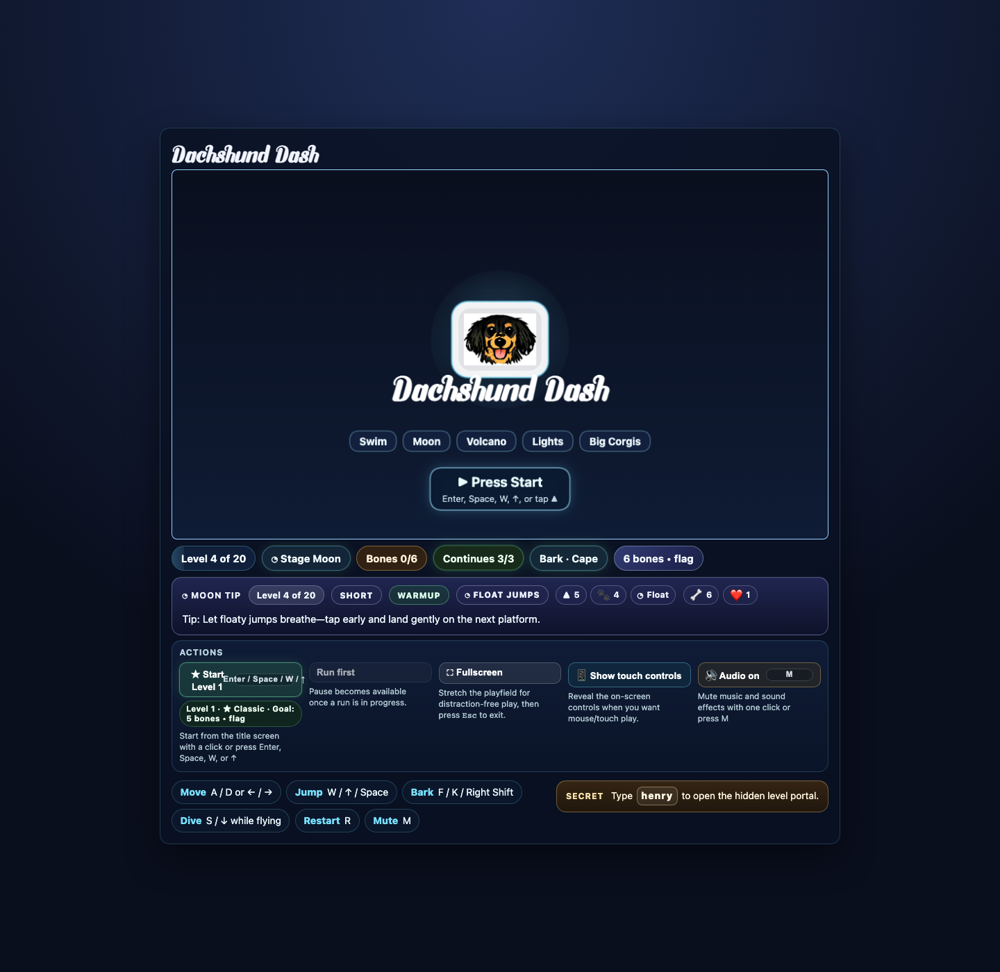

### Daily improvement: HENRY portal pickup chips now tint to each stage theme
- Updated the hidden **HENRY** level-select card pickup chips so they now inherit each card’s stage theme instead of staying on the same generic gold treatment for every secret start.
- This keeps special starts like **Moon**, **Tunnel**, **Water**, and **Boss** cards easier to scan at a glance while staying local to the existing portal UI and not touching gameplay logic.
- Verified with `node --check game.js` and a headless Playwright check that forced **Level 4**, opened the **HENRY** portal, and confirmed the current card’s `.level-btn-stat-pill` renders with the expected moon-tinted background, border, and text color.

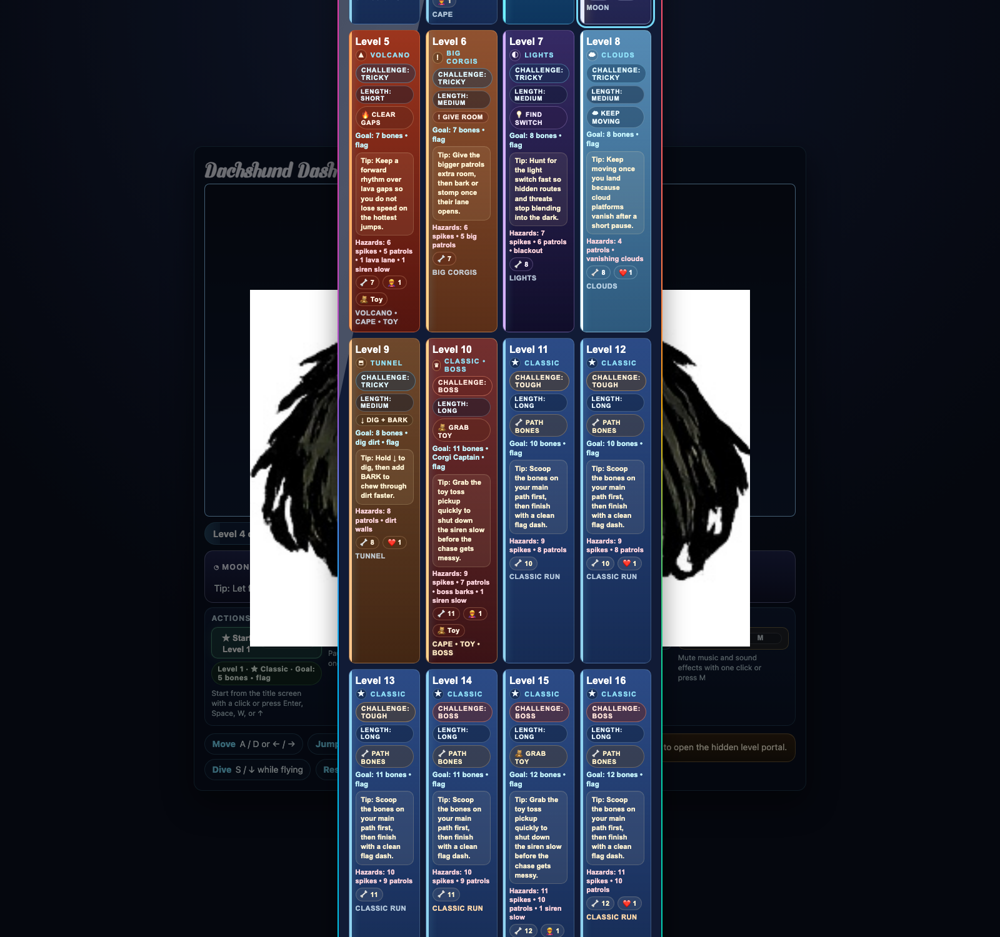

## 2026-07-14
### Daily improvement: HENRY level-select cards now show a stage-specific focus pill
- Added a compact **focus pill** to each hidden **HENRY** portal level card so special starts now surface the most important action at a glance — for example **↓ Dig + Bark** on tunnel stages — without making players parse the longer tip sentence first.
- Reused the same existing stage-focus metadata from the visible start/title tip card, keeping the change local and safe while making cheat-start stage selection faster to scan.
- Verified with `node --check game.js` and a headless Playwright check (`node tmp/verify-henry-focus-pill.js`) that opened the **HENRY** portal, confirmed the **Level 9** card renders `.level-btn-focus` as **↓ DIG + BARK** with the expected tunnel accessibility label, and captured the updated screenshot.

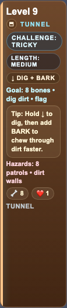

### Daily improvement: start-screen stage tips now show a stage-specific focus badge
- Added one new **focus badge** to the visible start/title **stage tip** callout so upcoming runs now surface the most important action at a glance, like **↓ Dig + Bark** for tunnel stages instead of leaving that control buried only in the sentence-length tip text.
- Kept the change local to the existing stage-tip card by reusing stage metadata and theme tinting, which makes special-stage inputs easier to scan without changing gameplay, progression, or controls.
- Verified with `node --check game.js` and a headless Playwright check (`node tmp/verify-stage-tip-focus.js`) that opened **Level 9**, confirmed `#summary-tip-focus` renders **↓ DIG + BARK** with `data-theme="tunnel"` and the expected accessibility label, and captured the updated screenshot.

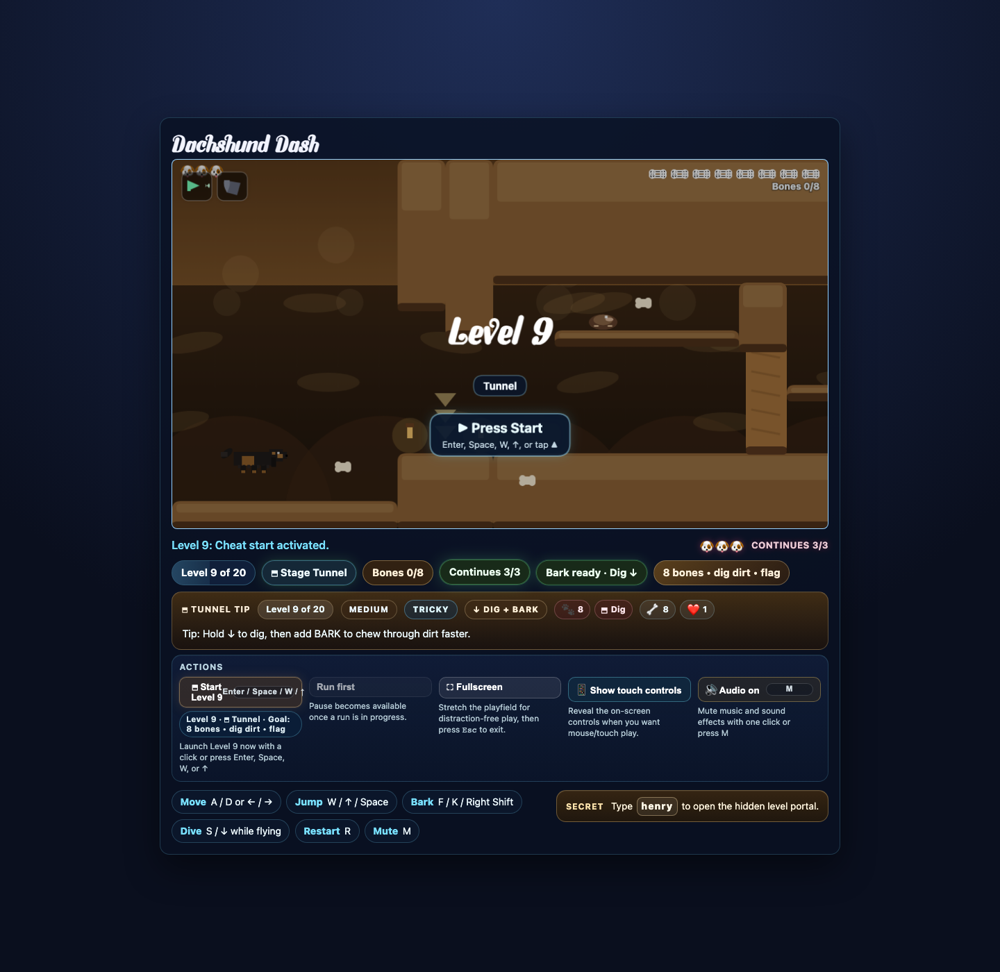

## 2026-07-13
### Daily improvement: start/title goal pill now theme-tints to each stage
- Updated the visible **goal pill** on the start and level-title screens so it now picks up the selected stage theme visually — for example a cool moon gradient on **Level 4** — instead of using the same generic goal styling for every launch state.
- Kept the change local by reusing the existing stage-theme key on the existing goal pill, which makes special starts easier to scan at a glance without adding more text or changing gameplay.
- Verified with `node --check game.js` and a headless Playwright check that forced **Level 4**, confirmed `#summary-goal` renders with `data-theme="moon"`, keeps the exact objective text, and uses the new moon gradient styling; captured the updated screenshot.

### Daily improvement: start/title goal pill now previews the exact objective
- Updated the visible **goal pill** on the start and level-title screens so it now previews the selected stage’s exact objective — for example **11 bones • Corgi Captain • flag** — instead of falling back to generic launch text.
- Reused the game’s existing goal-summary helper, which keeps the change local and safe while making boss starts and special stages easier to read at a glance before the run begins.
- Verified with `node --check game.js` and a headless Playwright check that forced **Level 10**, confirmed `#summary-goal` renders **11 bones • Corgi Captain • flag** with `data-tone="boss"`, and captured the updated screenshot.

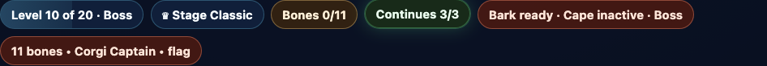

## 2026-07-12
### Daily improvement: start-screen stage tips now show a length badge
- Added a compact **length badge** to the start/title **stage tip** callout so upcoming runs now preview whether the stage is **Short**, **Medium**, or **Long** before the level begins.
- Reused the game’s existing level-length metadata and stage-theme tinting, keeping the change visual-first and low-text while helping players gauge longer boss or special runs at a glance.
- Verified with `node --check game.js` and a headless Playwright check that forced **Level 10**, confirmed `#summary-tip-length` renders **Long** with `aria-label="Length: Long"` and `data-theme="boss"`, and captured the updated screenshot.

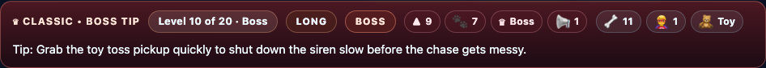

### Daily improvement: start-screen stage tips now preview hazard chips
- Added a compact **hazard chip row** to the start/title **stage tip** callout so upcoming runs now preview key threats like **spikes**, **patrols**, **boss barks**, **currents**, and other stage-specific hazards before the level begins.
- Kept the change local to the existing tip card by reusing level metadata and short icon pills, which makes tricky starts easier to read at a glance without changing gameplay, controls, or progression.
- Verified with `node --check game.js` and a headless Playwright check that forced **Level 10**, confirmed `#summary-tip-hazards` renders **9 spikes**, **7 patrols**, **boss barks**, and **1 siren slow** in its aria labels, and captured the updated screenshot.

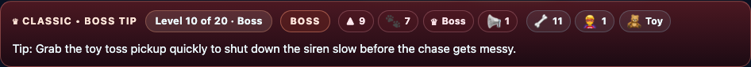

## 2026-07-11
### Daily improvement: start-screen stage tips now preview pickup chips
- Added a compact **pickup chip row** to the start/title **stage tip** callout so upcoming runs now preview key collectibles like **bones**, **hearts**, **capes**, and **toy toss** pickups before the level begins.
- Reused the existing level metadata and compact icon pills, keeping the change visual-first and low-text while making special stages easier to read without opening the HENRY portal.
- Verified with `node --check game.js` and a headless Playwright check that forced **Level 5**, confirmed `#summary-tip-pickups` renders **🦴7**, **🦸1**, and **🧸Toy** with the expected pickup aria label, and captured the updated screenshot.

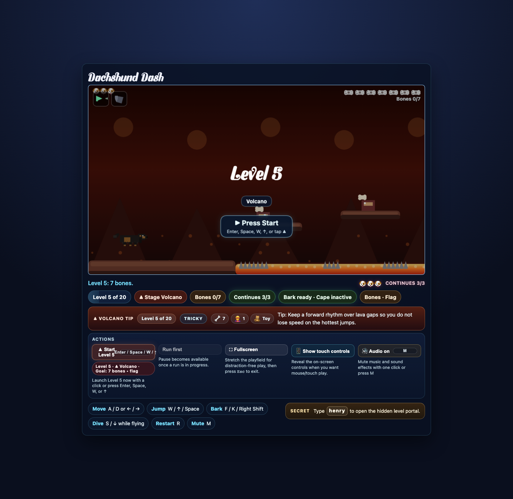

### Daily improvement: start-screen stage tips now show challenge badges
- Added a compact **challenge badge** to the start/title **stage tip** callout so players can see whether the upcoming run is a **Warmup**, **Tricky**, **Tough**, or **Boss** stage without opening the HENRY portal first.
- Reused the game’s existing level difficulty metadata and matching tone colors, keeping the change local to the tip card while making high-pressure starts easier to read at a glance.
- Verified with `node --check game.js` and a headless Playwright check that forced **Level 10**, confirmed `#summary-tip-challenge` renders **Boss** with `data-tone="boss"`, and captured the updated screenshot.

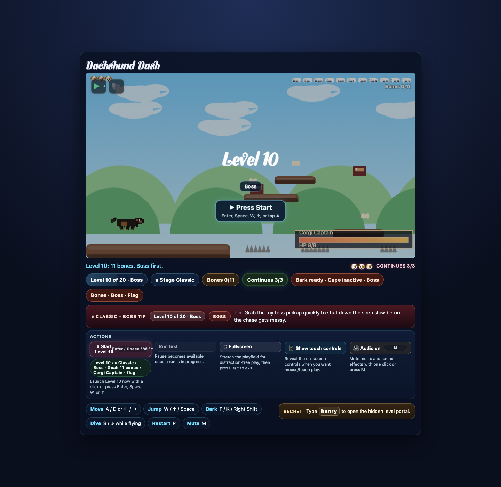

## 2026-07-10
### Daily improvement: stage-aware Start button
- Updated the desktop **Start** quick-action button so launch states now show the matching **stage icon** directly in the label — for example **`◔ Start Level 4`** on moon starts — instead of using the same generic text for every stage.
- The Start button now also picks up the upcoming stage’s tint during launch states, which makes HENRY jumps and other special starts easier to trust at a glance without adding more UI copy.
- Verified with `node --check game.js` plus a headless Playwright check that opened the HENRY portal, selected **Level 4**, confirmed `#btn-start-desktop` renders **`◔ Start Level 4`** with `data-theme="moon"`, and captured the updated screenshot.

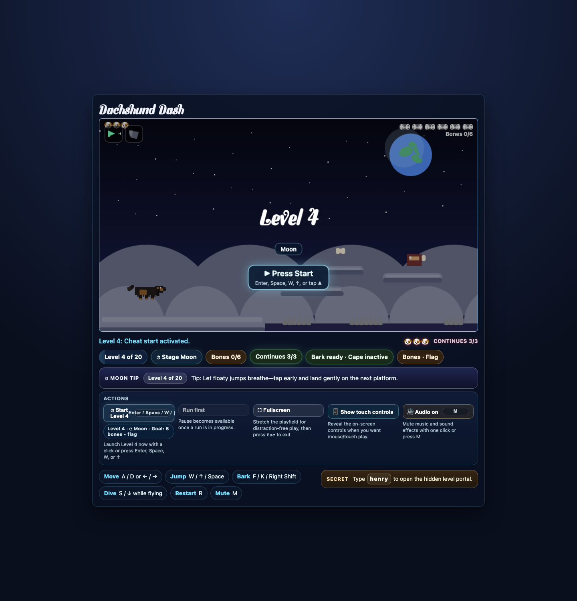

### Daily improvement: start action context preview
- Added a compact **start action preview pill** beneath the desktop Start button so the title screen now spells out the **next level**, **stage theme**, and **goal** before launch.
- The Start button label is now contextual too, using **`Start Level N`** on the opening screen and level intro screens so Henry portal jumps are clearer at a glance.
- Kept the new preview hidden outside of launch states so the action panel stays focused once a run is already underway.

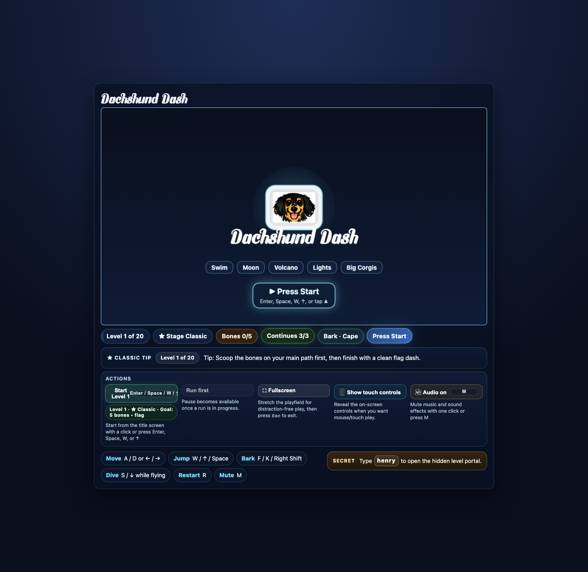

## 2026-07-09
### Daily improvement: stage tip callout now stays out of active gameplay
- Updated the start-screen **stage tip** card so it only appears while players are on the start screen or level-intro screen, then automatically hides once active gameplay begins.
- This keeps the tip useful for onboarding but removes extra reading-heavy UI during platforming, which fits Daniel’s standing preference for less on-screen text.
- Verified with `node --check game.js` and a headless Playwright check that confirmed the `.stage-tip-callout` is visible on the start screen, hidden during active play, and captured the updated screenshot.

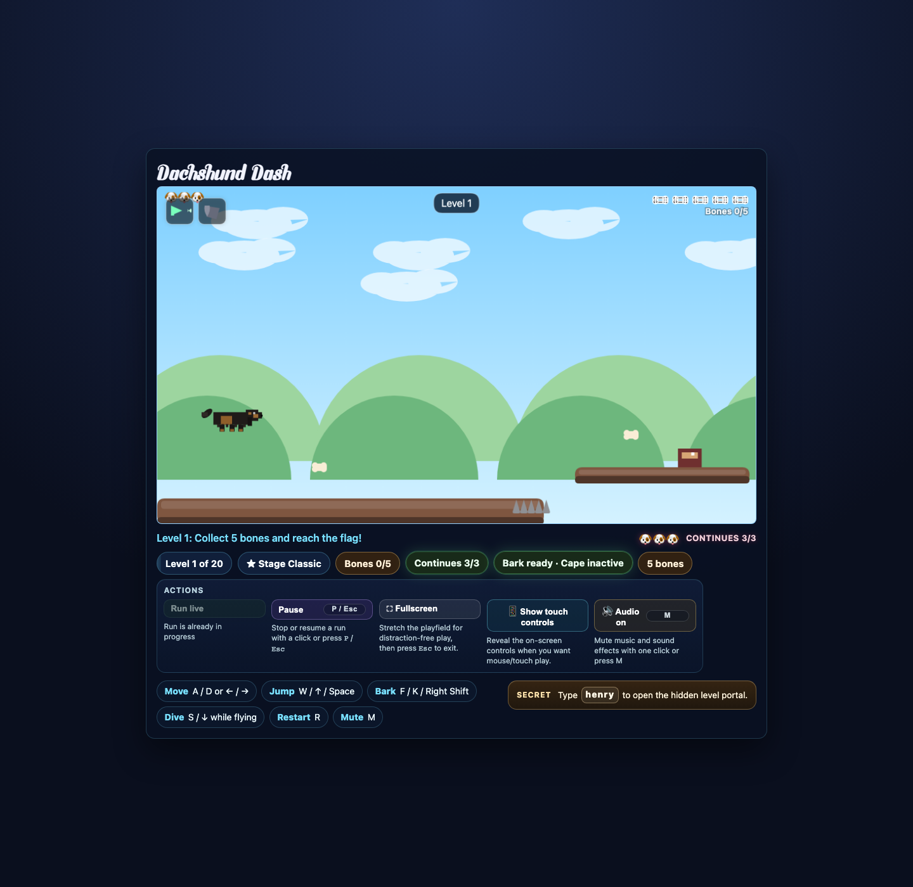

### Daily improvement: stage tip callout now includes the current level badge
- Added a compact **Level X of 20** badge directly inside the start-screen **stage tip** card so players can see the current stage context without scanning back up to the run summary row.
- Kept the change local to the tip callout, which makes the guidance panel easier to read at a glance without changing gameplay, progression, or controls.
- Verified with `node --check game.js` and a headless Playwright check that loaded the title screen, confirmed `#summary-tip-level` renders **Level 1 of 20**, and captured the updated screenshot.

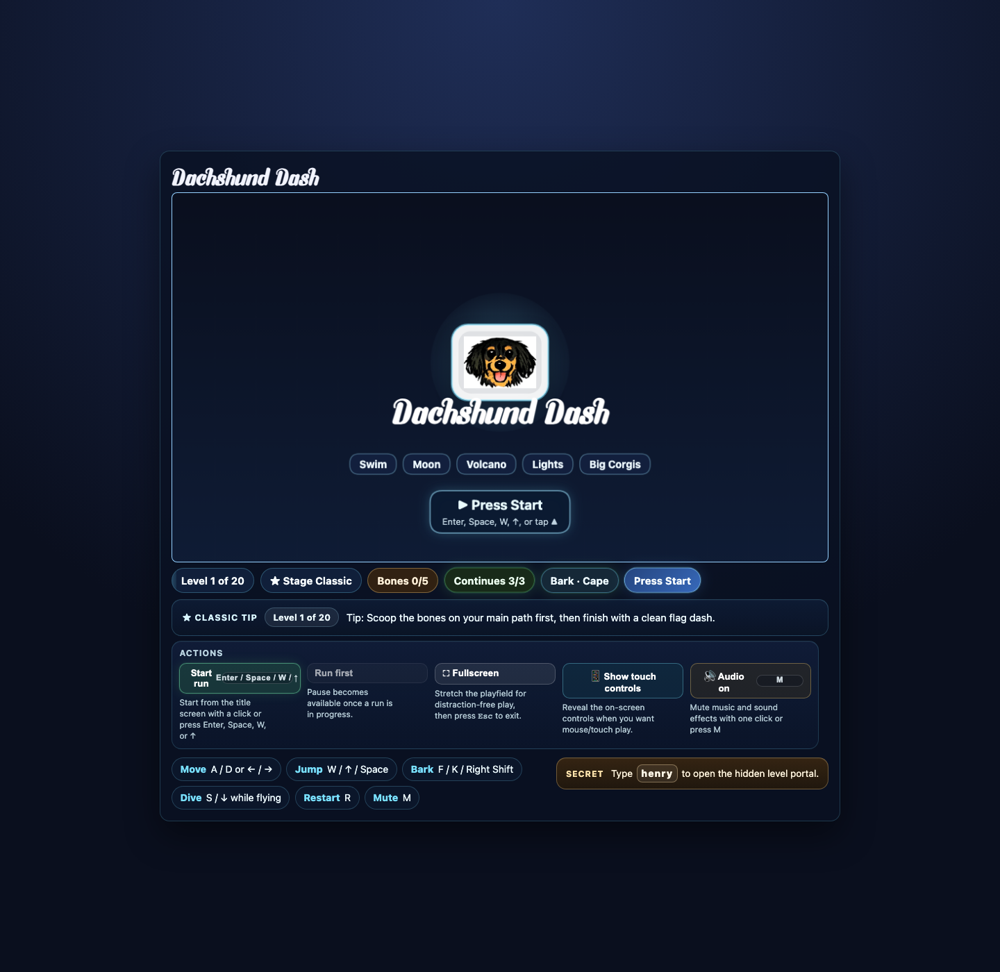

## 2026-07-08
### Daily improvement: HENRY progress theme pill now includes each stage icon
- Updated the hidden **HENRY** portal’s current/default **stage theme** pill so it now shows the matching stage icon too, for example **◔ Stage Moon**, instead of relying on text alone.
- Kept the change local to the compact portal summary, which makes secret-start context easier to scan before jumping into a run without changing gameplay, controls, or progression.
- Verified with `node --check game.js` and a headless Playwright check that forced **Level 4**, opened the HENRY portal, confirmed `#henry-progress-theme` renders **◔ Stage Moon**, and captured the updated screenshot.

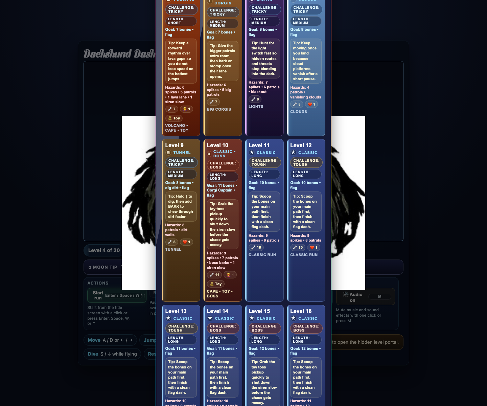

### Daily improvement: run-summary stage pill now includes each stage icon
- Added the matching stage icon directly to the visible **run-summary Stage pill**, so special runs like **◔ Moon**, **≈ Swim**, **☁ Clouds**, and **♛ Boss** scan faster without needing extra text.
- Kept the change local to the summary label only, which makes the stage cue clearer on both the title flow and in-run shell without changing gameplay, controls, or progression.
- Verified with `node --check game.js` and a browser DOM check that forced **Level 4** and confirmed `#summary-theme` renders **◔ Stage Moon**, then captured the updated screenshot.

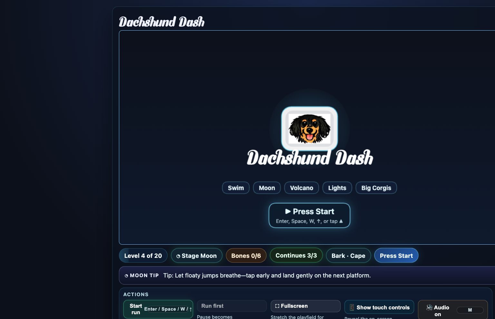

## 2026-07-07
### Daily improvement: stage tips now tint to match each stage theme
- Updated the new start-screen **stage tip** card so it now picks up the current stage theme visually — for example moon tips shift to a cool lunar tint while volcano, tunnel, water, dark, and boss stages each get their own matching treatment.
- Kept the change lightweight by reusing the existing stage-theme metadata, which makes special runs easier to scan at a glance without adding more text or changing gameplay.
- Verified with `node --check game.js` and a headless Playwright check that forced the Level 4 moon start, confirmed the stage-tip card renders with `data-theme="moon"`, and captured the updated screenshot.

### Daily improvement: start screen now shows a contextual stage tip
- Added a compact **stage tip** callout directly under the run summary so the title screen gives one level-specific hint before the first jump instead of leaving that advice buried in the hidden HENRY portal.
- The card reuses the game’s existing stage metadata, so it automatically updates its label and tip text for the current level theme without changing progression, controls, or gameplay rules.
- Verified with `node --check game.js` and a headless Playwright check that confirmed the new `#summary-tip` card renders on the start screen with the expected tip text, then captured the updated screenshot.

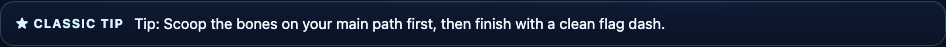

## 2026-07-06
### Daily improvement: pause shortcut badge now waits until a run is active
- Updated the desktop **Pause** quick-action button so it no longer shows the **P / Esc** shortcut badge on the title screen, where pausing is unavailable and the old hint was misleading.
- The shortcut badge now appears only once a run is actually active, which keeps the start screen a little cleaner and makes the pause affordance more truthful without changing controls or game flow.
- Verified with `node --check game.js` and a headless Playwright check that the title screen renders `#btn-pause-desktop` as **Run first** with an empty `data-shortcut`, then switches to **Pause** with `data-shortcut="P / Esc"` after forcing play state; captured the updated screenshot.

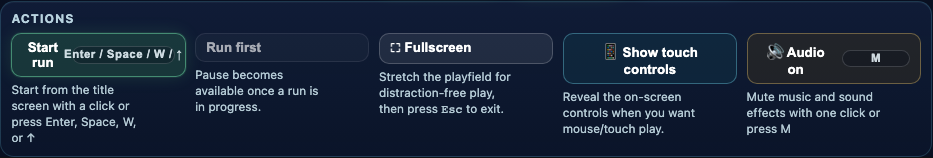

### Daily improvement: HENRY quick jump button now shows its target stage name
- Updated the hidden **HENRY** portal’s quick-jump button so it now includes a visible stage badge like **◔ Moon** before **Jump to Level 4**, instead of leaving the stage context to color alone.
- Kept the change local to the portal summary action, which makes the shortcut easier to scan and trust without changing progression, controls, or cheat-start behavior.
- Verified with `node --check game.js` and a headless Playwright check that loaded the portal on **Level 4**, confirmed `#henry-progress-jump` renders a visible `.henry-progress-action-theme` badge with **◔ Moon** plus the **Jump to Level 4** label, and captured the updated screenshot.

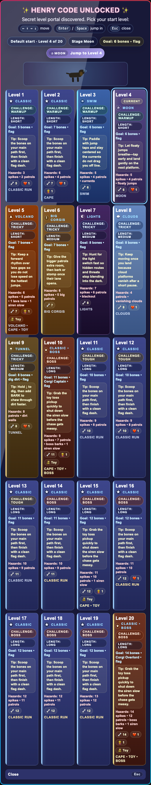

### Daily improvement: HENRY quick jump button now previews its stage theme
- Updated the hidden **HENRY** portal’s quick-jump button so it now carries the target stage’s icon and color treatment, like a moon-tinted **◔ Jump to Level 4**, instead of looking the same for every jump.
- Kept the change local to the portal summary action, which makes the shortcut easier to trust at a glance without adding more reading-heavy copy or changing progression behavior.
- Verified with `node --check game.js` and a headless Playwright check that loaded the portal on **Level 4**, confirmed `#henry-progress-jump` renders **◔ Jump to Level 4** with `data-theme="moon"`, and captured the updated screenshot.

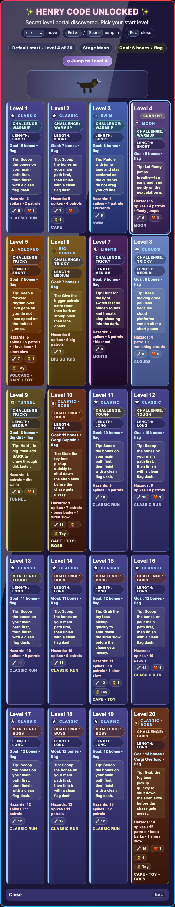

## 2026-07-04
### Daily improvement: recovery shortcuts now stay hidden until they matter
- Hid the **Recovery** shortcut callout on the title screen and level-intro views so the shell only shows those continue/quit shortcuts after a real wipeout, when players can actually use them.
- Kept the change local to the shell help UI, which makes the start screen a little calmer without changing controls, progression, or recovery behavior.
- Verified with `node --check game.js` and a headless Chrome DOM check that the title screen renders `#recovery-shortcut-callout` with the `.hidden` class plus `aria-hidden="true"`, then captured the updated screenshot.

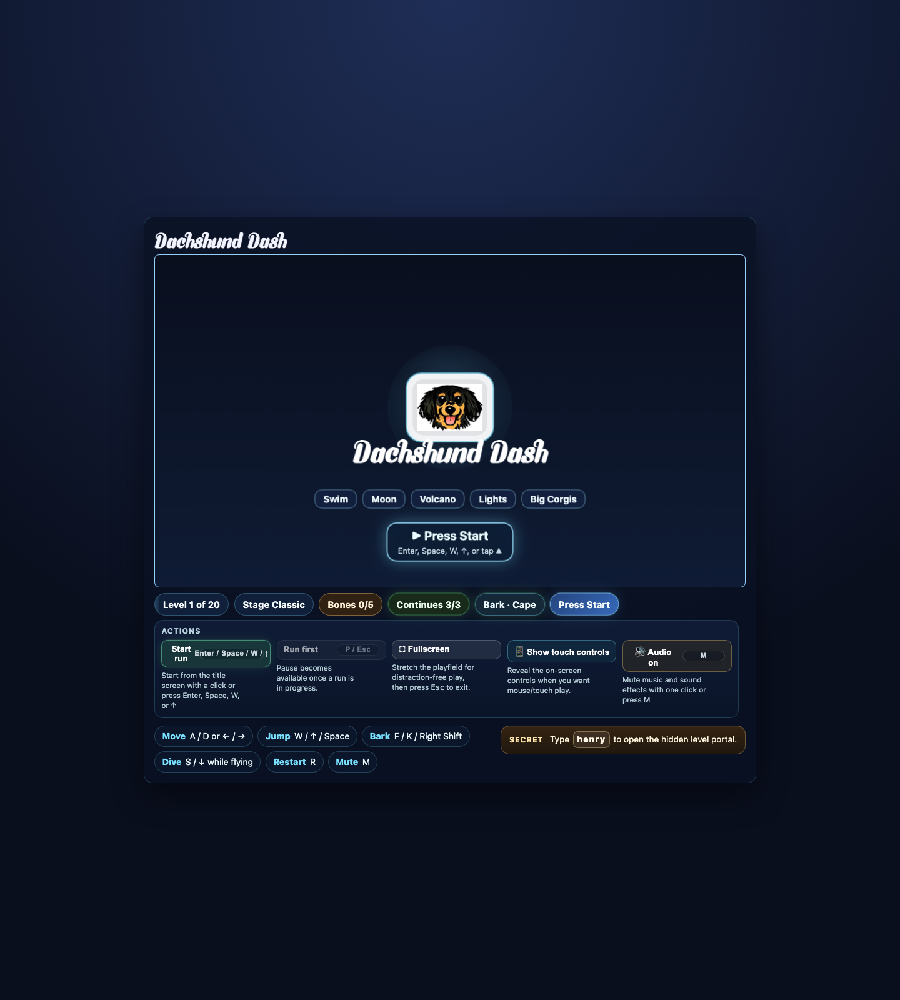

### Daily improvement: HENRY quick jump button now names its target level
- Updated the hidden **HENRY** portal’s quick-jump button so it now says exactly which level it will launch, for example **Jump to Level 1**, instead of the vaguer **default start / current level** wording.
- Kept the change local to the secret-start portal UI, which makes the shortcut action easier to trust at a glance without changing progression, controls, or cheat behavior.
- Verified with `node --check game.js` and a headless Chrome portal check that opened **HENRY**, confirmed the quick-jump button renders **Jump to Level 1**, and captured the updated screenshot.

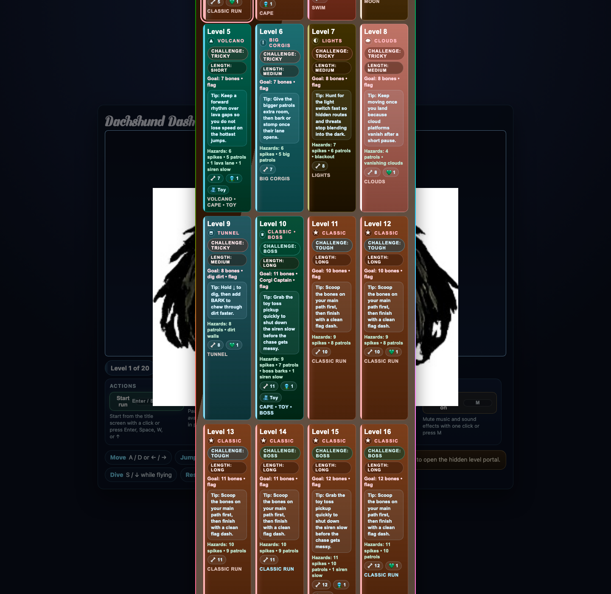

## 2026-07-03
### Daily improvement: start button now shows every launch key
- Updated the desktop **Start run** button so its visible shortcut badge and helper text now list every supported launch key: **Enter**, **Space**, **W**, and **↑**.
- Kept the change local to the start/level-launch UI, making the first action more truthful and easier to discover without changing gameplay, balance, or progression.
- Verified with `node --check game.js` and a headless Playwright check that loaded the title screen, confirmed `#btn-start-desktop` renders **Enter / Space / W / ↑**, confirmed the helper text mentions the same keys, and captured the updated screenshot.

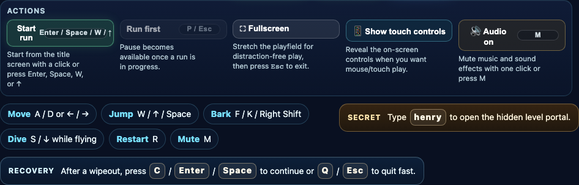

### Daily improvement: recovery shortcuts now use compact action chips
- Reworked the visible **Recovery** helper into two compact action chips — **Continue** and **Quit** — so the wipeout shortcuts stay easy to scan without the older sentence-length callout.
- Kept the change local to the shell help UI, reducing reading-heavy text on the title screen without changing recovery behavior or controls.
- Verified with a headless Playwright check that loaded the title screen, confirmed exactly two `.recovery-shortcut-chip` pills render with the expected **Continue / C / Enter / Space** and **Quit / Q / Esc** shortcuts, then captured the updated screenshot; also re-ran `node --check game.js`.

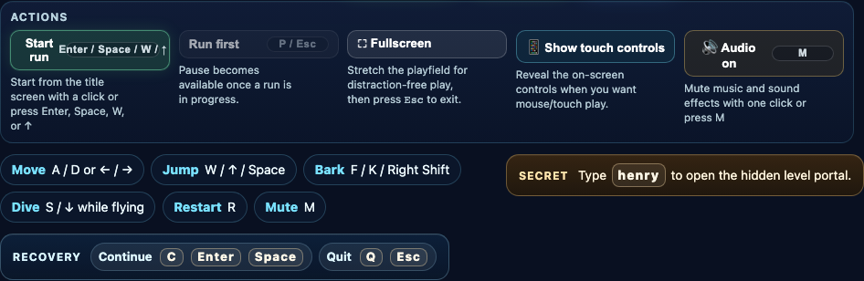

## 2026-07-02
### Daily improvement: HENRY portal close button now shows the Esc shortcut
- Updated the hidden **HENRY** level portal close button so it now includes a visible **Esc** shortcut badge right on the button, making the fastest exit path easier to discover at the moment players want to leave the overlay.
- Kept the change local to the portal UI without changing gameplay, progression, or level-select behavior.
- Verified with `node --check game.js` and a headless Playwright check that opened the **HENRY** portal, confirmed the close button renders both **Close** and **Esc**, and captured an updated screenshot.

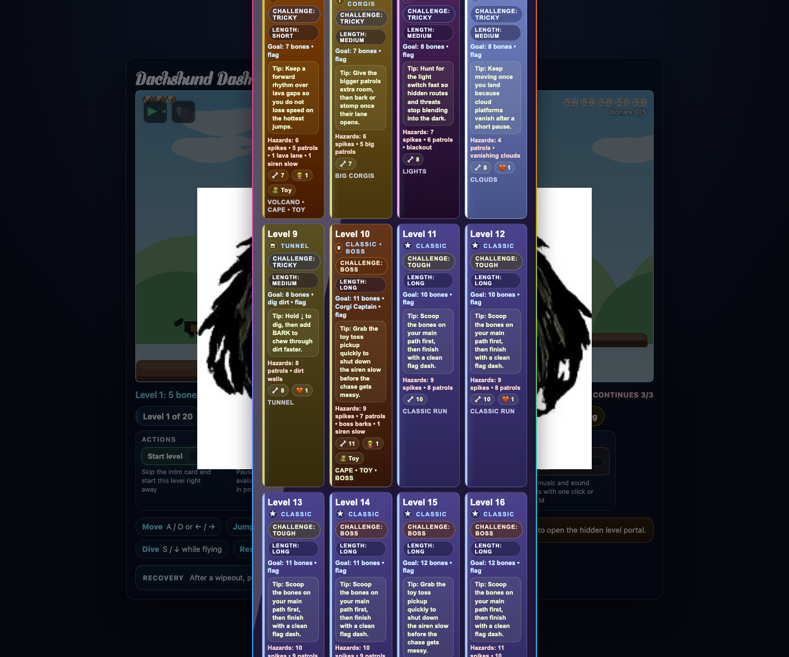

### Daily improvement: touch controls panel now has its own hide button
- Added a small **Hide panel** button directly inside the expanded on-screen controls header, so mouse and touch players can dismiss the control pad without scrolling back up to the **Actions** row.
- Kept the change local to the shell UI, reusing the existing touch-controls visibility logic instead of changing gameplay, balance, or control bindings.
- Verified with `node --check game.js` and a headless Playwright check that opened the touch-controls panel, confirmed the new **Hide panel** button appears, clicked it, and confirmed the panel collapses while the main toggle returns to `aria-expanded="false"`.

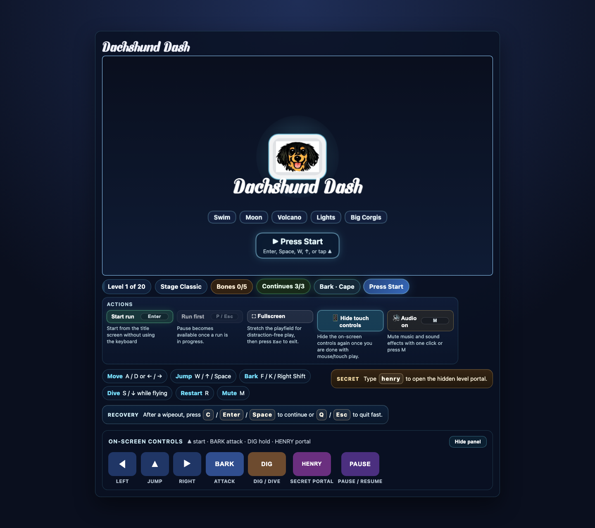

## 2026-07-01
### Daily improvement: recovery action button now uses stateful recovery colors
- Updated the desktop primary action button so wipeout recovery states now change color with the situation: **Continue** uses a warm amber treatment after a faint, while **Restart run** uses a stronger red treatment after full game over.
- This keeps the recovery path more scannable for mouse-first players without adding more on-screen text or changing any gameplay logic.
- Verified with `node --check game.js` plus a headless Playwright check that forced both **dead** and **gameover** states, confirmed the button switches to distinct recovery colors, and captured the screenshot.

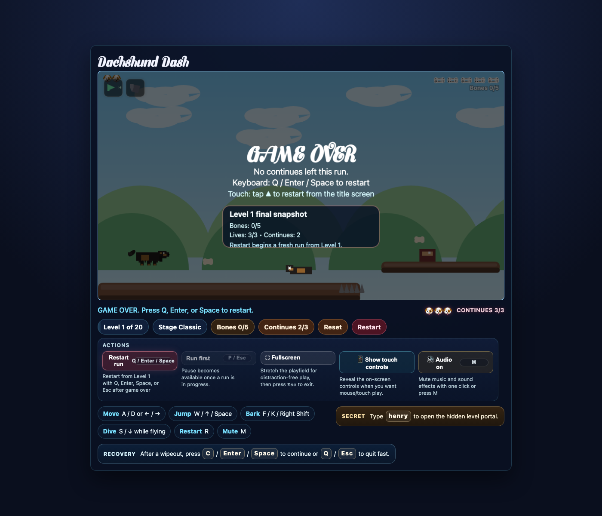

### Daily improvement: recovery action button now shows the real keyboard shortcuts
- Updated the desktop **Continue / Restart run** action button so wipeout states now advertise the same keyboard shortcuts the game already accepts instead of the older partial badge.
- The fainted state now shows **C / Enter / Space**, and the game-over state now shows **Q / Enter / Space** with matching hint copy, which makes recovery options more truthful and easier to discover.
- Verified with `node --check game.js` plus a headless Playwright check that forced both **dead** and **gameover** states, confirmed the button labels, shortcut badges, and helper text, and captured the screenshot.

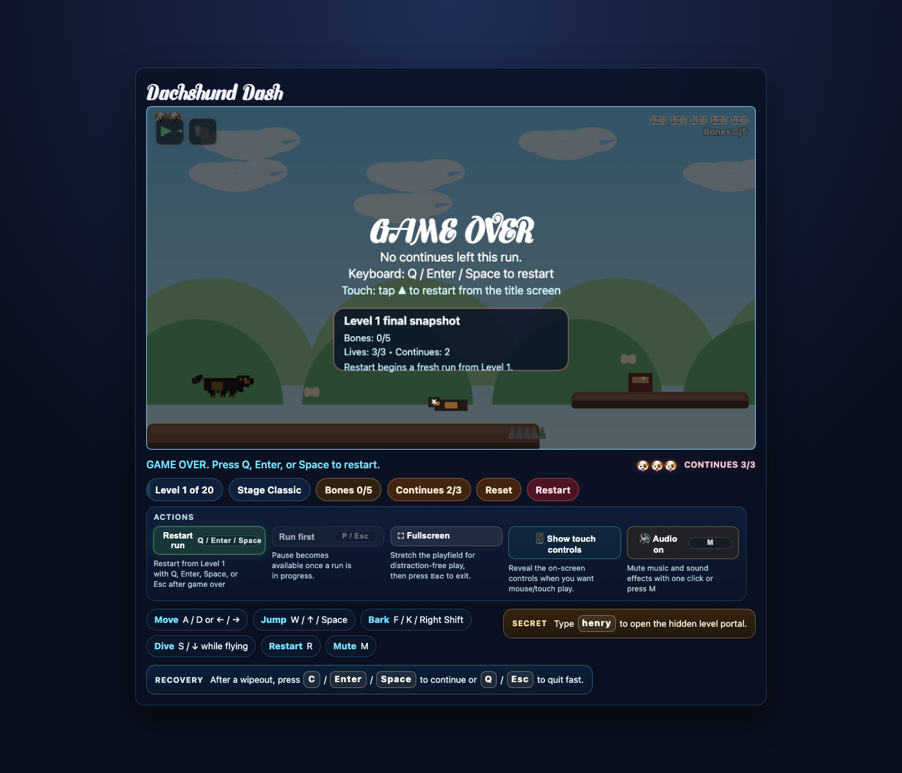

## 2026-06-30
### Daily improvement: HENRY portal now offers a one-click quick jump
- Added a compact **Jump to default start / Jump to current level** button inside the hidden **HENRY** portal so players can relaunch the anchored run immediately without scanning the whole level grid.
- The button text updates with portal state, stays next to the new progress strip, and uses the same reset-lives cheat-start behavior as picking the current card manually.
- Verified with `node --check game.js` and a headless Playwright check that opened the portal, confirmed the button label reads **Jump to default start**, activated it, confirmed the portal closes and the status updates to **Level 1: Quick jump activated.**, then reopened the portal and captured the screenshot.

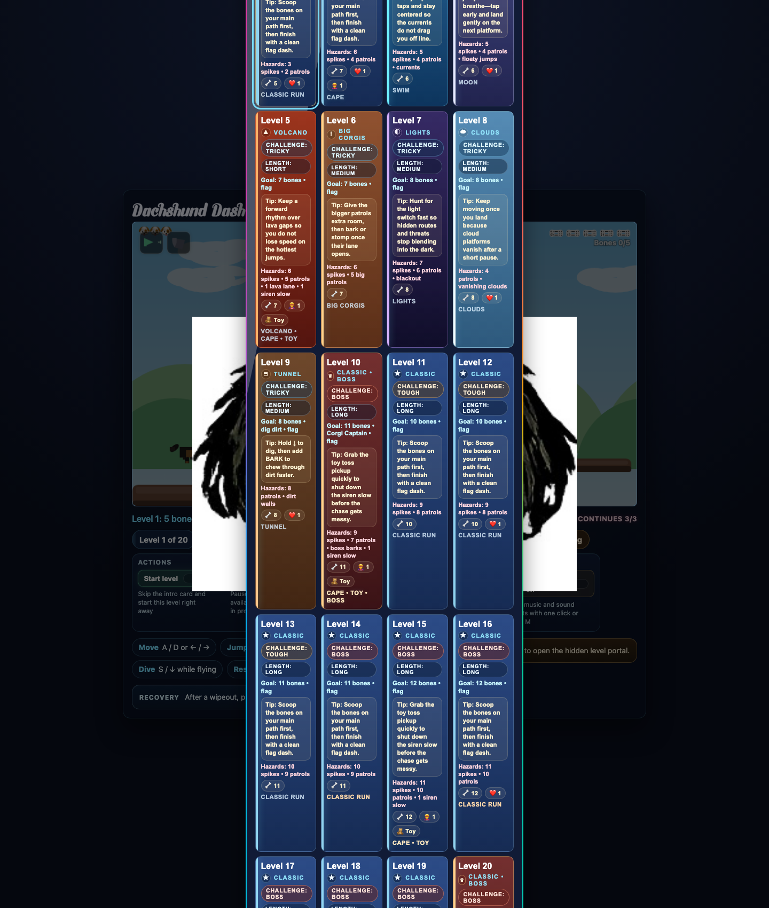

### Daily improvement: HENRY portal now shows your current/default run summary
- Added a compact **progress strip** above the hidden **HENRY** level grid so the portal now tells you which start it is anchored to before you pick a different level.
- The new pills surface the **current/default level**, **stage theme**, and **goal** in one glance, which makes cheat-start decisions easier without changing gameplay, balance, or progression.
- Verified with `node --check game.js` and a headless Playwright check that opened the portal, confirmed the new summary reads **Default start · Level 1 of 20**, **Stage Classic**, and **Goal: 5 bones • flag**, and captured the updated screenshot.

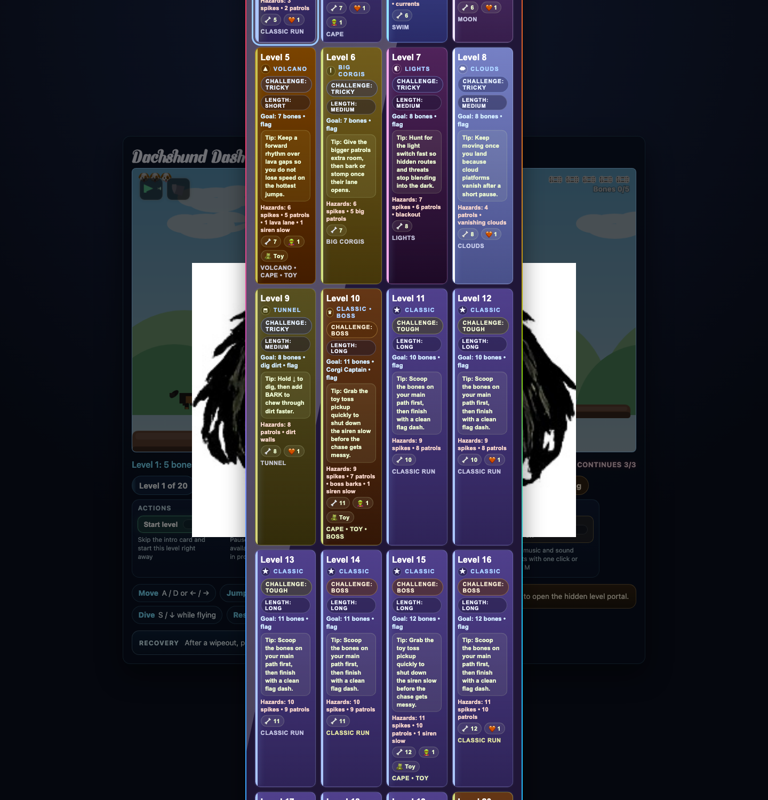

## 2026-06-29
### Daily improvement: touch controls now show a held/pressed state
- Added a real visual **held** state to the on-screen control buttons so touch players can immediately see which button is active while steering, jumping, digging, pausing, or opening the secret portal.
- Extended the feedback beyond the button face by brightening the matching control caption too, making long presses like **Left**, **Right**, and **DIG** easier to track during play.
- Verified with `node --check game.js` and a headless Playwright check that opened the touch-controls panel, triggered `pointerdown` on **Left**, confirmed both the button and its caption gain the new `.is-held` state, confirmed the state clears on `pointerup`, and captured the updated screenshot.

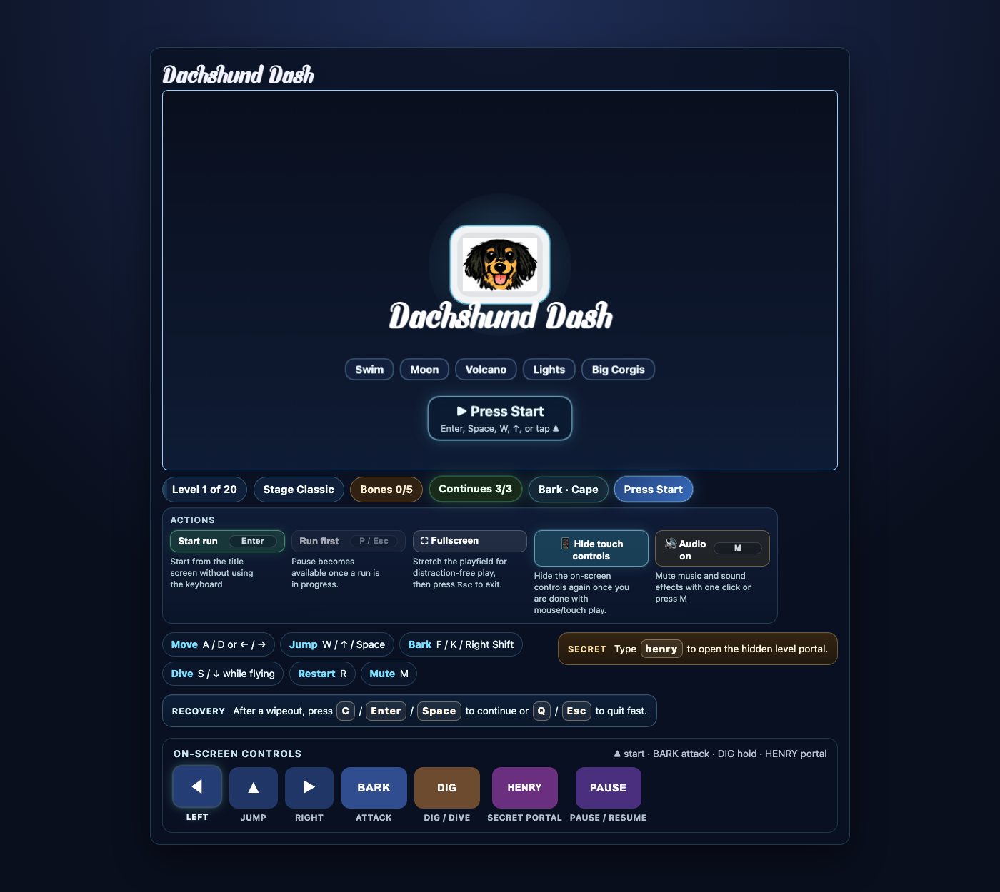

### Daily improvement: start-screen run summary now shows continues
- Added a new **Continues 3/3** run-summary pill so players can see the per-level continue budget even on the start screen, where the main HUD stays hidden.
- Kept the change local to the run-summary UI by mirroring the existing continue count and shifting the pill tone as the level respawn budget drops.
- Verified with `node --check game.js` and a headless Playwright check that loaded the start screen, confirmed `#summary-continues` renders **Continues 3/3**, confirmed the HUD remains hidden while `.run-summary` stays visible, and captured the updated screenshot.

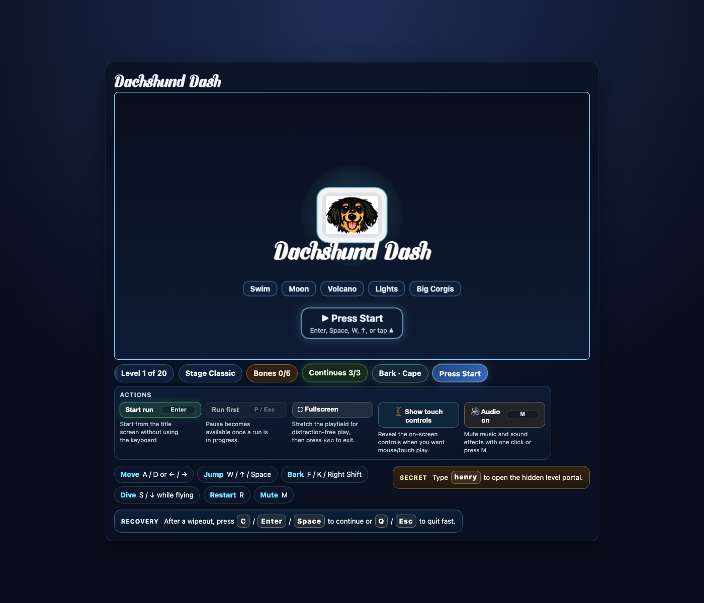

## 2026-06-28
### Daily improvement: HENRY portal cards now use compact pickup chips
- Reworked the hidden **HENRY** level-select pickup line into compact chips like **🦴 5**, **❤️ 1**, **🦸 1**, and **🧸 Toy** so secret-start cards stay scannable without the older reading-heavy text line.
- Kept the change local to the portal card UI, preserving gameplay, balance, progression, and controls while making level rewards easier to parse at a glance.
- Verified with `node --check game.js` and a headless Playwright check that opened the HENRY portal, confirmed pickup chips render on the cards, and captured the updated screenshot.

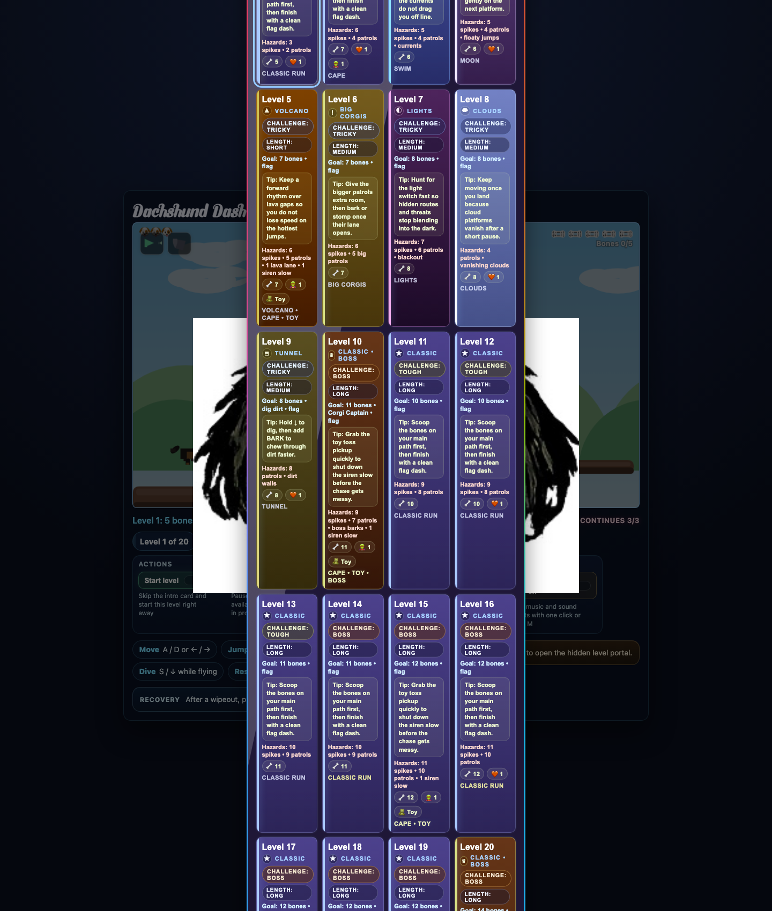

### Daily improvement: HENRY portal cards now show counted hazards
- Reworked the hidden **HENRY** level-select hazard line so it now shows concrete counts like **3 spikes**, **4 patrols**, or **1 lava lane** instead of only generic hazard labels.
- Kept the change local to the portal card copy, making secret-start planning clearer without changing movement, balance, progression, or combat behavior.
- Verified with `node --check game.js` and a headless Playwright check that opened the HENRY portal, confirmed counted hazard text appears on the cards, and captured the updated screenshot.

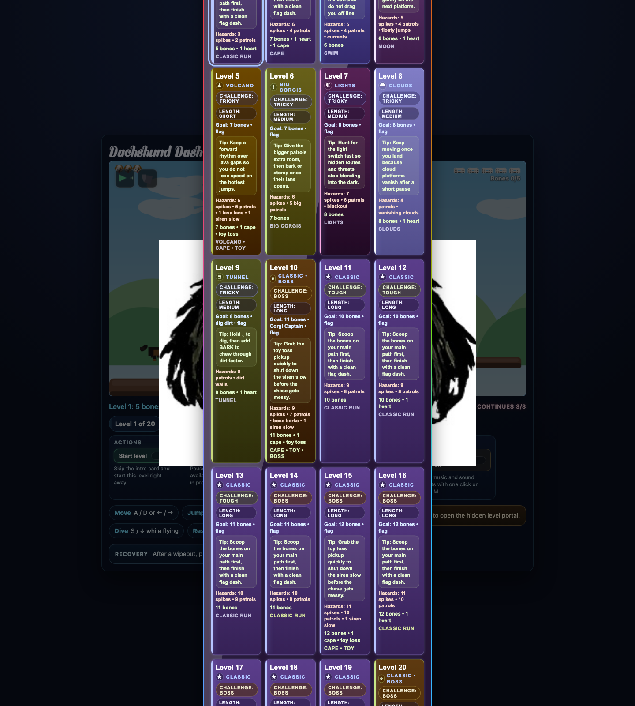

## 2026-06-27
### Daily improvement: HENRY portal cards now show compact stage-length badges
- Added a compact **Length** badge to every hidden **HENRY** level-select card so players can quickly spot short warmups versus longer gauntlet starts before jumping in.
- Kept the change local to the secret portal UI, improving level-pick planning without changing gameplay, balance, progression, or controls.
- Verified with `node --check game.js` and a headless Playwright check that opened the HENRY portal, confirmed all 20 cards render `.level-btn-length` badges, confirmed Short/Medium/Long variants all appear, and captured the updated screenshot.

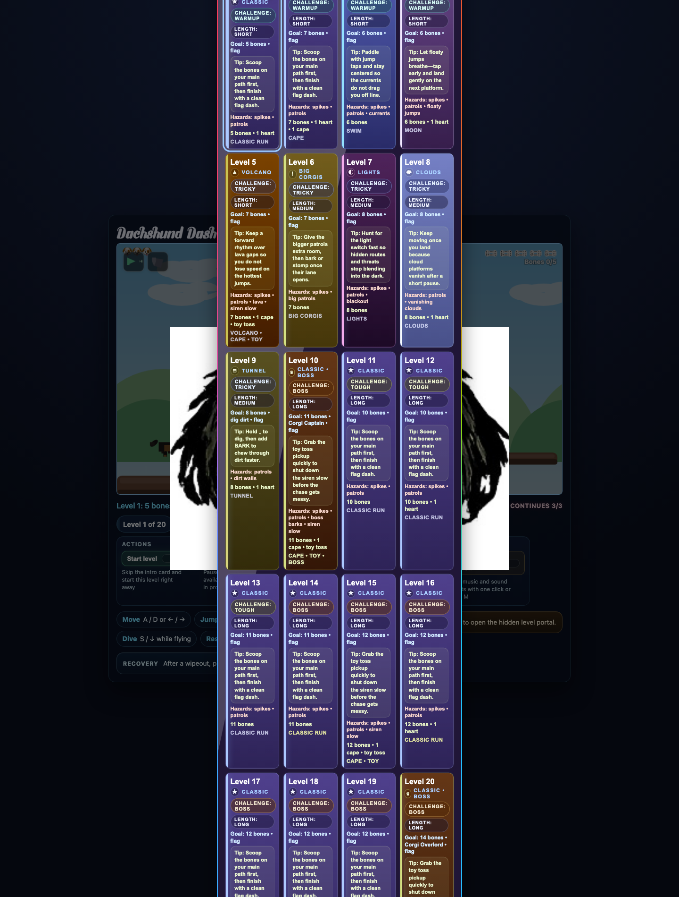

### Daily improvement: HENRY portal cards now include stage-specific tip lines
- Added a compact **Tip** callout to every hidden **HENRY** level-select card so players get a quick stage-specific hint before jumping in, like digging faster in tunnels or staying centered in water currents.
- Kept the change local to the secret portal UI, improving level-pick clarity without changing movement, balance, progression, or combat rules.
- Verified with `node --check game.js` and a headless Playwright check that opened the HENRY portal, confirmed all 20 cards render `.level-btn-tip` lines, confirmed tunnel and water-specific tip text appears, and captured the updated screenshot.

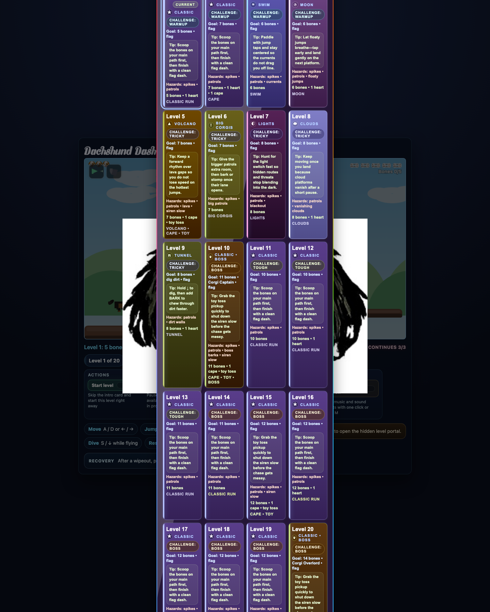

## 2026-06-26
### Daily improvement: HENRY portal cards now show compact stage icons
- Added tiny themed stage icons to the hidden **HENRY** level-select cards so players can scan classic, swim, moon, cloud, tunnel, volcano, dark, giant, and boss starts faster with less reading.
- Kept the change local to the secret portal UI, improving visual wayfinding without changing gameplay, progression, or balance.
- Verified with `node --check game.js` and a headless Playwright check that opened the HENRY portal, confirmed all 20 cards render `.level-btn-stage-icon` badges including moon/cloud/boss variants, and captured the updated screenshot.

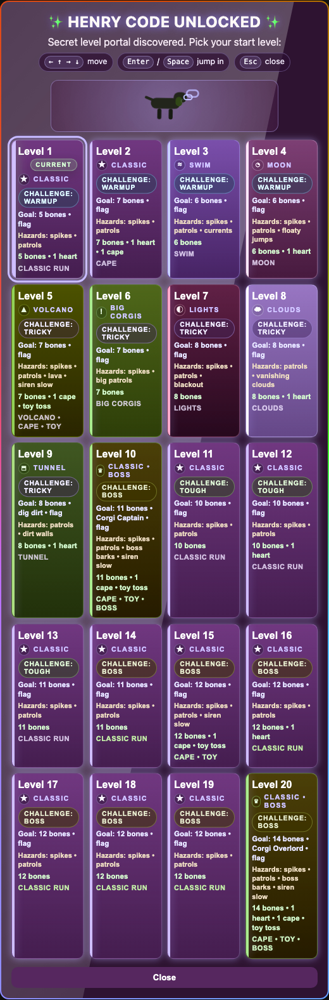

### Daily improvement: HENRY portal now shows its keyboard shortcuts
- Added a compact shortcut strip to the hidden **HENRY** level portal so players can immediately see **arrow-key movement**, **Enter / Space** to jump into a selected level, and **Esc** to close the overlay.
- Kept the change local to the secret portal UI, improving discoverability for the existing keyboard flow without changing gameplay, progression, or balance.
- Verified with `node --check game.js` and a headless Playwright check that opened the HENRY portal, confirmed all three shortcut chips render, and captured the updated screenshot.

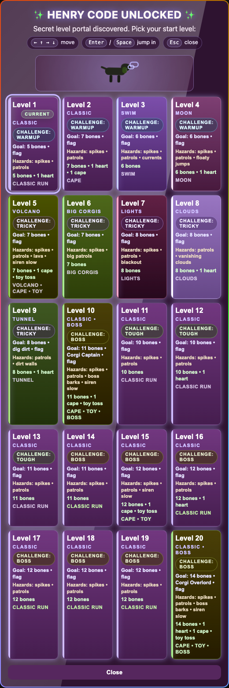

## 2026-06-25
### Daily improvement: HENRY level select now supports arrow-key grid navigation
- Added real **arrow-key navigation** to the hidden **HENRY** level-select grid, so keyboard players can move between secret-start cards with **← ↑ → ↓** and launch the focused level with **Enter** or **Space**.
- Kept the change local to the portal UX, making cheat-start selection faster without adding more reading-heavy UI or changing gameplay.
- Verified with `node --check game.js` and a headless Playwright check that opened the HENRY portal, confirmed initial focus starts on **Level 1**, and confirmed **ArrowRight** moves focus to **Level 2** before capturing the updated screenshot.

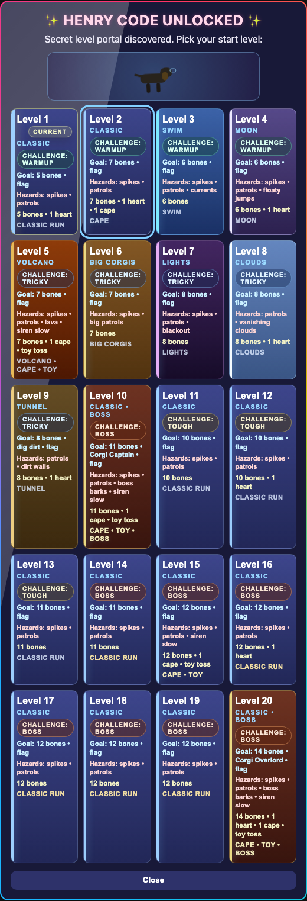

### Daily improvement: HENRY level select now shows compact challenge tags
- Added a small **Challenge** pill to every hidden **HENRY** level-select card so players can scan which secret starts feel like a **Warmup**, **Tricky**, **Tough**, or full **Boss** run before jumping in.
- Kept the change local to the portal UI, improving level-pick readability without changing movement, combat, layouts, or balance.
- Verified with `node --check game.js` and a headless Playwright check that opened the HENRY portal, confirmed the new `.level-btn-difficulty` tags render, and captured the updated screenshot.

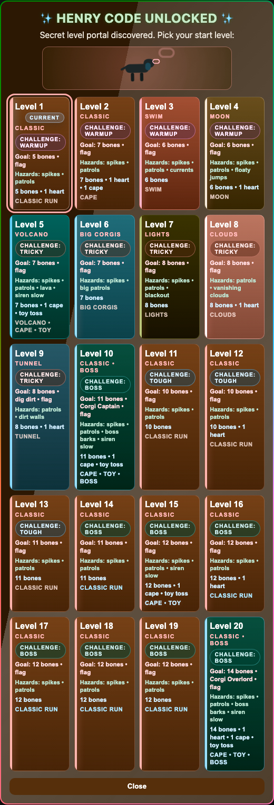

## 2026-06-24
### Daily improvement: recovery shortcut callout now matches the real keys
- Expanded the visible **Recovery** helper so it now truthfully lists every supported desktop recovery key: **C / Enter / Space** to continue and **Q / Esc** to quit after a wipeout.
- Kept the change small and local to the shell copy, improving trust in the controls without touching gameplay, balance, or flow.
- Verified with a headless Playwright check that loaded the page, confirmed the recovery callout text includes **Enter**, **Space**, and **Esc**, and captured the updated screenshot.

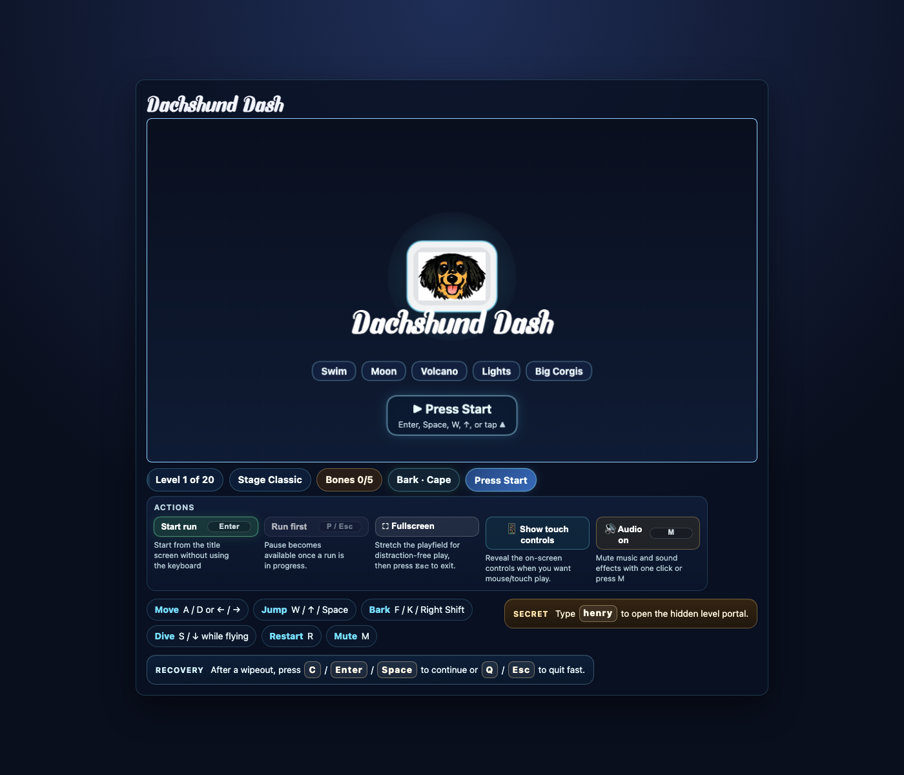

### Daily improvement: start screen now keeps the run summary visible
- Kept the **run summary strip** visible on the start screen so players can immediately see **Level 1 of 20**, the current stage theme, bone target, and **Press Start** goal before the first input.
- Kept the HUD status text hidden there, so the start screen gains useful run context without adding extra duplicate copy above the canvas.
- Verified with `node --check game.js` and a headless Playwright check that confirmed the start-screen summary renders with `display: flex` while the HUD remains hidden, then captured the updated screenshot.

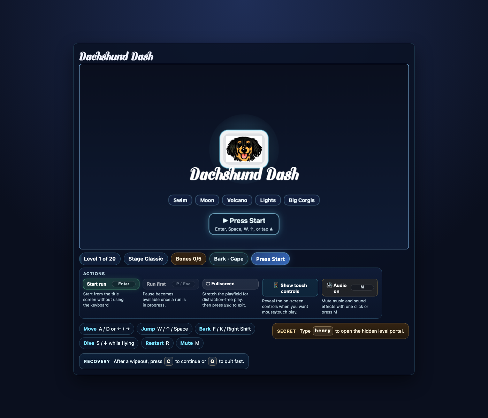

## 2026-06-23
### Daily improvement: HENRY portal now highlights the current level card
- Added a compact **Current** badge plus a brighter gold outline to the hidden **HENRY** level portal so the active level stands out immediately instead of blending into the full grid.
- Kept the change local to the portal UI, improving mid-run re-entry and level orientation without changing movement, combat, or level balance.
- Verified with `node --check game.js` and a headless Playwright check that opened the HENRY portal, confirmed the **Current** badge renders on **Level 1**, and captured the updated portal screenshot.

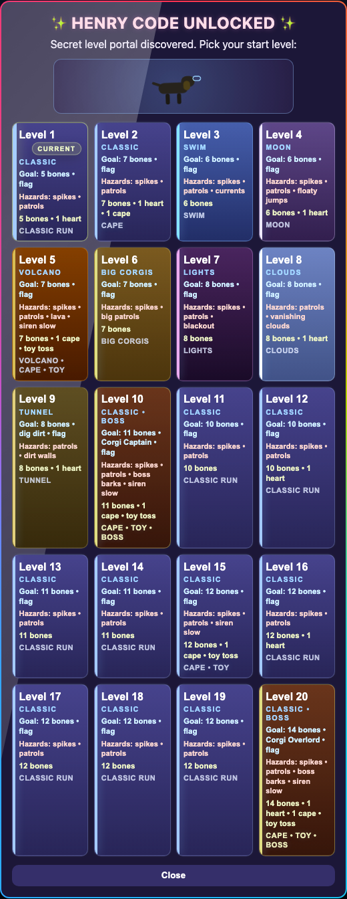

### Daily improvement: HENRY portal now auto-focuses the active level card
- When the hidden **HENRY** level portal opens, it now automatically moves keyboard focus onto the active level card so players can immediately see and use the right spot in the grid.
- Kept the change local to portal behavior, improving keyboard/mouse re-entry without touching gameplay, level balance, or controls.
- Verified with `node --check game.js` and a headless Playwright check that opened the HENRY portal, confirmed the focused element is the **Level 1** current card, and captured the updated portal screenshot.

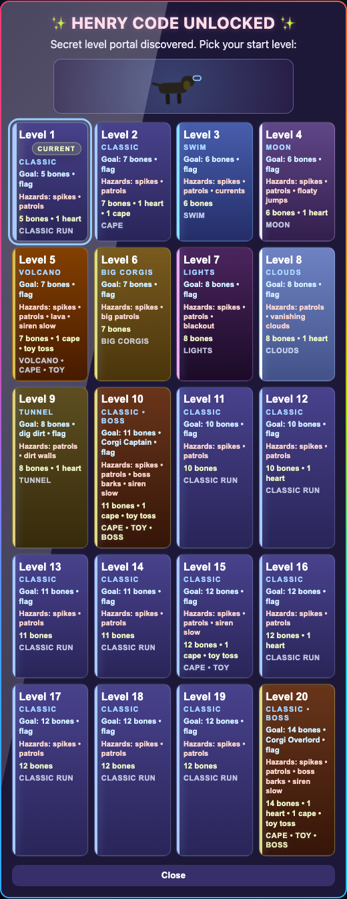

## 2026-06-22
### Daily improvement: HENRY level select cards now use stage-tinted theme art
- Added **theme-tinted card gradients** to the hidden **HENRY** level-select portal so Classic, Swim, Moon, Volcano, Tunnel, Clouds, Dark, and Boss stages pop visually before players read the text.
- Kept the change compact and local to the secret level-select styling, improving scan speed without changing gameplay, balance, or controls.
- Verified with `node --check game.js` and a headless Playwright check that opened the HENRY portal, confirmed multiple distinct `data-theme` card styles render, and captured the updated portal screenshot.

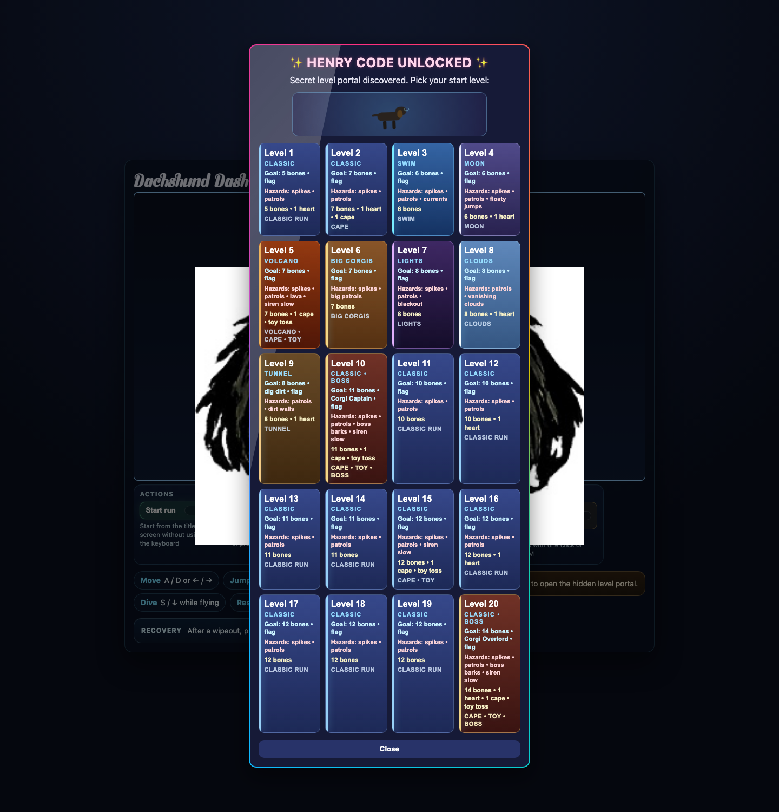

### Daily improvement: HENRY level select now previews each stage's hazards
- Added a compact **Hazards** line to every hidden **HENRY** level-select card so players can spot threats like **spikes**, **patrols**, **currents**, **floaty jumps**, **dirt walls**, and **boss barks** before jumping in.
- Kept the change local to the cheat portal UI, making stage selection more readable without touching core movement, combat, or level layouts.
- Verified with `node --check game.js` and a headless Playwright check that opened the HENRY portal, confirmed the new hazard lines render, and captured the updated portal screenshot.

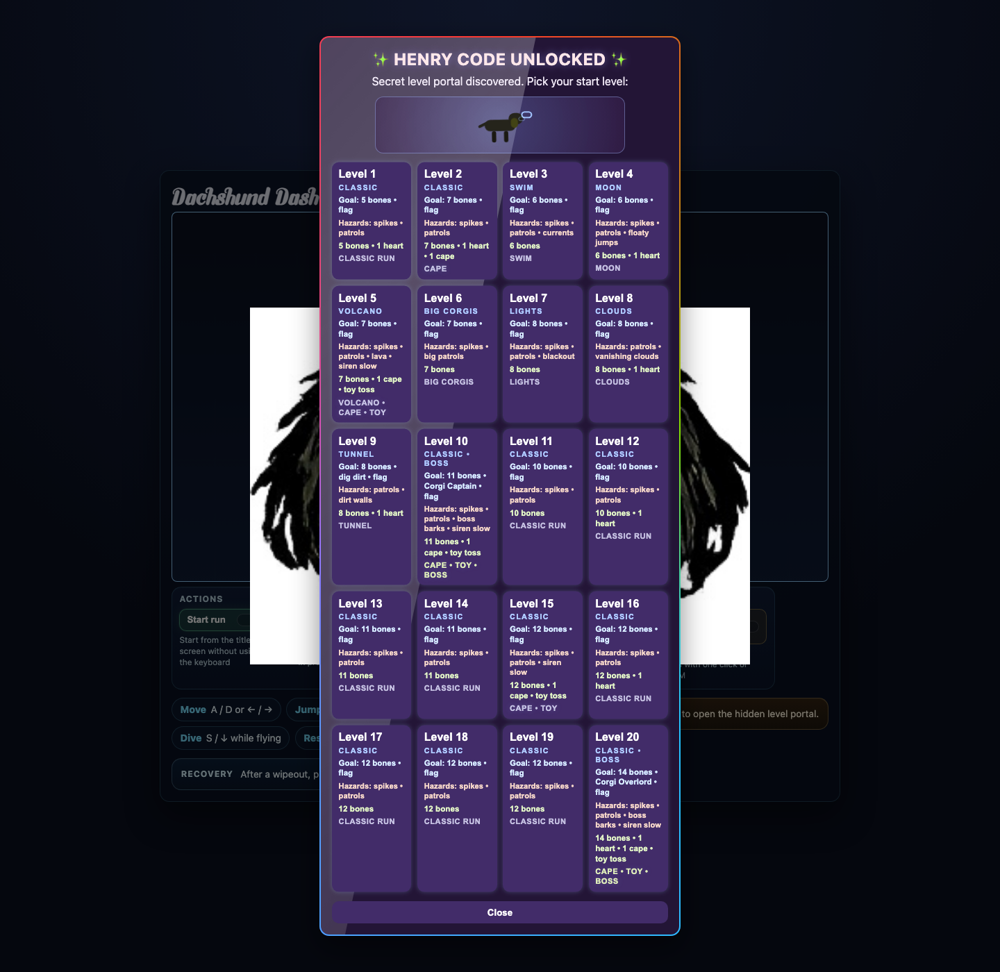

## 2026-06-21
### Daily improvement: HENRY level select now labels each stage theme
- Added a compact uppercase **stage label** to every hidden **HENRY** level-select card, so secret starts are easier to scan than the old Level-only headings.
- Theme cards now surface labels like **Swim**, **Moon**, **Volcano**, **Clouds**, **Tunnel**, and **Classic • Boss** directly in the card body without adding a big new text block.
- Verified with `node --check game.js` and a headless Playwright check that opened the HENRY portal, confirmed the stage labels render in order, and captured the updated portal screenshot.

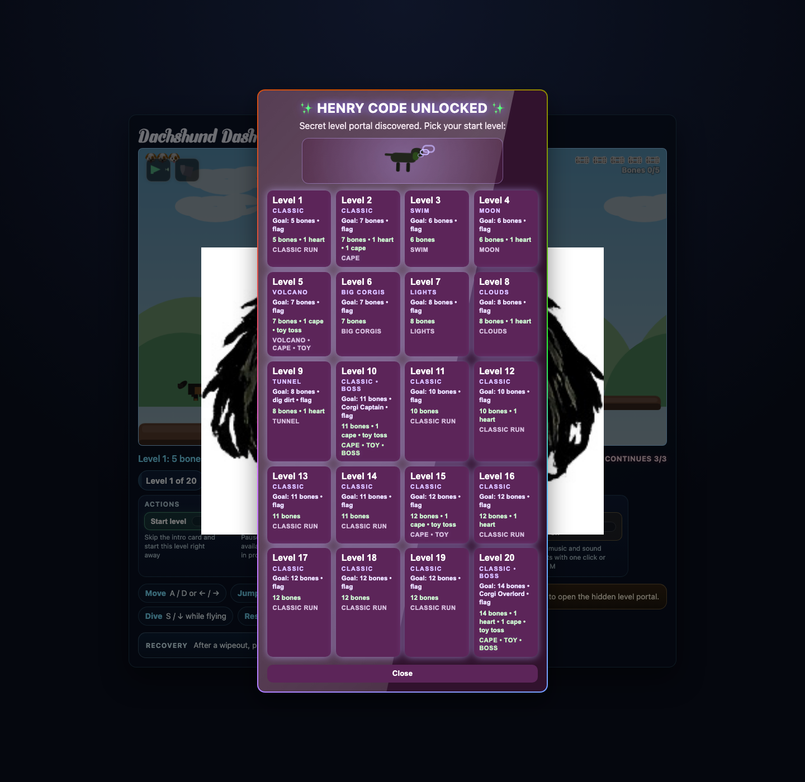

### Daily improvement: HENRY level select now shows each level's goal
- Added a compact **Goal** line to every hidden **HENRY** level-select card so players can see the objective before jumping in.
- Boss cards now surface the boss step there too, and tunnel stages call out the new **dig dirt** requirement instead of leaving it implicit.
- Verified with `node --check game.js` and a headless Playwright check that opened the HENRY portal, confirmed goal lines like **"Goal: 5 bones • flag"** and **"Goal: 8 bones • dig dirt • flag"**, and captured the updated portal screenshot.

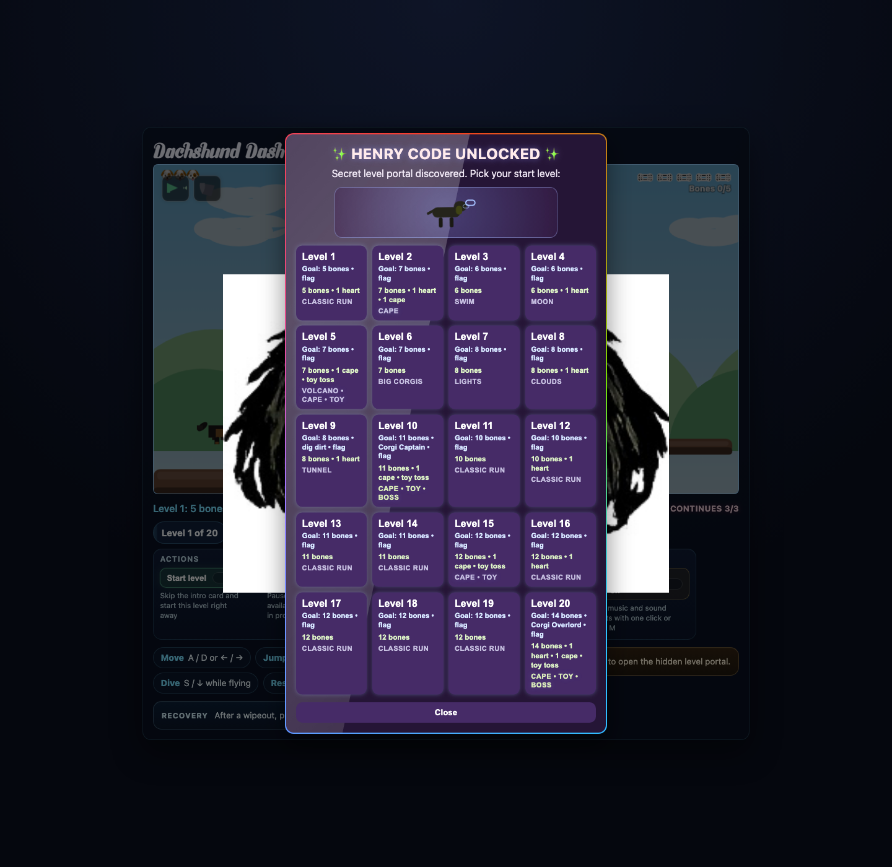

## 2026-06-20
### Daily improvement: tunnel stages now surface the dig control in the live summary strip
- Updated the run-summary **power pill** on tunnel stages so it now shows **Dig ↓** instead of an irrelevant inactive cape status, keeping the required input visible during Level 9 play.
- Kept the change compact and stage-specific, so non-tunnel levels still show the normal Bark/Cape readiness info without adding extra reading-heavy UI.
- Verified with `node --check game.js` and a local Playwright browser check that opened the HENRY portal, selected **Level 9**, confirmed the summary pill text, and captured the updated strip.

### Daily improvement: quick action buttons now show their keyboard shortcuts
- Added compact **shortcut badges** directly onto the desktop **Start run**, **Pause/Resume**, and **Audio** buttons so the matching keys are visible right where players click.
- Kept the badges in sync with each button's changing state, so the start action now surfaces **Enter**, **P / Esc**, **C**, or **R** when those shortcuts actually apply.
- Verified with `node --check game.js` and a local Playwright check that confirmed the new button badges render with the expected shortcuts before capturing the updated controls panel.

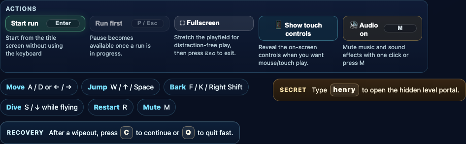

## 2026-06-19
### Daily improvement: Level 9 preview now teaches the dig controls before the tunnel starts
- Added a tunnel-specific **Dig** line to the Level 9 intro preview so players now see **hold ↓ to dig** and **↓ + BARK to chew faster** before they drop into the dirt.
- Also surfaced **dirt walls** in the preview’s danger list and let the preview card grow to fit the extra hint cleanly instead of cramming the layout.
- Verified with `node --check game.js` and a local Playwright browser check that opened the HENRY level portal, selected **Level 9**, and captured the updated preview card.

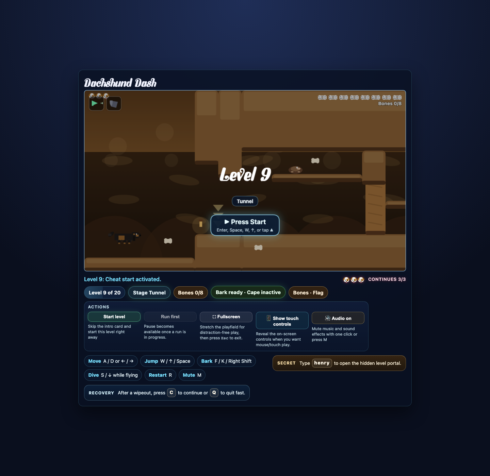

### Daily improvement: start prompt now shows the real launch shortcuts
- Expanded the in-canvas **Press Start** card so it now includes the actual launch inputs right where players first look: **Enter, Space, W, ↑, or tap ▲**.
- Kept the change local to the title/start prompt, making the first action clearer without changing flow, level logic, or controls.
- Verified with `node --check game.js` and a local Playwright browser capture confirming the new shortcut line renders cleanly on the start screen.

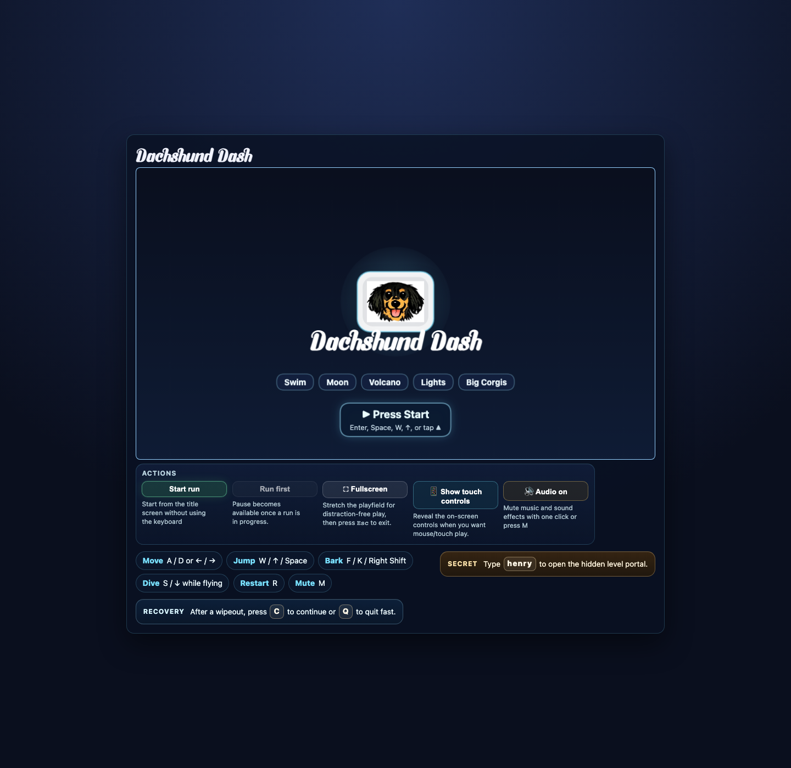

## 2026-06-18
### Daily improvement: pause quick action now clearly waits for a live run
- Made the desktop **Pause** quick-action button context-aware so it no longer looks clickable before gameplay actually begins.
- On the title flow, the button now reads **Run first**, stays disabled, and explains that pausing unlocks once the run is in progress; once gameplay starts, it switches back to the normal **Pause** / **Resume** behavior.
- Verified with a Playwright browser check that the button is disabled on the start screen and becomes enabled after starting into live gameplay, then captured an updated screenshot of the actions panel.

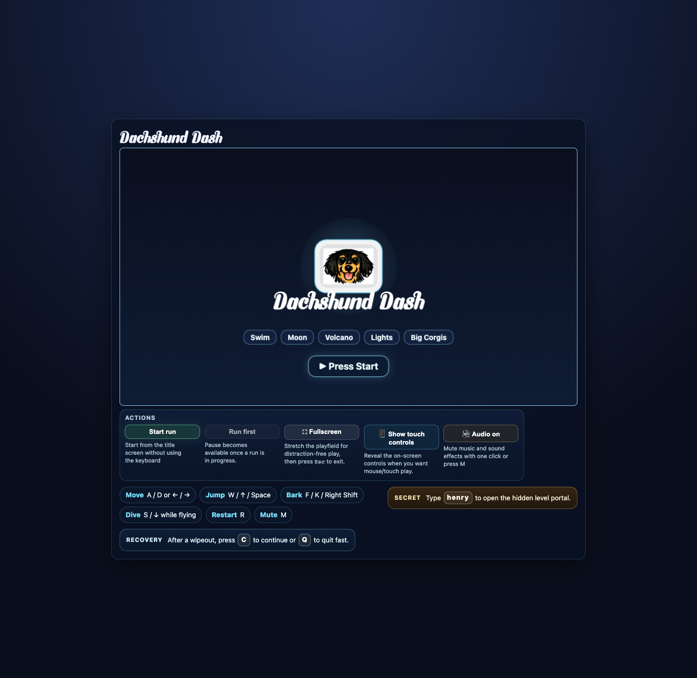

### Daily improvement: finish flags now glow when the level exit is truly ready
- Added a **live ready-state glow** to level finish flags once every required bone is collected (and any boss is down), so the real exit pops visually instead of looking the same as a locked flag.
- Ready flags now **flutter a bit wider and shed small sparkles**, which makes the final objective easier to spot without adding more instruction text to the screen.
- Verified with `node --check game.js` and a Playwright browser inspection that forced a flag-ready state, then captured the new visual treatment in-canvas.

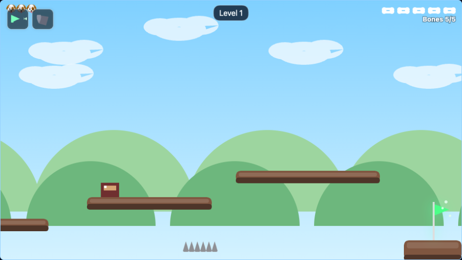

### Requested mobile controls update: HENRY portal access and tunnel digging now work on phones
- Added a mobile-only **HENRY portal chip** on the immersive start screen, plus a matching **HENRY** touch button, so phone players can open the hidden level-select without needing a hardware keyboard.
- Added real mobile digging support in two places: a dedicated **DIG** touch button in the control row, and an immersive **hold bottom-center to dig** gesture for tunnel stages so players cannot get stuck in Level 9.
- In tunnel stages, mobile gameplay now also shows a compact **HOLD DIG** cue above the center touch zone to make the new gesture visible.
- Verified with `node --check game.js` and a Playwright mobile check confirming the HENRY chip opens level select from the immersive start screen and a held center touch sets `state.keys.down = true` on Level 9, then releases cleanly.

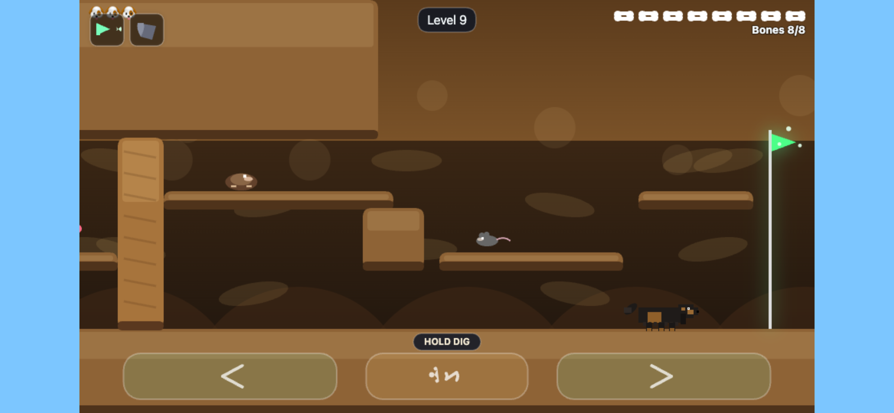

### Requested audio tweak: moon level now uses its own track
- Routed moon stages to the dedicated **`assets/moonlevel.wav`** track instead of falling back to the main run music.
- Kept the change local to level music selection so moon physics/gameplay stay untouched.
- Verified with `node --check game.js` plus a source check confirming moon-stage music now resolves to `MOON_LEVEL_MUSIC`.

## 2026-06-17
### Daily improvement: fading cloud platforms now visibly warn before they vanish
- Unstable **Level 8 cloud platforms** now **wobble, sag, and puff off little cloud wisps** as they get close to disappearing, so players get a clearer visual warning before the floor drops out.
- Kept the change local to the cloud-platform render pass, improving fairness and readability without adding more reading-heavy UI text.
- Verified with `node --check game.js` plus a Playwright browser capture/staged state check showing a Level 8 vanishing cloud in its new warning pose (`collapseProgress ≈ 0.89`, `warningProgress ≈ 0.83`).

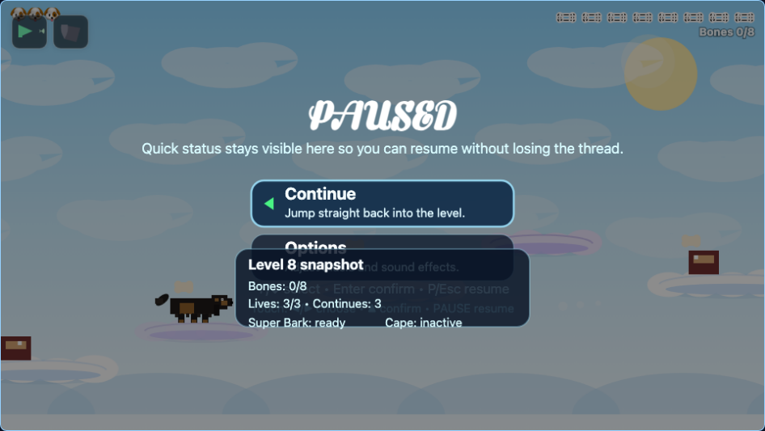

## 2026-06-16
### Requested improvement: Level 9 now has real digging through dirt walls
- Added true **tunnel digging** to Level 9: hold **↓** to dig slowly through soft dirt, or press **↓ + BARK** to chew through it much faster.
- Placed multiple **diggable dirt walls** through the tunnel stage so the new mechanic is required a few times instead of being just cosmetic.
- While Henry digs, **dirt now sprays out of the wall/opening**, and each dirt block visually breaks down before opening into a passable tunnel.
- Verified with `node --check game.js` plus Playwright checks confirming both slow-dig and fast-dig destroy a tunnel wall, and captured a browser screenshot of the dirt burst in action.

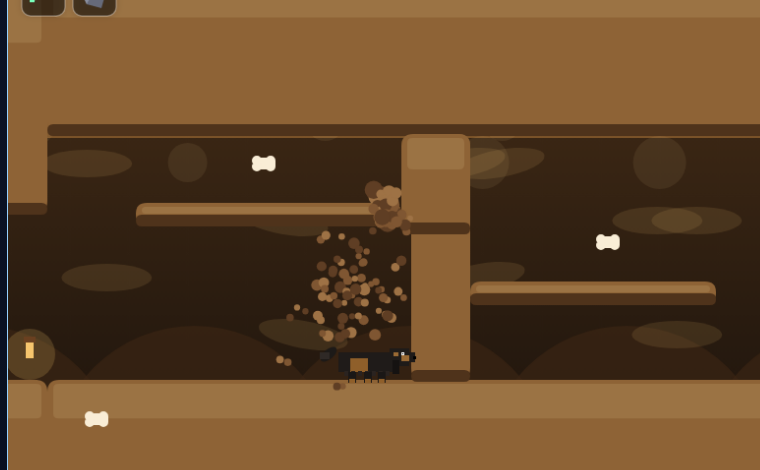

### Daily improvement: Level 9 tunnel entrance now has visible drop markers
- Added glowing **shaft markers** above the Level 9 tunnel entrance so the first drop reads like the intended path instead of a random dirt wall.
- Framed the opening with warm lanterns, a brighter shaft rim, and animated down-pointing chevrons to teach the route without adding more words to the screen.
- Verified with `node --check game.js` and a Playwright browser capture of Level 9 showing the new entrance markers in place.

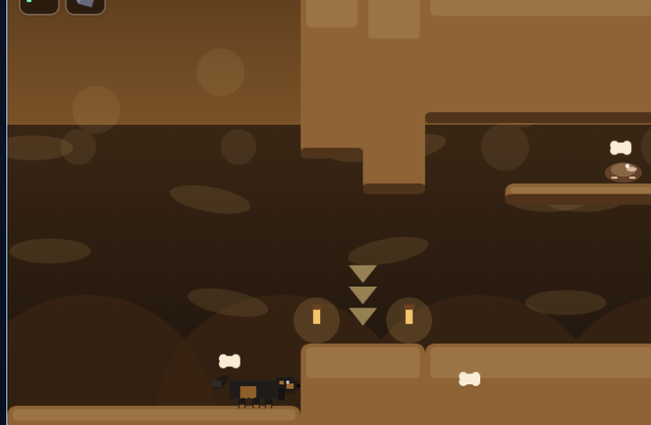

### Daily improvement: Level 9 tunnel entrance now has a real landing floor
- Carved the blocked Level 9 opener into a true **drop shaft** with a matching floor underneath it, so Henry can actually enter the underground tunnel instead of falling into a dead-start trap.
- Widened the tunnel entrance trigger to cover the full opening, keeping the dirt-burst moment aligned with the playable shaft.
- Verified with `node --check game.js` and a small Playwright state check that dropping Henry into the entrance now settles him safely onto the new floor inside the tunnel.

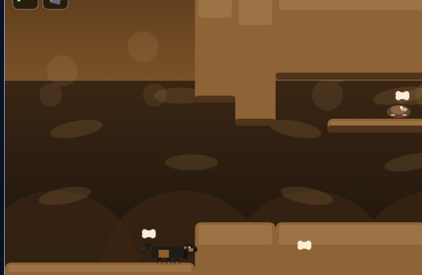

## 2026-06-15
### Follow-up audio tweak: giant corgis stage now uses its own track
- Changed the giant corgis level music so that stage now plays **`assets/giantlevel.wav`** instead of falling back to the standard run track.
- Kept the change local to level music routing, so gameplay and other stage themes stay untouched.
- Verified the giant-enemy stage still resolves correctly and now points at the dedicated giant-level music asset.

### Requested improvement: Level 9 is now a tunnel-digging stage underground
- Rebuilt the level after Clouds into an underground **Tunnel** stage with a surface dig shaft, packed dirt walls, and a burrow-like path that snakes through the ground instead of another open-sky run.
- Added tunnel-specific enemies — **moles** and **mice** — so the underground route feels like a real burrow full of critters instead of reused overworld bad guys.
- When Henry first drops into the dig shaft, a one-shot **dirt burst** now sprays out around the entrance to sell the dachshund digging fantasy you asked for.

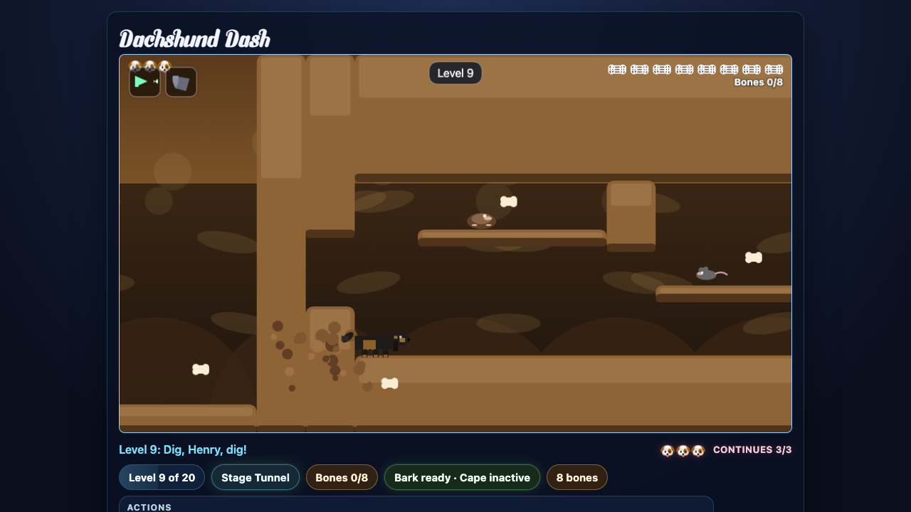

### Follow-up audio tweak: water stage now uses its own swim track
- Changed the water/swim level music so the stage now plays **`assets/waterlevel.wav`** instead of falling back to the standard run track.
- Kept the change local to level music selection, so gameplay, controls, and other stages stay untouched.
- Verified the water stage still resolves as the themed swim level and now points at the dedicated water music asset.

### Daily improvement: volcano stage now uses its own lava music
- Changed the volcano/lava level music so the stage now plays **`assets/lavalevel.wav`** instead of falling back to the standard run track.
- Kept the change local to level music selection, so gameplay, controls, and other stages stay untouched.
- Verified the volcano stage still resolves as the themed lava level and now points at the dedicated lava music asset.

### Daily improvement: immersive mobile mode now shows touch pads on screen
- Added subtle **left / bark / right touch pads** at the bottom of immersive mobile gameplay so the new control layout is visible without relying on extra instruction text.
- The pads lightly glow when pressed, which makes it easier to tell which zone is active during movement or barking.
- Kept the overlay compact and icon-based so it helps readability without adding more reading-heavy UI.

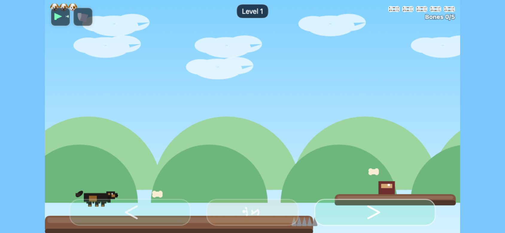

### Requested mobile control rewrite: bottom zones now split into left / bark / right
- Replaced the immersive phone tilt scheme with a simpler direct-touch layout: **hold the bottom-left of the screen to run left**, **hold the bottom-right to run right**, and **release to stand still**.
- The left and right movement zones now support **both a quick tap jump** and an **upward swipe jump**, which fixes swimming and other cases where repeated jump input matters.
- Reserved the **bottom-center** area for bark controls: **single tap = bark**, **double tap = super bark**, so movement/jump gestures no longer fight with barking.
- Reworked the touch handler for **true two-finger play**, so you can keep holding one side to run and tap/swipe jump on the opposite side without Henry flipping directions.

### Follow-up tuning: mobile tilt is calmer and level music now swaps cleanly
- Fixed the background-music handoff so repeated mobile audio unlock/start attempts do not leave the **Level 1** track hanging around after you move into the next level.
- Raised the mobile tilt threshold and widened the neutral zone, so Henry now stays still through small hand movement and needs a more deliberate lean before he starts running.
- Locked landscape tilt to a stable dominant axis and smoothed the sensor input, which removes the odd **brief left-run glitch** that could happen while switching directions.

## 2026-06-14
### Follow-up tooling: local HTTPS launcher added for iPhone Safari tilt support
- Added `scripts/run-https.sh` plus `scripts/serve-https.js` so the game can be served over **local HTTPS** instead of plain HTTP, which is important for iPhone motion/tilt APIs.
- The launcher now auto-generates a local certificate for `localhost`, the Mac’s current LAN IP, and the Mac’s `.local` hostname, then prints the exact iPhone URL to open.
- Added `.cert/` to `.gitignore` and documented the HTTPS flow in `README.md` so the setup is repeatable without committing private keys.

## 2026-06-14
### Follow-up fix: tilt controls now calibrate to neutral and support iPhone landscape better
- Reworked the mobile tilt handler so it **calibrates a neutral resting angle**, which means Henry should now stay still when the phone is not tilted.
- Added a **landscape-aware axis fallback** so iPhone tilt can drive movement even when Safari reports the sideways lean on a different orientation axis than expected.
- If Safari still refuses to send motion data, the game now says so explicitly and explains the likely cause: **plain local HTTP instead of HTTPS** on iPhone sensor APIs.

## 2026-06-14
### Requested improvement: mobile play now uses immersive tilt-and-touch controls
- Mobile browsers are now detected automatically, and phones in portrait get a full-screen **rotate to landscape** prompt before play.
- In landscape mobile mode, the game hides the shell UI so only the gameplay view remains visible, then switches controls to **tilt left/right to run**, **touch or swipe up to jump**, **bottom-half tap to bark**, and **bottom-half double tap for super bark**.
- Added an iPhone-friendly motion-permission/fullscreen handoff so Safari users can enable tilt controls from an in-game prompt instead of relying on the old button row underneath the canvas.

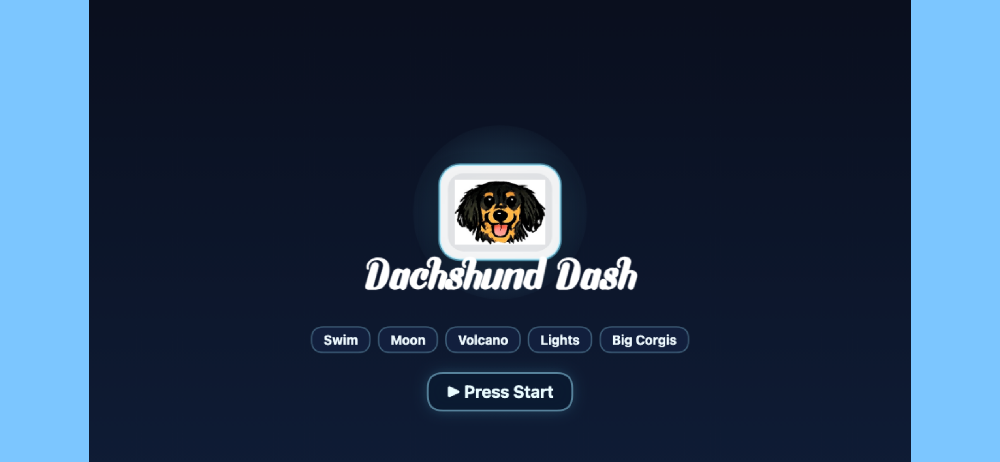

## 2026-06-14
### Requested improvement: Level 8 is now a cloud stage with fading platforms
- Rebuilt **Level 8** into a sky run with a bright cloud backdrop, cloud-shaped platforms, and a lighter final approach so the whole stage reads like a trip through the sky instead of a standard ground layout.
- Added **six tinted cloud platforms** that disappear if Henry stands on them for more than a couple seconds, then reform shortly after, creating the temporary footing you asked for without turning the level into a dead-end trap.
- Updated the level theme labels so Level 8 now shows up as **Clouds** in the run summary, intro chips, and hidden HENRY level select.

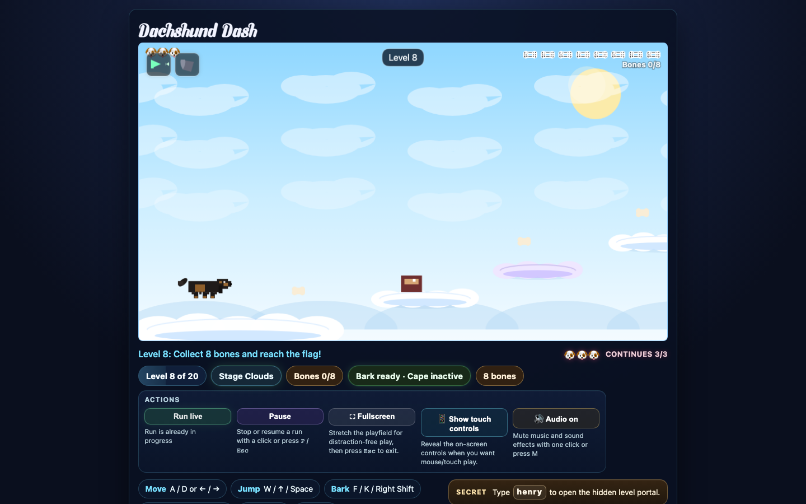

## 2026-06-14
### Daily improvement: touch-control panel now explains the multi-use buttons
- Added a compact heading to the **On-screen controls** panel so the touch row reads like an intentional control surface instead of a floating button strip.
- The panel now explicitly teaches that **▲** handles **start / continue / restart** flows and that **BARK** can **quit after wipeouts**, which makes the touch shortcuts truthful before players hit those states.
- Kept the change local to the shell UI, improving touch discoverability without changing gameplay rules or control bindings.

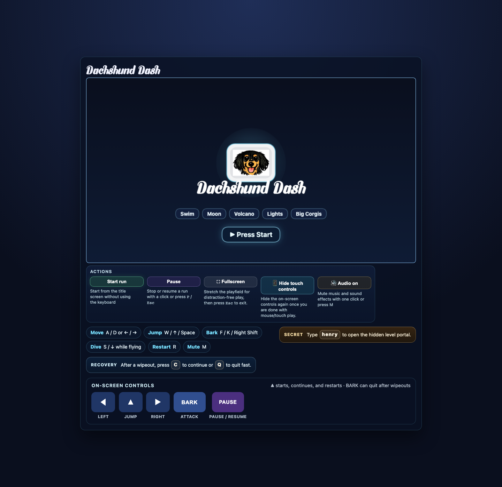

## 2026-06-14
### Daily improvement: start screen now surfaces the most useful shortcuts
- Added a compact **keyboard tips** strip beside the desktop quick actions so new players can spot movement, jump, bark, dive, restart, and mute inputs without hunting through the README.
- Restored the hidden **henry** cheat hint and **continue / quit** recovery shortcuts as visible callouts on the start screen, using the UI styles that were already in the stylesheet.
- Kept the change local to the shell UI, making it a safe onboarding polish pass without touching level layout, physics, or combat balance.

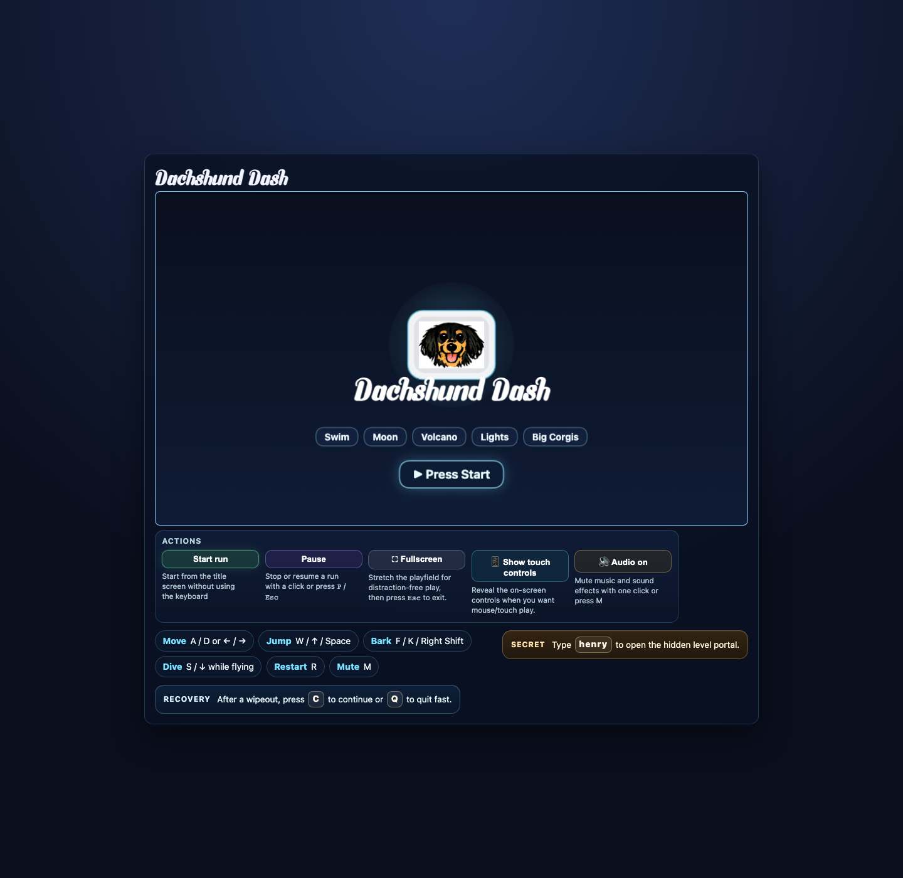

## 2026-06-13
### Daily improvement: level-intro prompts now actually let players start immediately
- Fixed a real onboarding mismatch on the per-level intro card: it said **Press Start**, but the prompt did not actually skip into gameplay right away.
- Players can now begin a level immediately from that intro state using the same inputs the game already teaches: **Enter**, **Space**, **W**, **↑**, touch **▲**, clicking the canvas, or the desktop **Start level** quick-action button.
- Kept the change local to the intro/start flow, making the prompt truthful without changing level layout, combat, or progression.

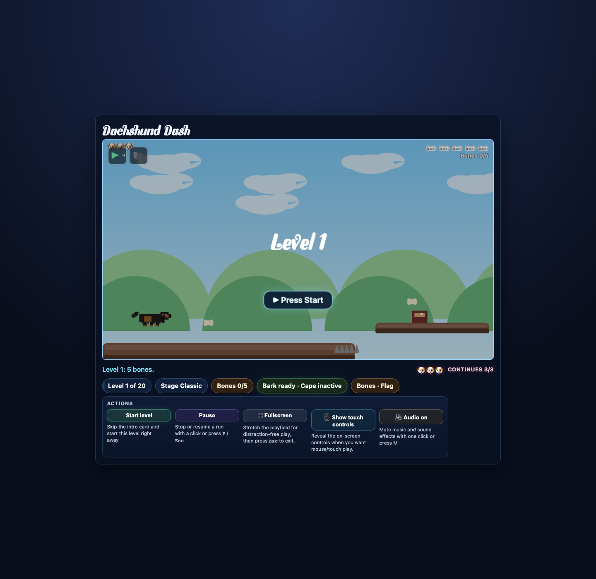

## 2026-06-13
### Daily improvement: HENRY level select now previews pickup counts too
- Upgraded the hidden **HENRY** level-select cards so each level now shows a compact pickup line with its **bone count** plus any **heart**, **cape**, or **toy toss** support before you jump in.
- Kept the existing theme/special tags underneath, so the secret portal now tells you both **what the level contains** and **what kind of run it is** at a glance.
- This stays local to the level-select overlay, making it a safe discoverability polish pass without changing gameplay rules.

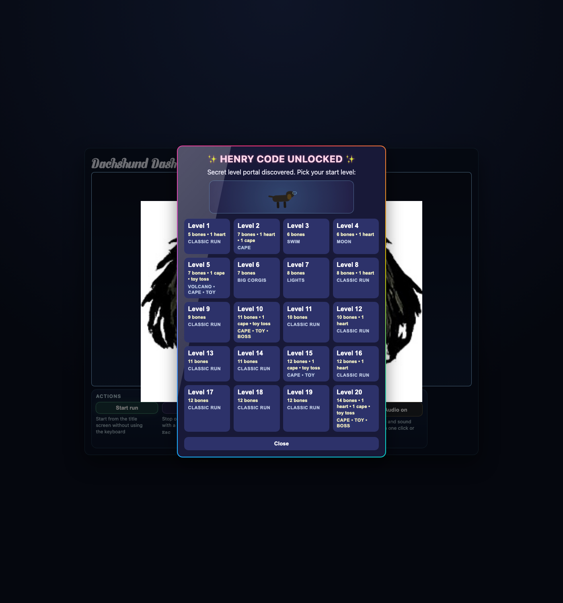

## 2026-06-12
### Daily improvement: quick-action helper captions are visible again
- Restored the short helper captions beneath the desktop **Quick actions** buttons so mouse-first players can actually see what **Start**, **Pause**, **Fullscreen**, **Touch controls**, and **Audio** do at a glance.
- Reused the helper-copy logic that was already in the game code, which means the captions now stay truthful as states change instead of drifting out of sync.
- Wired the new **Touch controls** toggle into that same helper system, so its caption flips between reveal/hide guidance along with the button label.

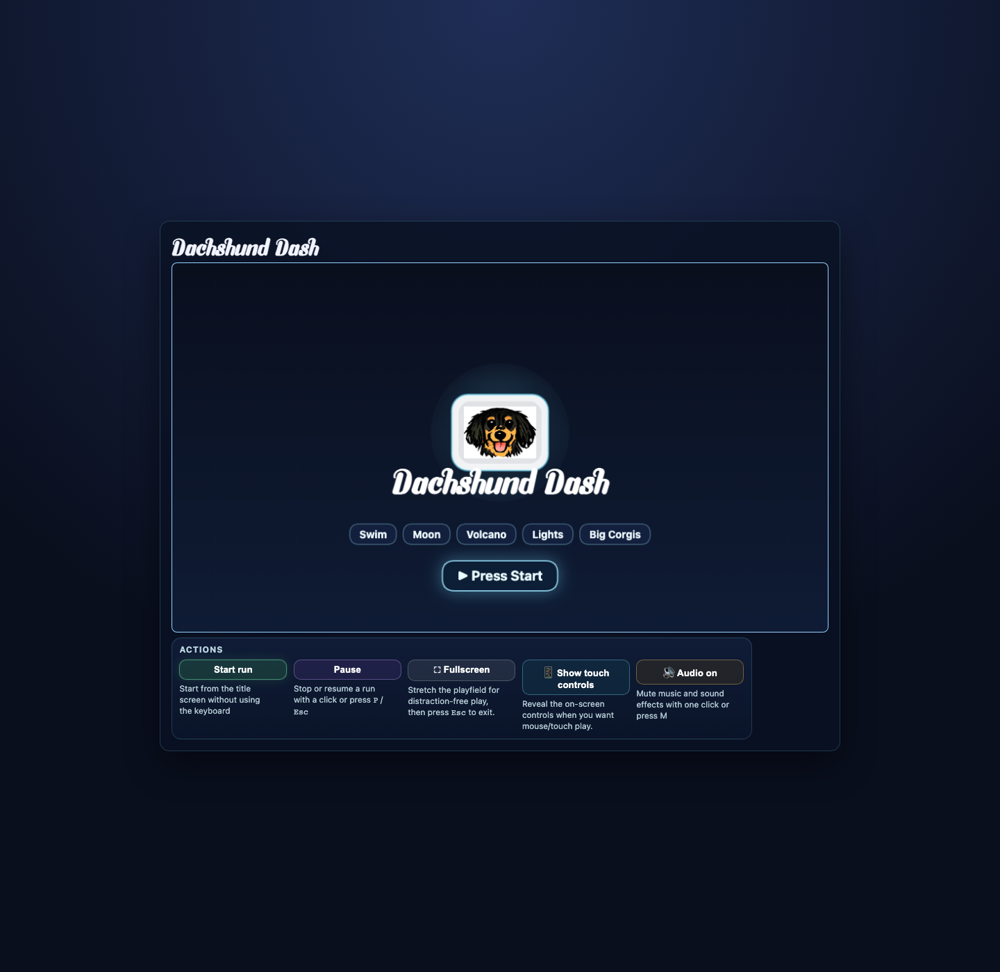

### Daily improvement: desktop touch controls now stay out of the way until needed
- Added a new **Show touch controls** quick-action button so desktop players can reveal the on-screen controls only when they actually want them.
- The large touch-control panel now starts **collapsed by default on desktop**, which keeps the start screen and HUD noticeably cleaner without removing mobile support.
- The toggle remembers the player’s last choice locally, while touch-first devices still open the panel by default.

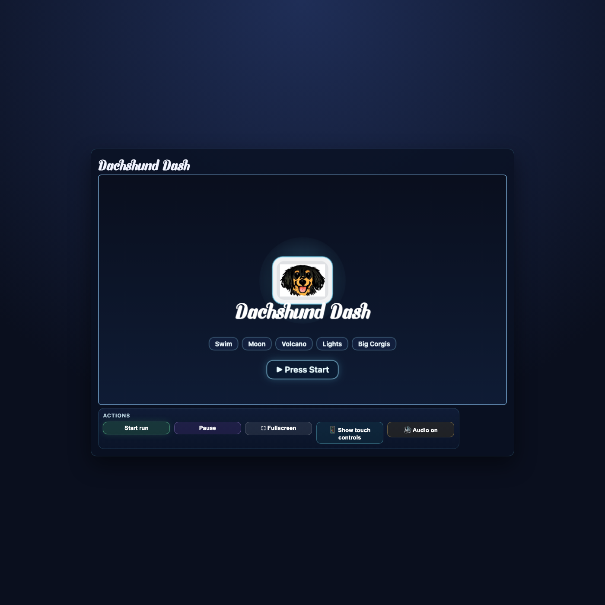

## 2026-06-11
### Art pass: volcano lava now spans the floor and the moon sky now shows Earth
- Changed the **volcano** stage lava so it stretches across the whole floor hazard zone, leaving safe ground only at the opening platform and the flag platform.
- Replaced the extra **moon** in the moon-stage sky with an **Earth** backdrop so the scene reads more clearly.
- Kept both changes visual and local to level presentation/hazard layout.

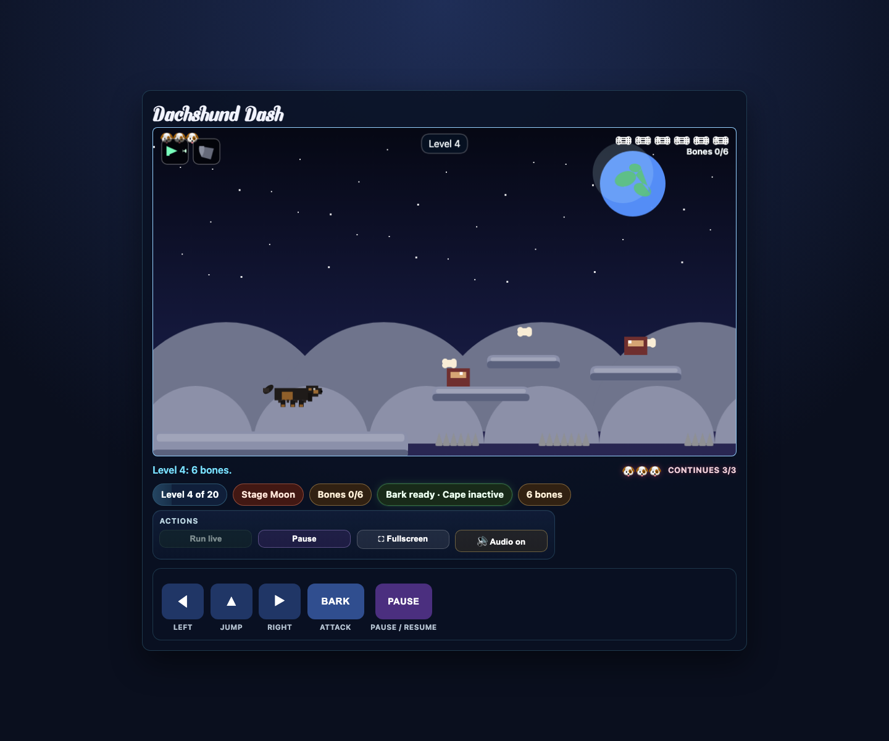

### Progression pass: first two levels stay normal and a volcano stage now joins the run
- Moved the special-theme rollout later so **Levels 1 and 2 stay normal**, giving players time to learn the controls before the gimmick stages begin.
- Shifted the themed progression so the run now introduces **Swim** on Level 3, **Moon** on Level 4, **Volcano** on Level 5, **Big Corgis** on Level 6, and **Lights** on Level 7.
- Added a new **volcano** stage with a fiery backdrop and visible **lava pools** filling the fall gaps, so that level reads like a distinct hazard zone instead of a standard stage reskin.

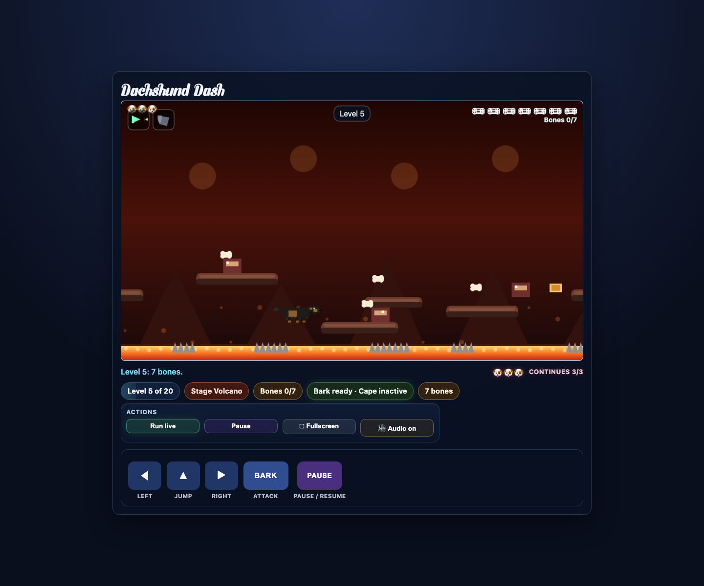

### Tuning pass: moon jumps got floatier and dark-stage lights now fully cycle
- Tuned the **moon** stage so Henry’s vertical movement is slower in both directions: jumps rise more gently, falls cap out sooner, and his **horizontal run speed stays unchanged**.
- Fixed the **lights** stage so Henry remains clearly visible inside the spotlight instead of disappearing into the darkness.
- Light switches now turn the whole stage visible like a normal run for **5 seconds**, then switch back off automatically.

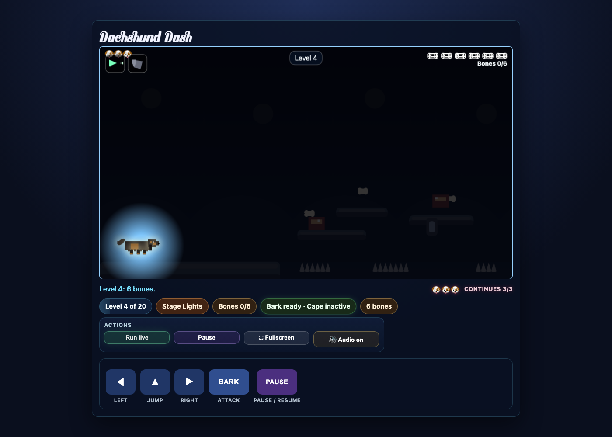

### Daily improvement: HENRY level select now previews themed stages too
- Expanded the hidden **HENRY** level-select badges so special stage variants are discoverable before players jump in.
- Water, moon, giant-corgi, and lights-out levels now show **Swim**, **Moon**, **Big Corgis**, and **Lights** tags right in the level grid, alongside the existing **Cape**, **Toy**, and **Boss** badges.
- Kept the change local to the secret level-select UI, making it a safe discoverability polish pass without changing gameplay rules.

### Daily improvement: run summary now shows the current stage theme
- Added a dedicated **Stage** pill to the run summary beneath the canvas so special level variants are visible outside the playfield HUD too.
- Water, moon, giant-corgi, and lights-out levels now surface labels like **Stage Swim**, **Stage Moon**, **Stage Big Corgis**, and **Stage Lights**, while standard levels fall back to **Stage Classic**.
- Kept the change local to the shell summary UI, making it a safe clarity upgrade that helps the new themed levels read at a glance.

### Follow-up polish: removed the Start/Flag progress map from gameplay
- Removed the small **Start / Flag** progress bar from gameplay completely.
- That strip was adding clutter without helping much, so the HUD now stays cleaner and more visual during play.

### Practice update 1: start screen text cut way back
- Trimmed the start/title presentation so it stays mostly visual instead of reading-heavy.
- Removed the bulky helper copy around the shell, hid the status/run-summary text on the start screen, and shortened the in-canvas prompts to just a few words.
- Kept the core buttons and touch controls visible so the game still starts cleanly without turning the screen into a wall of text.

### Practice update 2: real underwater swim level
- Turned the opening water-themed stage into a true underwater level with buoyant swim physics, drag, lift, bubbles, light rays, and kelp silhouettes.
- Henry now glides through the stage instead of moving like a normal land jump level, which gives the first environment a clearly different feel right away.

### Practice update 3: moon gravity level
- Added a moon stage with low gravity, a space sky, stars, a moon backdrop, and floatier jumps.
- The lower-gravity physics change the rhythm of the level without needing extra on-screen explanation.

### Practice update 4: giant enemy level
- Added a level variant where the corgi enemies are comically oversized but still go down in the normal way.
- Also gave the stage a hotter sunset palette so the “big corgis” run reads differently at a glance.

### Practice update 5: dark spotlight level with light switches
- Added a dark level that limits visibility to Henry’s spotlight until he reaches light switches placed through the stage.
- Switched-on lights carve out extra safe visibility pockets, so the mechanic reads visually instead of through tutorial text.

## 2026-06-10
### Daily improvement: desktop game-over restart button now truly restarts
- Fixed a real UX mismatch in the desktop **Quick actions** card: when the game-over state surfaced a **Restart run** button, clicking it used to send players back to the title flow instead of actually restarting the run.
- The button now correctly restarts from **Level 1** with full hearts and refreshed continues, matching its visible label and the surrounding restart guidance.
- Kept the change narrowly scoped to the existing desktop game-over action, making it a safe behavior-alignment fix without altering combat, level rules, or touch controls.

### Daily improvement: fullscreen exit helper copy
- Updated the desktop **Fullscreen** quick-action helper text to explicitly teach **`Esc`** as the way back out after expanding the playfield.
- This closes a small but real usability gap: fullscreen mode hid the surrounding shell, so first-time players had no visible reminder for how to exit once they went in.
- Kept the change local to the existing quick-action copy plus matching button accessibility text, making it a safe discoverability polish pass without changing gameplay.

## 2026-06-09
### Daily improvement: Enter start shortcut discoverability
- Surfaced **`Enter`** everywhere players look before a run starts: the desktop **Start** shortcut chip, the run-summary start prompt, the title-screen status text, and the level-intro start banner now all explicitly mention it.
- This closes a small desktop onboarding gap, because the game already accepted **`Enter`** to begin a run but the visible shell only taught **Space / W / ↑ / tap ▲**.
- Kept the change local to visible start-state copy, making it a safe clarity polish pass without changing gameplay behavior.

### Daily improvement: faint-screen recovery shortcut callout
- Added a visible **Recovery shortcuts** callout to the desktop help area so players can learn the **faint-screen** keyboard inputs before they need them.
- The new helper explicitly teaches **`C` / `Enter` / `Space`** to continue and **`Q` / `Esc`** to quit, which closes a small discoverability gap in the run-recovery flow.
- Kept the change local to the shell help UI, making it a safe clarity polish pass without changing gameplay behavior.

## 2026-06-08
### Daily improvement: touch restart shortcut chip
- Updated the visible **touch controls** help so the **`▲`** chip now explicitly says **Jump · start · continue · restart**.
- This closes a small mobile onboarding gap: touch players could already restart with **▲** after a loss or full clear, but the start-screen shortcut row stopped at **continue**.
- Kept the change local to the shell help copy, making it a safe discoverability polish pass without changing gameplay behavior.

### Daily improvement: pause shortcut discoverability
- Surfaced the keyboard **pause/resume shortcut** everywhere players look first: the desktop controls chips, the title-screen helper badge, the paused-state summary text, and the desktop pause button helper copy now all call out **`P`** alongside **`Esc`**.
- This closes a small but real onboarding gap, because the game already supported **`P`** in-play but the visible shell mostly implied **`Esc`** was the only keyboard pause key.
- Kept the change local to UI copy and existing state text, making it a safe clarity polish pass without changing gameplay behavior.

## 2026-06-07
### Daily improvement: desktop start shortcut chip
- Added a dedicated **Start** chip to the desktop controls quick-reference row so the title screen explicitly teaches which keyboard inputs begin a run.
- This removes the need to infer that **Jump** also starts the game, making the first action clearer for new desktop players.
- Kept the change local to visible shell help copy, making it a safe onboarding polish pass.

### Daily improvement: clearer start prompt controls
- Reworded the title-screen and start-state prompt copy to spell out the actual start inputs: **Space**, **W**, **↑**, or touch **▲**.
- This removes the vague **“Jump”** wording, so first-time players can tell exactly which keyboard keys will begin the run.
- Kept the change local to prompt text only, making it a safe onboarding clarity pass.

## 2026-06-06
### Daily improvement: level-select special-stage tags
- Upgraded the hidden **HENRY** level-select grid from number-only buttons to clearer **Level N** cards with small stage-type tags.
- Special runs now preview whether a level includes a **Cape**, **Toy**, or **Boss**, so cheat-starting later levels is much easier to scan without opening them first.
- Kept the change local to the secret level-select UI, making it a safe discoverability polish pass without touching gameplay.

### Daily improvement: faint-screen recovery snapshot card
- Added a compact **recovery snapshot** card to the **YOU FAINTED** overlay so players can immediately see bones collected, hearts, continues, ability state, and boss HP before deciding whether to continue or quit.
- The full **GAME OVER** screen now reuses that same snapshot treatment with a restart-focused footer, keeping the run summary visible right at the failure decision point instead of dropping players into a mostly empty overlay.
- Kept the change local to overlay presentation, making it a safe clarity polish pass without altering combat or progression rules.

## 2026-06-05
### Daily improvement: visual campaign progress fill in the level pill
- Turned the run-summary **level pill** into a lightweight campaign progress indicator by adding a fill bar that grows with the current level.
- Players can now read both the **`Level X of 20`** text and the visual sense of how far through the run they are, without opening menus or relying on the in-canvas action.
- Kept the change local to the shell summary UI, making it a safe presentation polish pass.

### Daily improvement: clearer level progress pill
- Updated the run-summary **level pill** to show full campaign progress as **`Level X of 20`** instead of only the current level name.
- Boss stages now add a compact **Boss** tag in that same pill, so players can tell at a glance where they are in the overall run.
- Kept the change local to the summary text, making it a safe clarity upgrade without changing gameplay.

## 2026-06-04
### Daily improvement: keyboard audio mute shortcut
- Added a real desktop **`M` mute/unmute shortcut** so players can silence or restore the game instantly without reaching for the mouse or opening pause options.
- Surfaced that shortcut directly in the visible desktop controls chips and in the audio quick-action helper copy, so the new shortcut is discoverable from the start screen.
- Kept the change local to existing shell/audio controls, making it a safe quality-of-life polish pass.

### Daily improvement: one-click desktop audio mute toggle
- Added a visible **Audio on / Audio off** button to the desktop **Quick actions** card so players can silence the game immediately without opening the pause menu sliders first.
- The button now updates its label, helper copy, and styling to reflect whether music and sound effects are currently muted.
- Kept the change local to the shell UI plus existing audio helpers, making it a safe quality-of-life improvement for shared or quieter play sessions.

## 2026-06-03
### Daily improvement: desktop start / continue / restart button
- Added a dedicated **desktop primary action button** to the Quick actions card so mouse-first players can start a run, resume a pause, continue after a faint, or restart after game over without reaching for the keyboard.
- The button now updates its label and helper copy with game state (**Start run**, **Resume run**, **Continue**, **Restart run**) and disables itself during active play so it stays truthful instead of behaving like a dead control.
- Kept the change local to shell UI plus existing game-state transitions, making it a safe discoverability upgrade for desktop play.

### Daily improvement: visible HENRY secret shortcut callout
- Added a dedicated **Secret shortcut** callout beside the desktop controls so the hidden **HENRY** level-select unlock is actually discoverable from the title screen.
- Styled each letter as a compact keyboard keycap, which makes the code easier to scan and remember without changing any gameplay logic.
- Kept the change local to the shell UI, so it improves onboarding for curious players while leaving the game systems untouched.

## 2026-06-02
### Daily improvement: on-screen control button captions
- Added visible **caption labels beneath each on-screen button** so the arrow-only controls no longer rely on symbol recognition or hover/assistive text.
- The bottom control row now spells out **Left**, **Jump**, **Right**, **Attack**, and **Pause / resume**, making the shell easier to understand for first-time desktop and touch players.
- Kept the change purely presentational and local to the control panel, so it improves clarity without touching game logic.

### Daily improvement: labeled on-screen controls panel
- Added a dedicated **On-screen controls** heading and helper caption above the bottom button row so those large buttons no longer read like unexplained floating UI.
- The new subtitle makes it explicit that the controls are **clickable with a mouse on desktop** and still **touch-friendly on phones**, which improves first-run discoverability without changing gameplay.
- Kept the change local to the shell UI, so it is easy to notice on the start screen and low-risk for the game itself.

## 2026-06-01
### Daily improvement: start-screen footer hints
- Added a compact **footer hint row** inside the start overlay so the most useful non-keyboard discoveries stay visible without bringing back the old wall of control chips.
- The title screen now explicitly points desktop players to the **Pause** and **Fullscreen** buttons below the playfield, while keeping the **HENRY** secret discoverable in the same lightweight treatment.
- Also nudged the main start prompt a bit higher so the bottom-of-canvas onboarding feels cleaner and less cramped.

### Daily improvement: decluttered start overlay spacing
- Simplified the **start overlay inside the playfield** so it no longer crams duplicated control rows into the canvas area.
- Kept the key feature badges, level objective chips, start prompt, and **HENRY** secret visible, while relying on the existing shell controls reference below the canvas for the full input list.
- This makes the title screen easier to scan and fixes the cut-off / overlapping lower overlay content without changing gameplay.

## 2026-05-31
### Daily improvement: desktop quick action hints
- Added short helper captions beneath the desktop **Pause** and **Fullscreen** buttons so mouse-first players can tell what those controls are for before starting a run.
- The new copy makes it obvious that **Pause** can stop or resume play without the keyboard and that **Fullscreen** is the distraction-free view.
- Kept the change lightweight and purely presentational, building on the quick-actions card without changing any controls or game logic.

### Daily improvement: desktop quick actions card
- Grouped the desktop **Pause** and **Fullscreen** buttons into a dedicated **Quick actions** card so they no longer feel visually detached from the keyboard help row.
- Added a small label, shared panel styling, and tighter button grouping to make those utility controls easier to spot before a run starts.
- Kept the change purely presentational, so it improves discoverability without changing any game behavior or inputs.

## 2026-05-30
### Daily improvement: pause summary resume hint now includes touch
- Updated the **paused run-summary goal pill** so it no longer reads like a keyboard-only instruction.
- The pill now says **“Paused · Esc or PAUSE resumes.”**, which matches the actual mobile and desktop resume paths already available in the shell.
- This keeps the pause-state guidance consistent with the newer touch-friendly controls instead of teaching only the Esc key.

### Daily improvement: start goal pill call-to-action styling
- Gave the **run summary goal pill** a dedicated **start-state treatment** so the landing-page prompt reads like the primary action instead of blending into the other status chips.
- The **“Press Space/Jump or tap to start”** pill now uses a brighter blue gradient, stronger border contrast, and a gentle pulse that makes the start instruction easier to spot at a glance.
- This stays purely presentational, so it improves the first-run read without changing any gameplay or controls.

## 2026-05-29
### Daily improvement: mobile touch controls quick reference
- Added a **Touch controls** help strip beneath the on-screen buttons on small screens, so phone players can see what each control does without guessing mid-run.
- The new chips call out that **▲** handles **jump / start / continue**, **BARK** is used for **attacks** and some **quit** flows, and **PAUSE** can both **pause** and **resume**.
- Kept it mobile-only so the extra guidance appears where it matters without adding clutter to the desktop layout.

### Daily improvement: visible keyboard focus ring for controls
- Added a clear **focus-visible highlight** to the shell buttons and touch controls so keyboard players can immediately tell which control is selected while tabbing.
- The **Pause**, **Fullscreen**, mobile control buttons, and level-select buttons now get the same cyan outline and glow, which makes the page feel more intentional and accessible without changing gameplay.
- This is especially useful on the title screen and around pause/fullscreen actions, where the game already exposes real page buttons outside the canvas.

## 2026-05-28
### Daily improvement: touch-friendly pause menu controls
- Closed a real mobile pause-menu gap: touch players can now actually **navigate and use** the pause menu instead of only pausing and resuming.
- On the main pause screen, **◀/▶** now switch between **Continue** and **Options**, **▲** confirms the current choice, and the overlay teaches that **PAUSE** resumes immediately.
- Inside pause options, **BARK** switches between the Music and SFX rows, **◀/▶** adjusts the selected slider, and **▲** saves back to the main pause menu.

### Daily improvement: game-over touch restart guidance
- Clarified the **GAME OVER** overlay so it no longer looks keyboard-only once a run is out of continues.
- The screen now explicitly says **no continues are left**, keeps the **keyboard restart** keys visible, and adds a dedicated **touch restart** line for tapping **▲**.
- Also synced the run-summary restart hint and game-over status copy to mention the same touch restart path, so the messaging stays consistent across the page.

## 2026-05-27
### Daily improvement: boss intro summary goal copy
- Fixed the **run summary goal pill** on boss-level intro screens so it no longer implies the flag is enough once players leave the title overlay.
- Levels 10 and 20 now explicitly say players must **collect the bones**, **defeat the boss**, and **then touch the flag**, matching the real win condition already used elsewhere.
- This keeps the summary strip truthful during the exact moment players are deciding what the level expects before they start moving.

### Daily improvement: desktop controls shortcut chips
- Replaced the dense **desktop controls** sentence below the canvas with a quick-scan strip of **shortcut chips** for Move, Jump, Dive, Bark, Restart, and Pause.
- This keeps the keyboard help visible but makes it much easier to read at a glance before starting a run or after a quick reset.
- Kept the existing **Pause** and **Fullscreen** utility buttons in place so the layout is clearer without changing gameplay behavior.

## 2026-05-26
### Daily improvement: pause snapshot boss status
- Expanded the **pause snapshot card** on boss stages so it now shows the live boss objective instead of dropping that context the moment players pause.
- During boss fights, the card now displays the boss name and current **HP remaining**, making it much easier to decide whether to resume aggressively or reset.
- If the boss is already beaten, the same line flips to a **defeated / flag-ready** reminder so the pause overlay still reflects the actual win condition.

### Daily improvement: boss-level preview goal copy
- Updated the **Level preview** card on boss stages so the **Goal** row no longer implies the flag alone is enough.
- Boss levels now explicitly say players must collect the bones, **defeat the boss**, and then reach the finish flag, which makes the win condition clearer before the run starts.
- This is a small copy-only polish change, but it removes a real moment of confusion right before Levels 10 and 20.

## 2026-05-25
### Daily improvement: level intro start prompt
- Added a visible **start prompt bar** inside the new level-intro preview card so players no longer have to guess how to leave the intro overlay and begin the level.
- The prompt explicitly calls out **Space**, **jump**, and **touch ▲** input paths, which makes the transition from reading the preview to actually playing much clearer.
- Kept the prompt animated and integrated with the existing preview card so the instruction feels like part of the game UI instead of a stray status line.

### Daily improvement: level intro preview card
- Added a new **Level preview** card to the level-intro overlay so players get a readable summary before they start moving.
- The card now spells out the current level's **goal**, available **pickups**, and the main **threats** waiting in the run, instead of leaving that context split across small badges.
- Also surfaced a quick **continues restock** reminder there, which makes each level start feel more intentional for quick retries.

## 2026-05-24
### Daily improvement: pause menu keyboard selection
- Fixed a real pause-menu UX gap: the overlay already told players to use **↑/↓ to select**, but those keys did not actually move between **Continue** and **Options**.
- The pause menu cards now support proper **Up/Down selection** and **Enter/Space confirmation**, so the on-screen hint finally matches the controls.
- This makes the pause overlay feel intentional instead of misleading, especially for keyboard-first players stopping mid-run.

### Daily improvement: run summary ability pill
- Added a new **run summary ability pill** below the canvas so players can read core power state without relying on the in-canvas HUD alone.
- The pill now reports **Super Bark ready vs cooldown**, **toy held** for siren levels, and **cape active vs inactive** in one glanceable line.
- This keeps moment-to-moment ability status visible in the page chrome, which is especially helpful on quick restarts and for players scanning below the playfield.

## 2026-05-23
### Daily improvement: stateful run summary strip
- Upgraded the new **run summary strip** so each pill now changes color with its current state instead of reading like static chrome.
- The strip now highlights **bone collection** in amber, **boss objectives** in warm danger tones, **paused / continue / restart** states in distinct warning colors, and **flag-ready / clear** states in bright green.
- This makes the summary easier to scan peripherally during quick resets and mid-run pauses without adding new gameplay complexity.

### Daily improvement: live run summary strip
- Added a visible **run summary strip** below the canvas that mirrors the current **level**, **bone count**, and **next objective** outside the canvas-only HUD.
- The goal pill now updates with context like **start prompt**, **bones remaining**, **boss defeat required**, **touch the flag**, and **paused / restart** states, making progress easier to read at a glance.
- This is especially helpful for accessibility and quick scanning because the key objective no longer lives only inside the animated playfield.

## 2026-05-22
### Daily improvement: start prompt call-to-action card
- Replaced the plain start-screen **"Press Space/Jump or tap to start"** line with a more readable **rounded call-to-action card** so the first input prompt stands out immediately.
- Added a subtle glow pulse and play-arrow treatment to make the starting action easier to spot without changing any gameplay rules.

### Daily improvement: pause menu option cards
- Reworked the pause overlay's main menu from plain text into readable **selection cards** for **Continue** and **Options**, making the current choice easier to scan when stopping mid-run.
- Added short helper subtitles and a clear active chevron/highlight so the pause flow feels more like an intentional game menu than a debug overlay.

## 2026-05-21
### Daily improvement: start-screen objective chips
- Added a highlighted **goal chip row** to the title screen that spells out the real win condition: **collect every bone**, **survive hazards**, and **then touch the flag**.
- This gives first-time players the objective before they begin, instead of learning mid-run that the flag alone is not enough.

### Daily improvement: start-screen Henry portal hint
- Added a visible **secret hint** to the start screen that tells players to type **`HENRY`** for the level-select portal, so the existing cheat unlock is discoverable without needing the README or source.
- Kept the hint small and in-theme so it helps curious players without crowding the core start prompt.

## 2026-05-20
### Daily improvement: readable continues counter
- Upgraded the shell HUD's lives area from emoji-only output to a clearer **Continues X/Y** counter alongside the dog icons, so players can tell how many retries remain without counting symbols.
- Added matching accessibility text on the lives widget so screen readers announce the same retry state explicitly.

### Daily improvement: desktop pause button
- Added a visible **Pause / Resume** button beside **Fullscreen** in the desktop controls row so mouse-first players can stop and restart a run without remembering keyboard shortcuts.
- Wired the button into the existing pause system and matching paused styling, so it flips to **Resume** while the overlay is active.

## 2026-05-19
### Daily improvement: touch faint-screen recovery
- Fixed a mobile recovery gap on the **YOU FAINTED** screen: touch players can now tap **▲** to continue from a lost life or **BARK** to quit back out, instead of getting stranded behind keyboard-only controls.
- Updated the death status copy and overlay hint so the touch path is visible right where players need it.

### Daily improvement: touch pause button
- Added a dedicated **PAUSE / RESUME** button to the on-screen touch controls so mobile players can stop and restart a run without needing a keyboard.
- Updated the start-screen touch hint to mention the new pause control, keeping the feature discoverable before the first level begins.

## 2026-05-18
### Daily improvement: title screen feature badges
- Added a compact **feature-badge row** to the title screen that calls out **20 levels**, **2 corgi bosses**, and **Super Bark + cape flight** before the run starts.
- This gives first-time players a quick read on the game's scale and signature mechanics without making them dig through the README.

### Daily improvement: start screen logo badge
- Styled the start screen's dachshund portrait as a **framed logo badge** with a soft glow, rounded card, and border so it feels intentional against the dark title backdrop.
- This keeps the existing art asset but makes the opening screen read more like a polished game menu instead of a floating rectangular image.

## 2026-05-17
### Daily improvement: in-run ability status strip
- Added a compact **top-left ability status strip** during gameplay so players can read **Super Bark** and **cape** state without decoding the icons alone.
- The new pills show **`Bark ready`** vs a live cooldown countdown, plus **`Cape inactive`** vs remaining cape time when flight is active.
- Kept the treatment small and color-coded so it stays readable without pulling focus away from jumps and hazards.

### Daily improvement: objective guidance chip
- Added a compact **top-center objective guidance chip** during gameplay so the next win condition stays explicit instead of living only in the status line.
- The chip now updates dynamically to show **bones remaining**, **boss defeat required**, or **`Flag ready!`** once the exit conditions are met.
- This keeps mid-level goals readable during movement-heavy sections and makes long runs easier to parse at a glance.

## 2026-05-16
### Daily improvement: in-run level progress tracker
- Added a compact **bottom-center progress tracker** during gameplay so players can see how far they are through the current level at a glance.
- The tracker shows the dachshund marker moving from **Start** toward the **Flag**, which makes long levels and quick restarts easier to read without opening menus.
- Kept it lightweight and translucent so it adds orientation without blocking platforming visibility.

### Daily improvement: pause overlay status snapshot
- Added a compact **status snapshot card** to the pause overlay so players can quickly check level progress before resuming.
- The pause screen now shows the current level, bones collected, hearts, continues, and whether **Super Bark** or the **cape** are ready or still active.
- Also added a small pause-controls hint line so the overlay is easier to use at a glance.

## 2026-05-15
### Daily improvement: restored centered game shell layout
- Fixed a CSS regression where the page background and layout styles were sitting outside the `body` rule and getting ignored by the browser.
- The game now loads inside its intended centered shell again, with the dark gradient backdrop and breathing room around the canvas.

### Daily improvement: start screen controls legend
- Added a compact two-row **controls legend** to the title screen so desktop and touch players see the core inputs before the first jump.
- The new chips call out movement, jump, bark, restart, pause, and touch controls without adding a separate menu.

## 2026-05-14
- Improved jump feel with **coyote time** and **jump buffering**.
- Ground jumps now still trigger for a brief moment after stepping off a platform, and slightly-early jump presses now fire on landing.
- Jump SFX now plays when the jump actually happens, so timing stays consistent across keyboard and touch.

### Daily improvement: level objective cards
- Added **objective cards** to the in-level title overlay so each stage previews its key goals and threats before play begins.
- The intro card now calls out collectible count plus special features like **heart pickups**, **super cape**, **toy vs siren**, and **boss encounters**.
- Boss badges get a warmer highlight so high-stakes stages read faster at a glance.

### Daily improvement: persistent in-run level chip
- Added a small **top-center level chip** during gameplay so the current stage stays visible without relying on the larger intro overlay or status text below the canvas.
- This makes quick restarts and mid-level context a little clearer, especially on mobile-sized layouts.

### Daily improvement: readable bone counter text
- Added a clear **`Bones X/Y`** label beneath the bone icons in the top-right HUD during gameplay.
- This keeps collectible progress readable at a glance, especially on later levels where icon-only counting gets harder.

