# Dachshund Dash Changelog

## 2026-06-11
### Daily improvement: HENRY level select now previews themed stages too
- Expanded the hidden **HENRY** level-select badges so special stage variants are discoverable before players jump in.
- Water, moon, giant-corgi, and lights-out levels now show **Swim**, **Moon**, **Big Corgis**, and **Lights** tags right in the level grid, alongside the existing **Cape**, **Toy**, and **Boss** badges.
- Kept the change local to the secret level-select UI, making it a safe discoverability polish pass without changing gameplay rules.

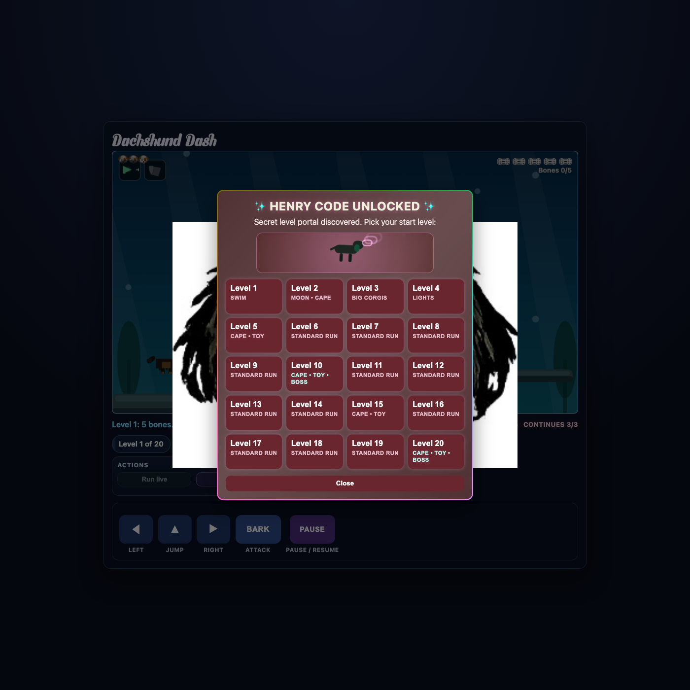

### Daily improvement: run summary now shows the current stage theme
- Added a dedicated **Stage** pill to the run summary beneath the canvas so special level variants are visible outside the playfield HUD too.
- Water, moon, giant-corgi, and lights-out levels now surface labels like **Stage Swim**, **Stage Moon**, **Stage Big Corgis**, and **Stage Lights**, while standard levels fall back to **Stage Classic**.
- Kept the change local to the shell summary UI, making it a safe clarity upgrade that helps the new themed levels read at a glance.

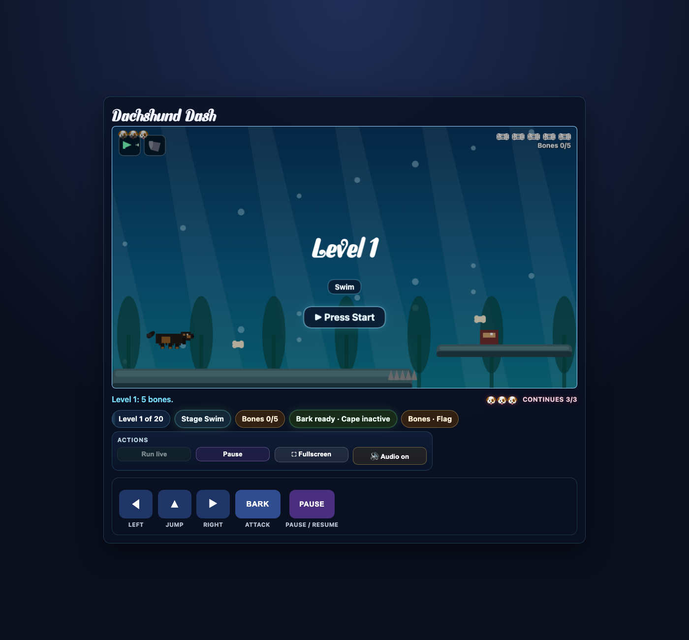

### Follow-up polish: removed the Start/Flag progress map from gameplay
- Removed the small **Start / Flag** progress bar from gameplay completely.
- That strip was adding clutter without helping much, so the HUD now stays cleaner and more visual during play.

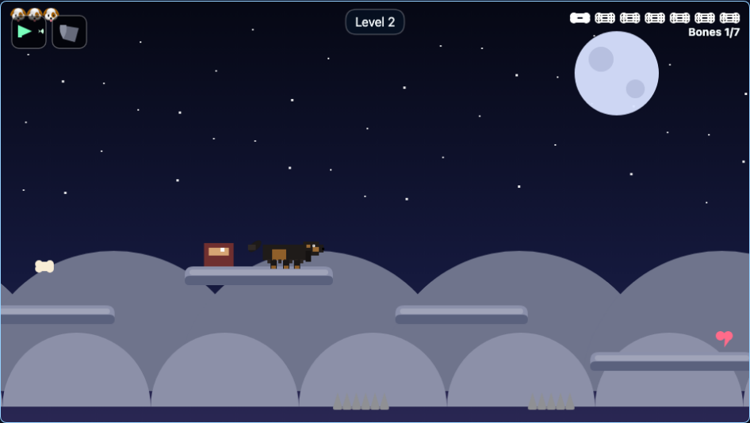

### Practice update 1: start screen text cut way back
- Trimmed the start/title presentation so it stays mostly visual instead of reading-heavy.
- Removed the bulky helper copy around the shell, hid the status/run-summary text on the start screen, and shortened the in-canvas prompts to just a few words.
- Kept the core buttons and touch controls visible so the game still starts cleanly without turning the screen into a wall of text.

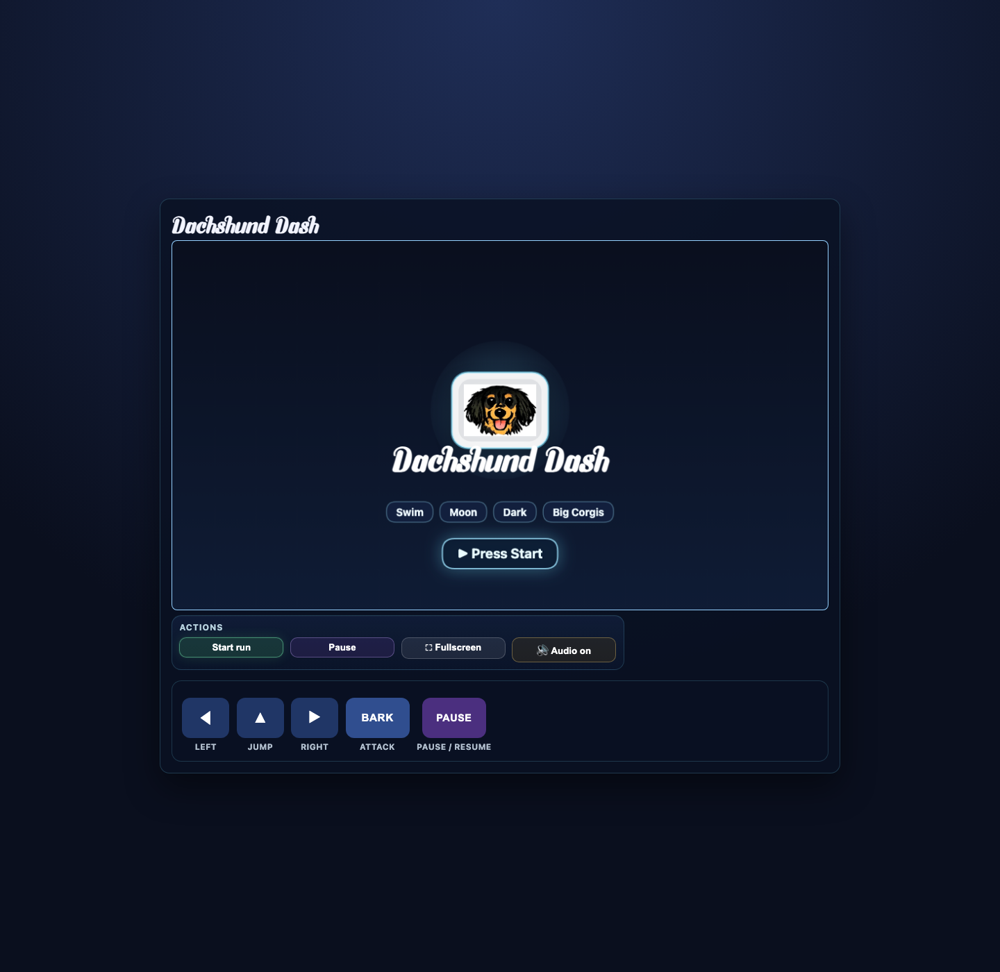

### Practice update 2: real underwater swim level
- Turned the opening water-themed stage into a true underwater level with buoyant swim physics, drag, lift, bubbles, light rays, and kelp silhouettes.
- Henry now glides through the stage instead of moving like a normal land jump level, which gives the first environment a clearly different feel right away.

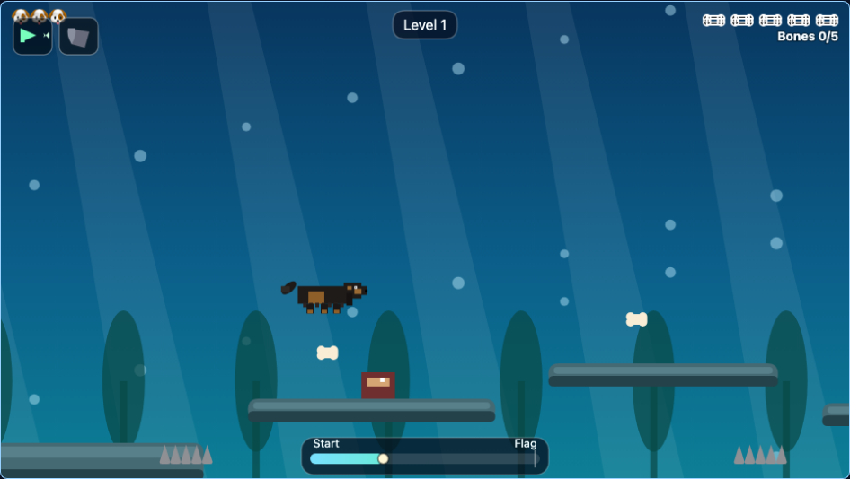

### Practice update 3: moon gravity level
- Added a moon stage with low gravity, a space sky, stars, a moon backdrop, and floatier jumps.
- The lower-gravity physics change the rhythm of the level without needing extra on-screen explanation.

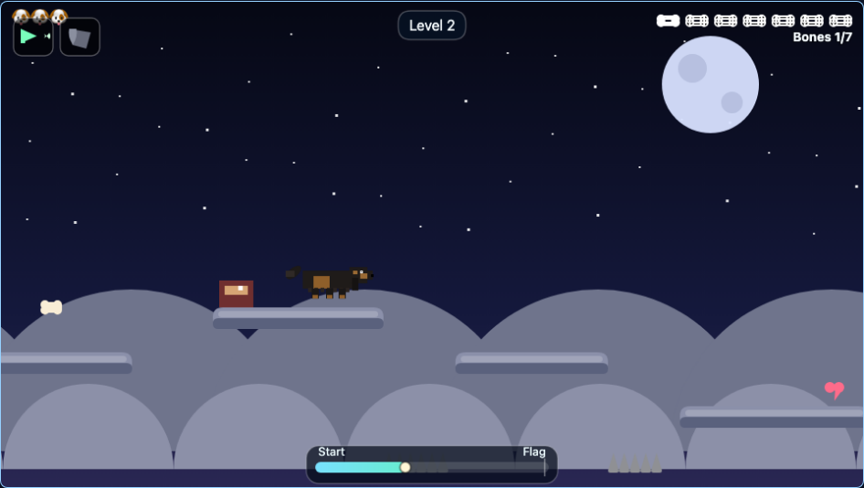

### Practice update 4: giant enemy level
- Added a level variant where the corgi enemies are comically oversized but still go down in the normal way.
- Also gave the stage a hotter sunset palette so the “big corgis” run reads differently at a glance.

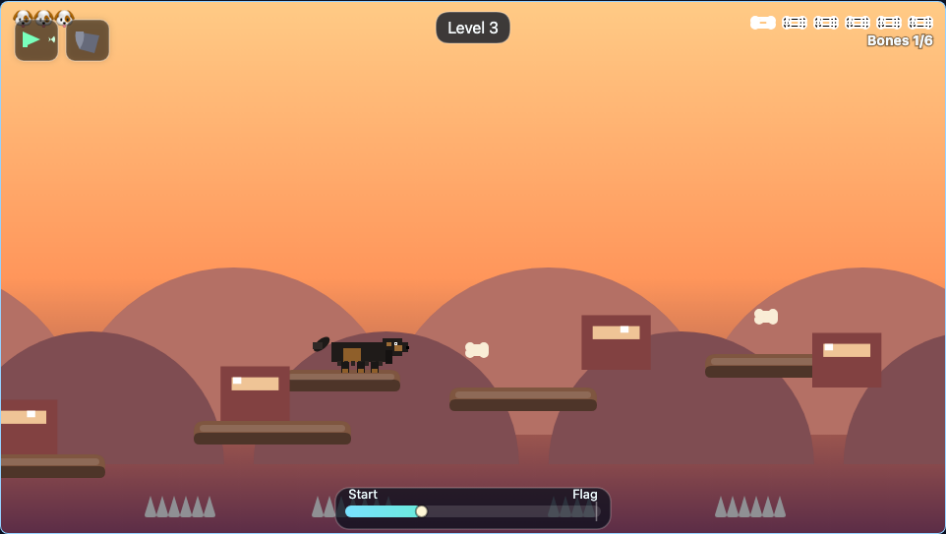

### Practice update 5: dark spotlight level with light switches
- Added a dark level that limits visibility to Henry’s spotlight until he reaches light switches placed through the stage.
- Switched-on lights carve out extra safe visibility pockets, so the mechanic reads visually instead of through tutorial text.

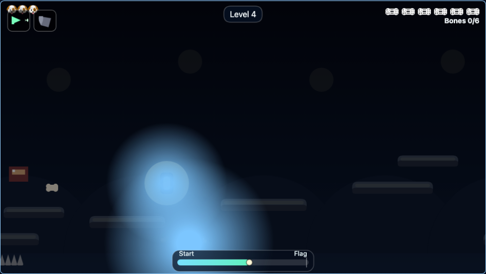

## 2026-06-10
### Daily improvement: desktop game-over restart button now truly restarts
- Fixed a real UX mismatch in the desktop **Quick actions** card: when the game-over state surfaced a **Restart run** button, clicking it used to send players back to the title flow instead of actually restarting the run.
- The button now correctly restarts from **Level 1** with full hearts and refreshed continues, matching its visible label and the surrounding restart guidance.
- Kept the change narrowly scoped to the existing desktop game-over action, making it a safe behavior-alignment fix without altering combat, level rules, or touch controls.

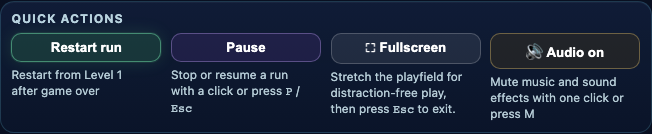

### Daily improvement: fullscreen exit helper copy
- Updated the desktop **Fullscreen** quick-action helper text to explicitly teach **`Esc`** as the way back out after expanding the playfield.
- This closes a small but real usability gap: fullscreen mode hid the surrounding shell, so first-time players had no visible reminder for how to exit once they went in.
- Kept the change local to the existing quick-action copy plus matching button accessibility text, making it a safe discoverability polish pass without changing gameplay.

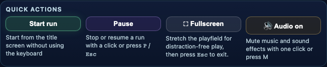

## 2026-06-09
### Daily improvement: Enter start shortcut discoverability
- Surfaced **`Enter`** everywhere players look before a run starts: the desktop **Start** shortcut chip, the run-summary start prompt, the title-screen status text, and the level-intro start banner now all explicitly mention it.
- This closes a small desktop onboarding gap, because the game already accepted **`Enter`** to begin a run but the visible shell only taught **Space / W / ↑ / tap ▲**.
- Kept the change local to visible start-state copy, making it a safe clarity polish pass without changing gameplay behavior.

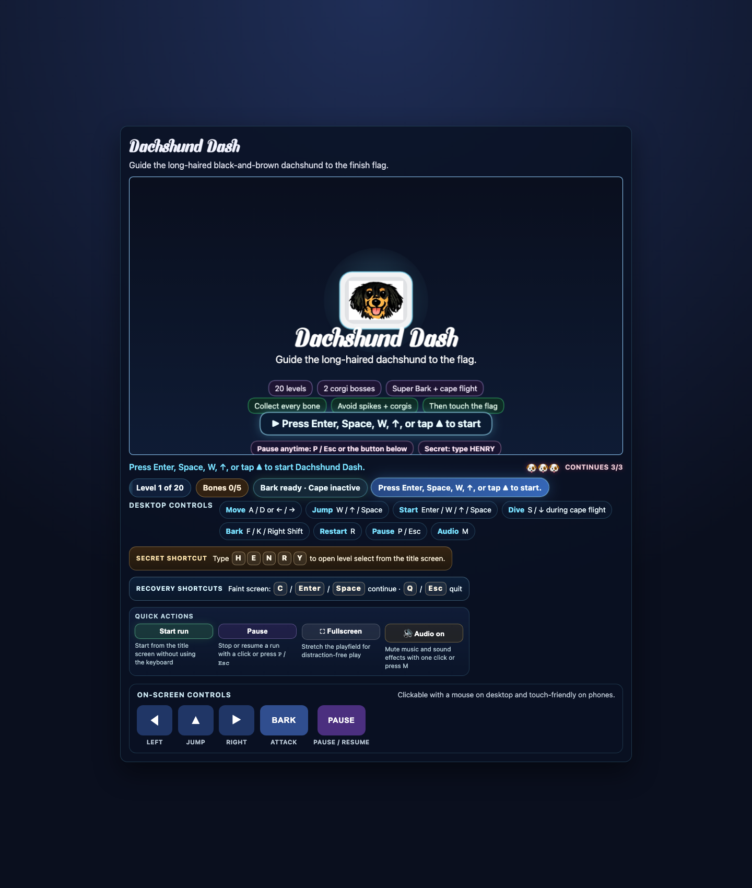

### Daily improvement: faint-screen recovery shortcut callout
- Added a visible **Recovery shortcuts** callout to the desktop help area so players can learn the **faint-screen** keyboard inputs before they need them.
- The new helper explicitly teaches **`C` / `Enter` / `Space`** to continue and **`Q` / `Esc`** to quit, which closes a small discoverability gap in the run-recovery flow.
- Kept the change local to the shell help UI, making it a safe clarity polish pass without changing gameplay behavior.

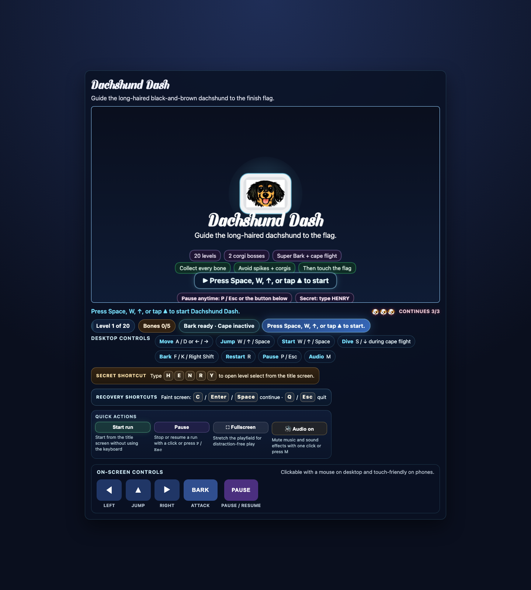

## 2026-06-08
### Daily improvement: touch restart shortcut chip
- Updated the visible **touch controls** help so the **`▲`** chip now explicitly says **Jump · start · continue · restart**.
- This closes a small mobile onboarding gap: touch players could already restart with **▲** after a loss or full clear, but the start-screen shortcut row stopped at **continue**.
- Kept the change local to the shell help copy, making it a safe discoverability polish pass without changing gameplay behavior.

### Daily improvement: pause shortcut discoverability
- Surfaced the keyboard **pause/resume shortcut** everywhere players look first: the desktop controls chips, the title-screen helper badge, the paused-state summary text, and the desktop pause button helper copy now all call out **`P`** alongside **`Esc`**.
- This closes a small but real onboarding gap, because the game already supported **`P`** in-play but the visible shell mostly implied **`Esc`** was the only keyboard pause key.
- Kept the change local to UI copy and existing state text, making it a safe clarity polish pass without changing gameplay behavior.

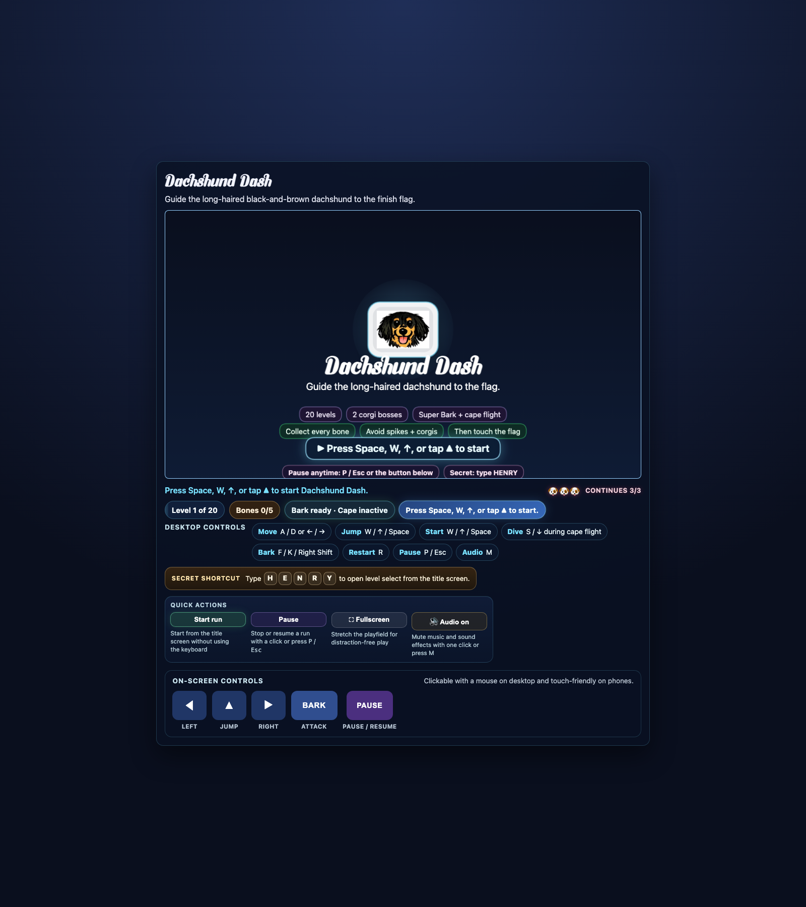

## 2026-06-07
### Daily improvement: desktop start shortcut chip
- Added a dedicated **Start** chip to the desktop controls quick-reference row so the title screen explicitly teaches which keyboard inputs begin a run.
- This removes the need to infer that **Jump** also starts the game, making the first action clearer for new desktop players.
- Kept the change local to visible shell help copy, making it a safe onboarding polish pass.

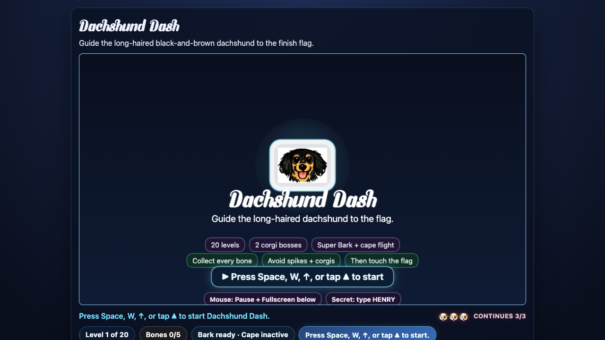

### Daily improvement: clearer start prompt controls
- Reworded the title-screen and start-state prompt copy to spell out the actual start inputs: **Space**, **W**, **↑**, or touch **▲**.
- This removes the vague **“Jump”** wording, so first-time players can tell exactly which keyboard keys will begin the run.
- Kept the change local to prompt text only, making it a safe onboarding clarity pass.

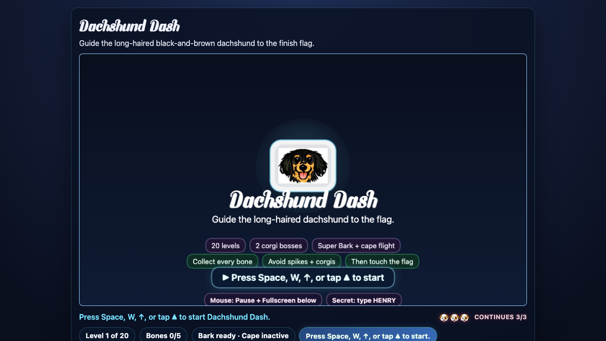

## 2026-06-06
### Daily improvement: level-select special-stage tags
- Upgraded the hidden **HENRY** level-select grid from number-only buttons to clearer **Level N** cards with small stage-type tags.
- Special runs now preview whether a level includes a **Cape**, **Toy**, or **Boss**, so cheat-starting later levels is much easier to scan without opening them first.
- Kept the change local to the secret level-select UI, making it a safe discoverability polish pass without touching gameplay.

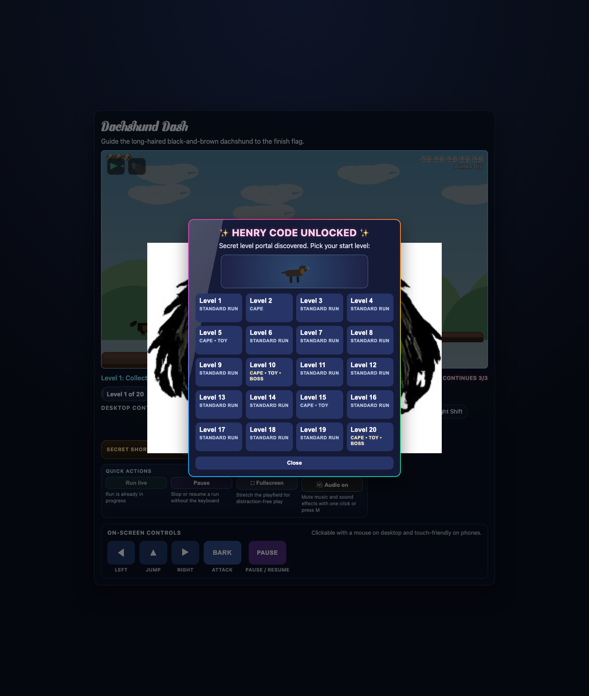

### Daily improvement: faint-screen recovery snapshot card
- Added a compact **recovery snapshot** card to the **YOU FAINTED** overlay so players can immediately see bones collected, hearts, continues, ability state, and boss HP before deciding whether to continue or quit.
- The full **GAME OVER** screen now reuses that same snapshot treatment with a restart-focused footer, keeping the run summary visible right at the failure decision point instead of dropping players into a mostly empty overlay.
- Kept the change local to overlay presentation, making it a safe clarity polish pass without altering combat or progression rules.

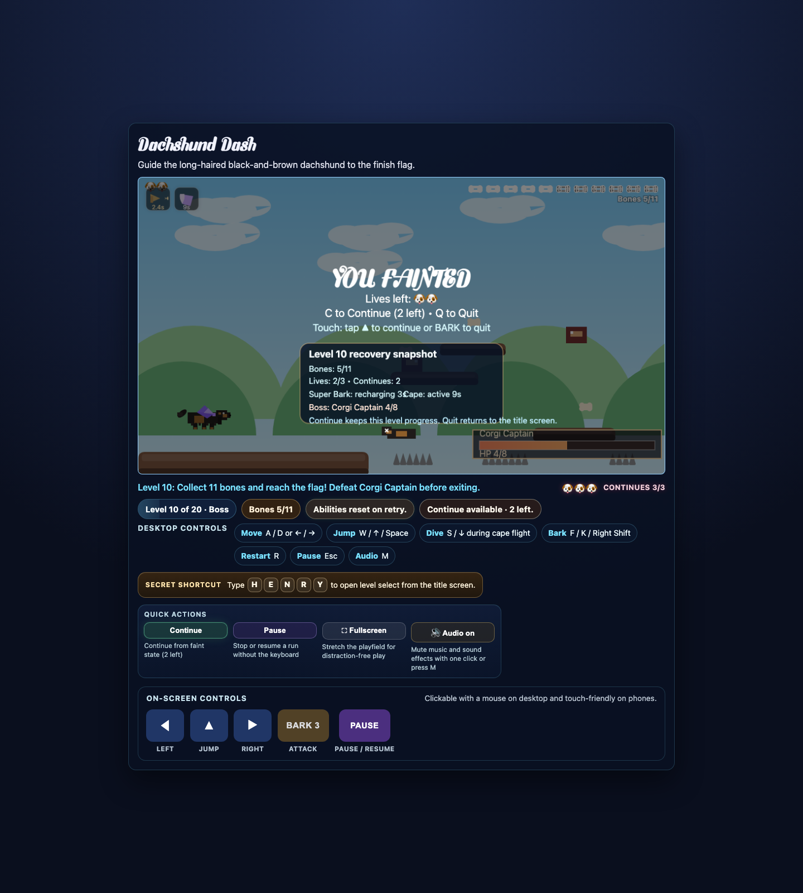

## 2026-06-05
### Daily improvement: visual campaign progress fill in the level pill
- Turned the run-summary **level pill** into a lightweight campaign progress indicator by adding a fill bar that grows with the current level.
- Players can now read both the **`Level X of 20`** text and the visual sense of how far through the run they are, without opening menus or relying on the in-canvas action.
- Kept the change local to the shell summary UI, making it a safe presentation polish pass.

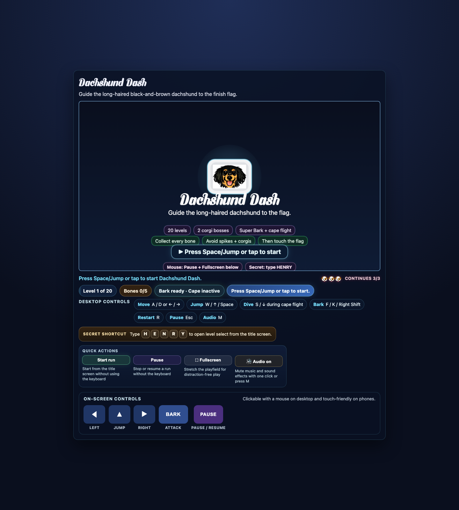

### Daily improvement: clearer level progress pill
- Updated the run-summary **level pill** to show full campaign progress as **`Level X of 20`** instead of only the current level name.
- Boss stages now add a compact **Boss** tag in that same pill, so players can tell at a glance where they are in the overall run.
- Kept the change local to the summary text, making it a safe clarity upgrade without changing gameplay.

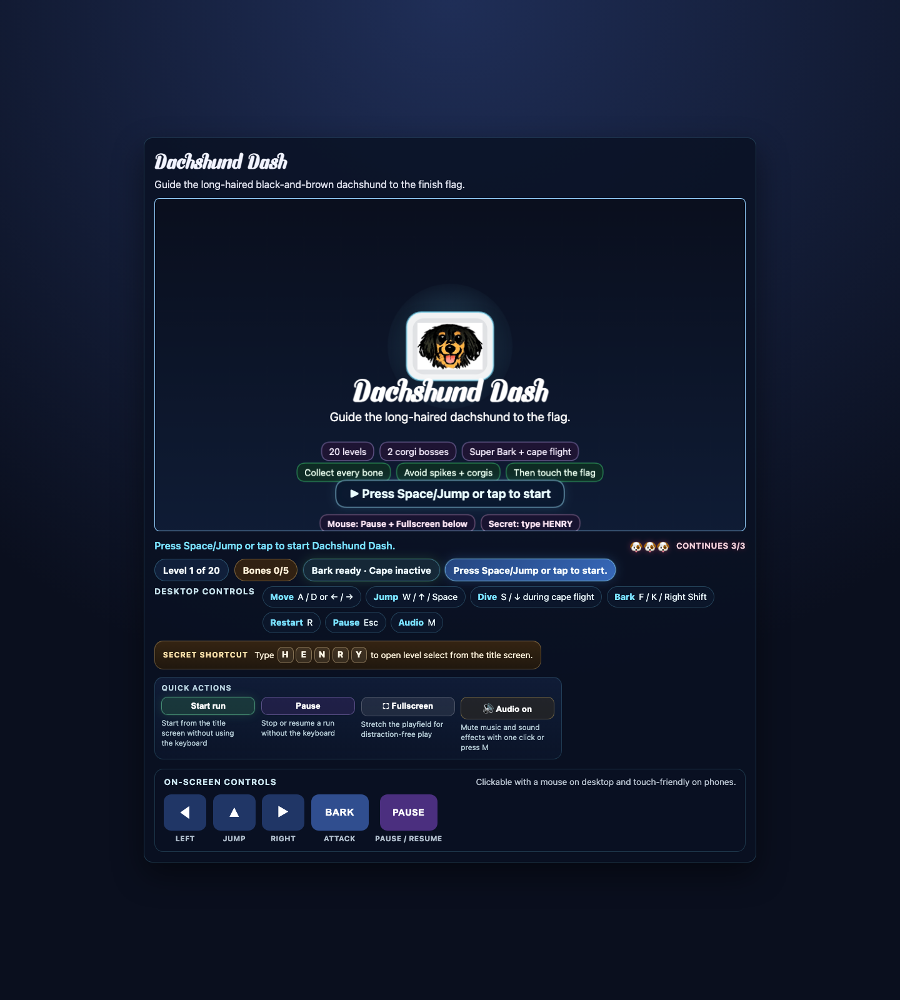

## 2026-06-04
### Daily improvement: keyboard audio mute shortcut
- Added a real desktop **`M` mute/unmute shortcut** so players can silence or restore the game instantly without reaching for the mouse or opening pause options.
- Surfaced that shortcut directly in the visible desktop controls chips and in the audio quick-action helper copy, so the new shortcut is discoverable from the start screen.
- Kept the change local to existing shell/audio controls, making it a safe quality-of-life polish pass.

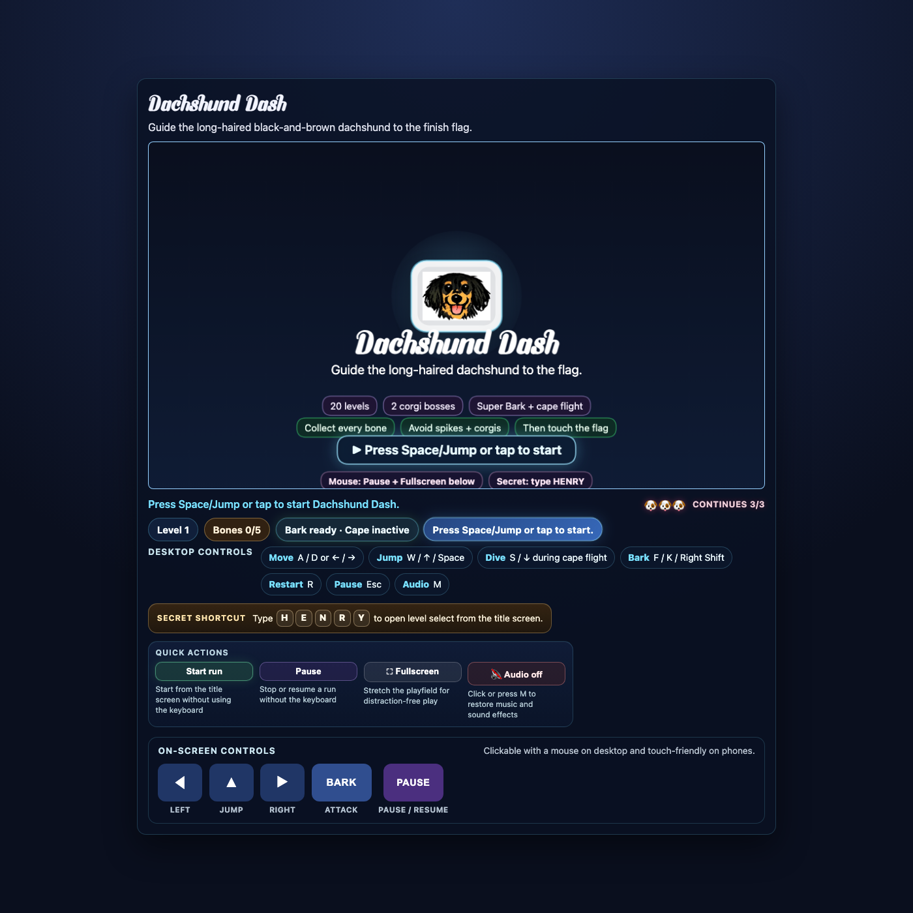

### Daily improvement: one-click desktop audio mute toggle
- Added a visible **Audio on / Audio off** button to the desktop **Quick actions** card so players can silence the game immediately without opening the pause menu sliders first.
- The button now updates its label, helper copy, and styling to reflect whether music and sound effects are currently muted.
- Kept the change local to the shell UI plus existing audio helpers, making it a safe quality-of-life improvement for shared or quieter play sessions.

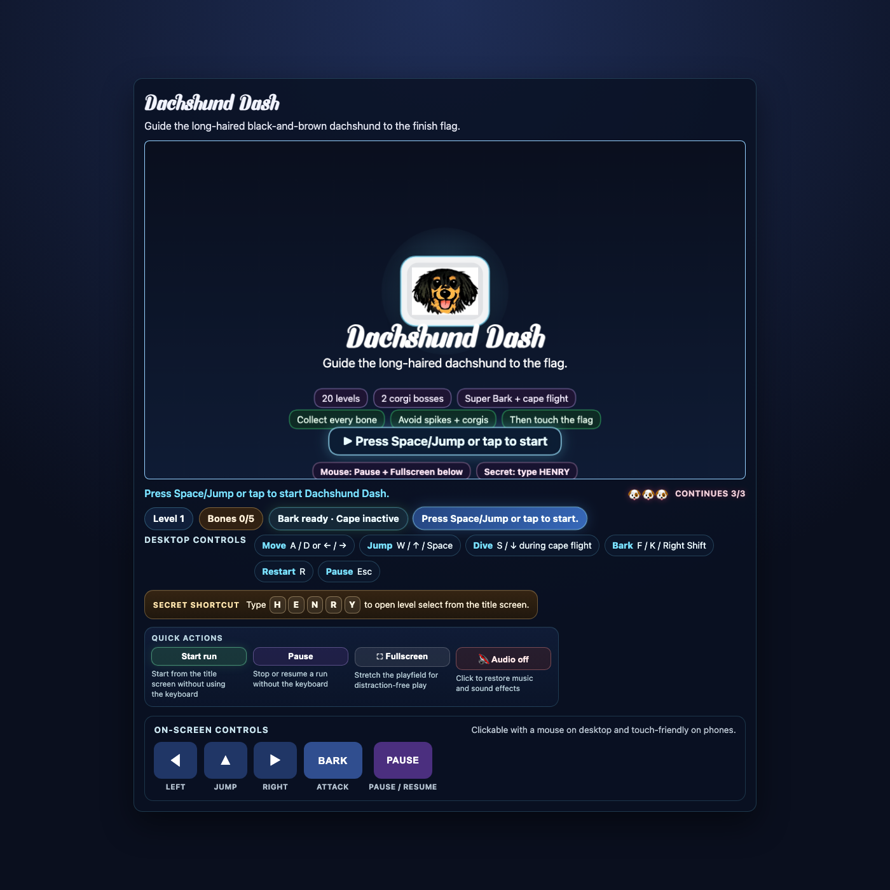

## 2026-06-03
### Daily improvement: desktop start / continue / restart button
- Added a dedicated **desktop primary action button** to the Quick actions card so mouse-first players can start a run, resume a pause, continue after a faint, or restart after game over without reaching for the keyboard.
- The button now updates its label and helper copy with game state (**Start run**, **Resume run**, **Continue**, **Restart run**) and disables itself during active play so it stays truthful instead of behaving like a dead control.
- Kept the change local to shell UI plus existing game-state transitions, making it a safe discoverability upgrade for desktop play.

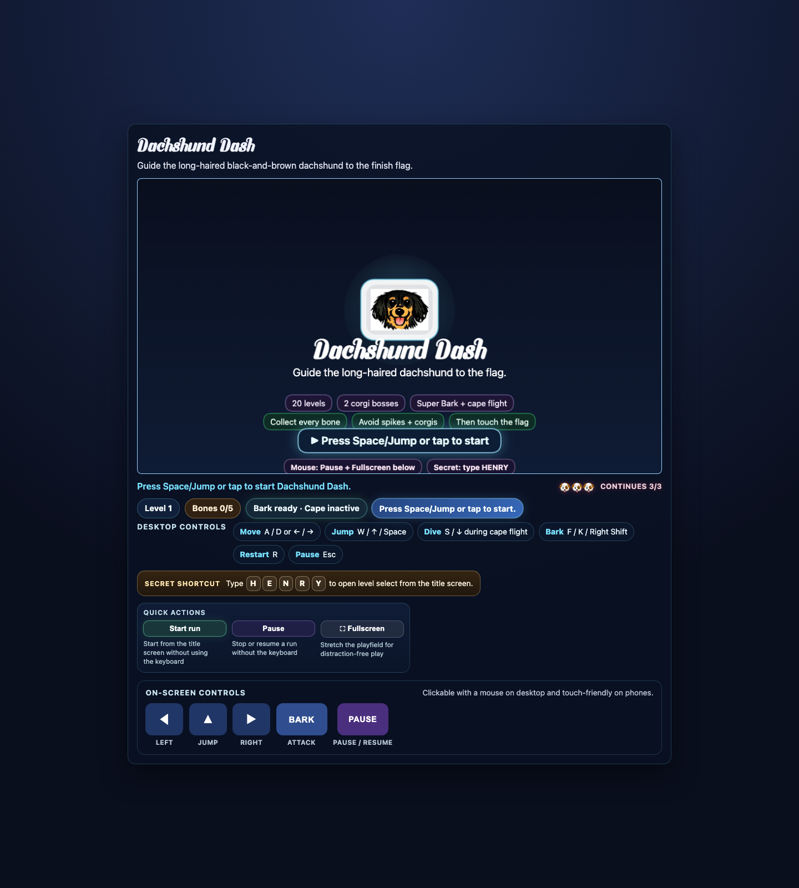

### Daily improvement: visible HENRY secret shortcut callout
- Added a dedicated **Secret shortcut** callout beside the desktop controls so the hidden **HENRY** level-select unlock is actually discoverable from the title screen.
- Styled each letter as a compact keyboard keycap, which makes the code easier to scan and remember without changing any gameplay logic.
- Kept the change local to the shell UI, so it improves onboarding for curious players while leaving the game systems untouched.

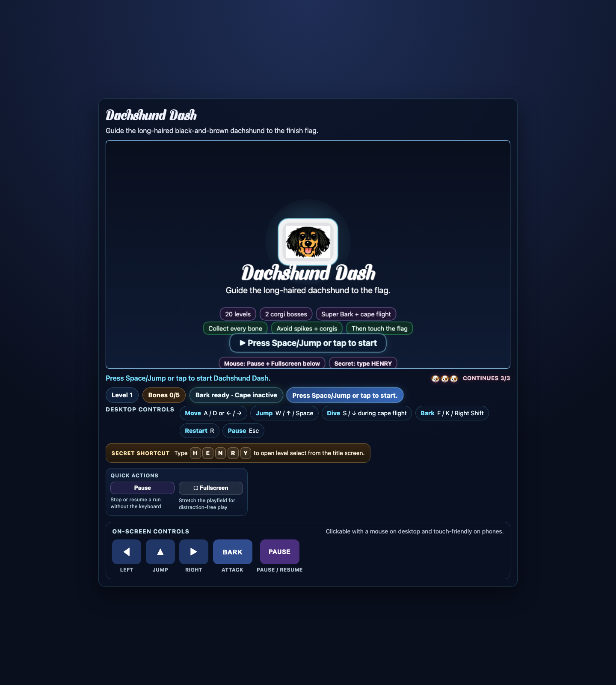

## 2026-06-02
### Daily improvement: on-screen control button captions
- Added visible **caption labels beneath each on-screen button** so the arrow-only controls no longer rely on symbol recognition or hover/assistive text.
- The bottom control row now spells out **Left**, **Jump**, **Right**, **Attack**, and **Pause / resume**, making the shell easier to understand for first-time desktop and touch players.
- Kept the change purely presentational and local to the control panel, so it improves clarity without touching game logic.

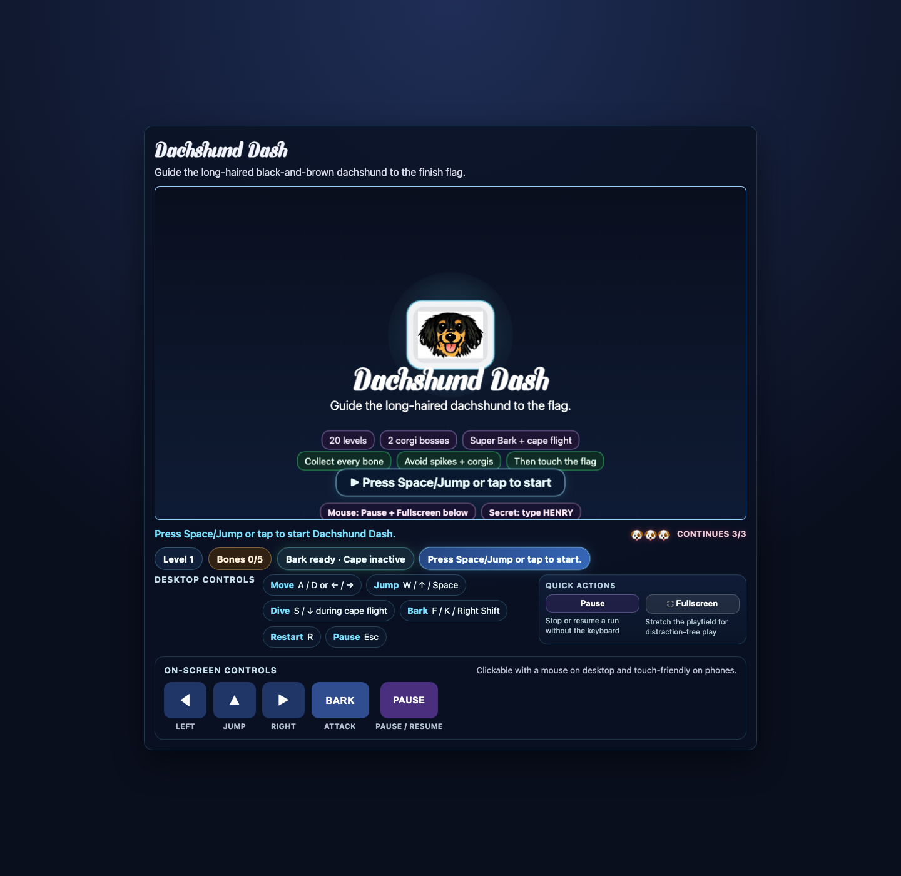

### Daily improvement: labeled on-screen controls panel
- Added a dedicated **On-screen controls** heading and helper caption above the bottom button row so those large buttons no longer read like unexplained floating UI.
- The new subtitle makes it explicit that the controls are **clickable with a mouse on desktop** and still **touch-friendly on phones**, which improves first-run discoverability without changing gameplay.
- Kept the change local to the shell UI, so it is easy to notice on the start screen and low-risk for the game itself.

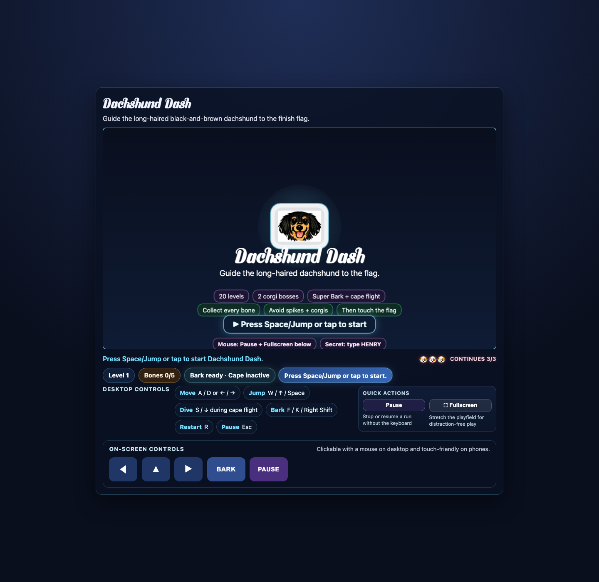

## 2026-06-01
### Daily improvement: start-screen footer hints
- Added a compact **footer hint row** inside the start overlay so the most useful non-keyboard discoveries stay visible without bringing back the old wall of control chips.
- The title screen now explicitly points desktop players to the **Pause** and **Fullscreen** buttons below the playfield, while keeping the **HENRY** secret discoverable in the same lightweight treatment.
- Also nudged the main start prompt a bit higher so the bottom-of-canvas onboarding feels cleaner and less cramped.

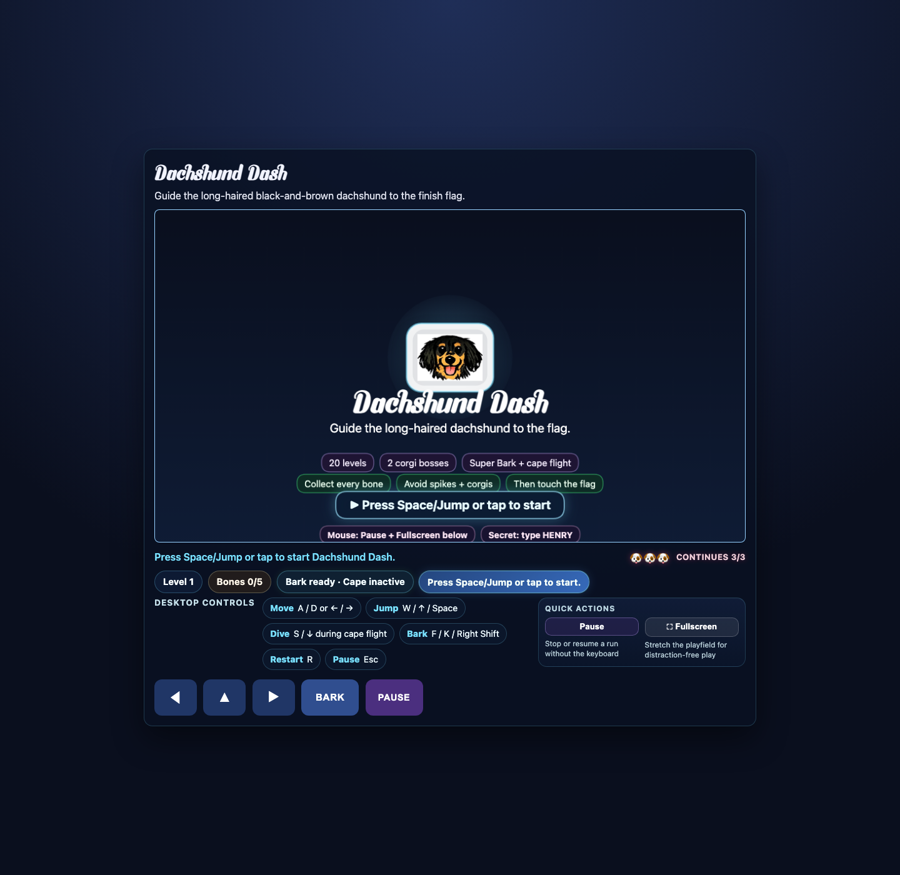

### Daily improvement: decluttered start overlay spacing
- Simplified the **start overlay inside the playfield** so it no longer crams duplicated control rows into the canvas area.
- Kept the key feature badges, level objective chips, start prompt, and **HENRY** secret visible, while relying on the existing shell controls reference below the canvas for the full input list.
- This makes the title screen easier to scan and fixes the cut-off / overlapping lower overlay content without changing gameplay.

## 2026-05-31
### Daily improvement: desktop quick action hints
- Added short helper captions beneath the desktop **Pause** and **Fullscreen** buttons so mouse-first players can tell what those controls are for before starting a run.
- The new copy makes it obvious that **Pause** can stop or resume play without the keyboard and that **Fullscreen** is the distraction-free view.
- Kept the change lightweight and purely presentational, building on the quick-actions card without changing any controls or game logic.

### Daily improvement: desktop quick actions card
- Grouped the desktop **Pause** and **Fullscreen** buttons into a dedicated **Quick actions** card so they no longer feel visually detached from the keyboard help row.
- Added a small label, shared panel styling, and tighter button grouping to make those utility controls easier to spot before a run starts.
- Kept the change purely presentational, so it improves discoverability without changing any game behavior or inputs.

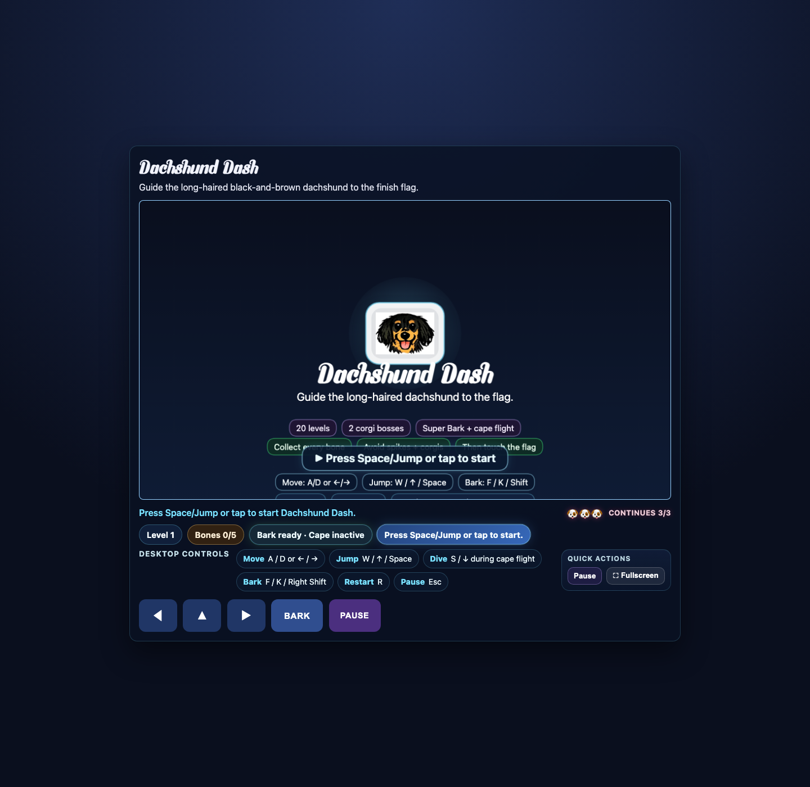

## 2026-05-30
### Daily improvement: pause summary resume hint now includes touch
- Updated the **paused run-summary goal pill** so it no longer reads like a keyboard-only instruction.
- The pill now says **“Paused · Esc or PAUSE resumes.”**, which matches the actual mobile and desktop resume paths already available in the shell.
- This keeps the pause-state guidance consistent with the newer touch-friendly controls instead of teaching only the Esc key.

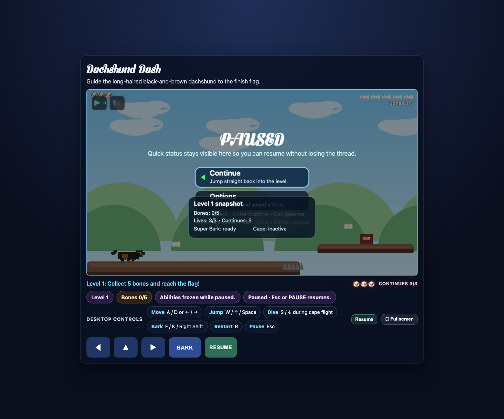

### Daily improvement: start goal pill call-to-action styling
- Gave the **run summary goal pill** a dedicated **start-state treatment** so the landing-page prompt reads like the primary action instead of blending into the other status chips.
- The **“Press Space/Jump or tap to start”** pill now uses a brighter blue gradient, stronger border contrast, and a gentle pulse that makes the start instruction easier to spot at a glance.
- This stays purely presentational, so it improves the first-run read without changing any gameplay or controls.

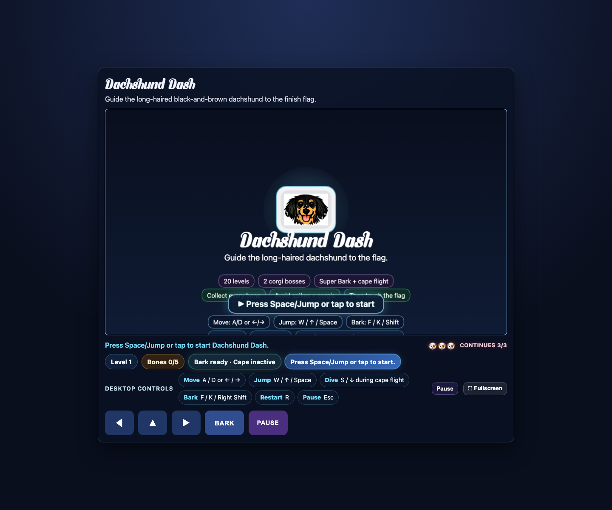

## 2026-05-29
### Daily improvement: mobile touch controls quick reference
- Added a **Touch controls** help strip beneath the on-screen buttons on small screens, so phone players can see what each control does without guessing mid-run.
- The new chips call out that **▲** handles **jump / start / continue**, **BARK** is used for **attacks** and some **quit** flows, and **PAUSE** can both **pause** and **resume**.
- Kept it mobile-only so the extra guidance appears where it matters without adding clutter to the desktop layout.

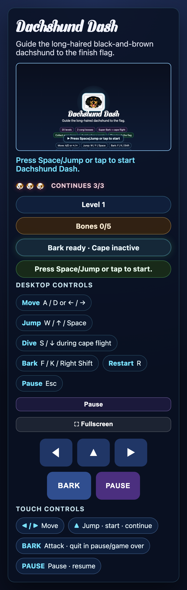

### Daily improvement: visible keyboard focus ring for controls
- Added a clear **focus-visible highlight** to the shell buttons and touch controls so keyboard players can immediately tell which control is selected while tabbing.
- The **Pause**, **Fullscreen**, mobile control buttons, and level-select buttons now get the same cyan outline and glow, which makes the page feel more intentional and accessible without changing gameplay.
- This is especially useful on the title screen and around pause/fullscreen actions, where the game already exposes real page buttons outside the canvas.

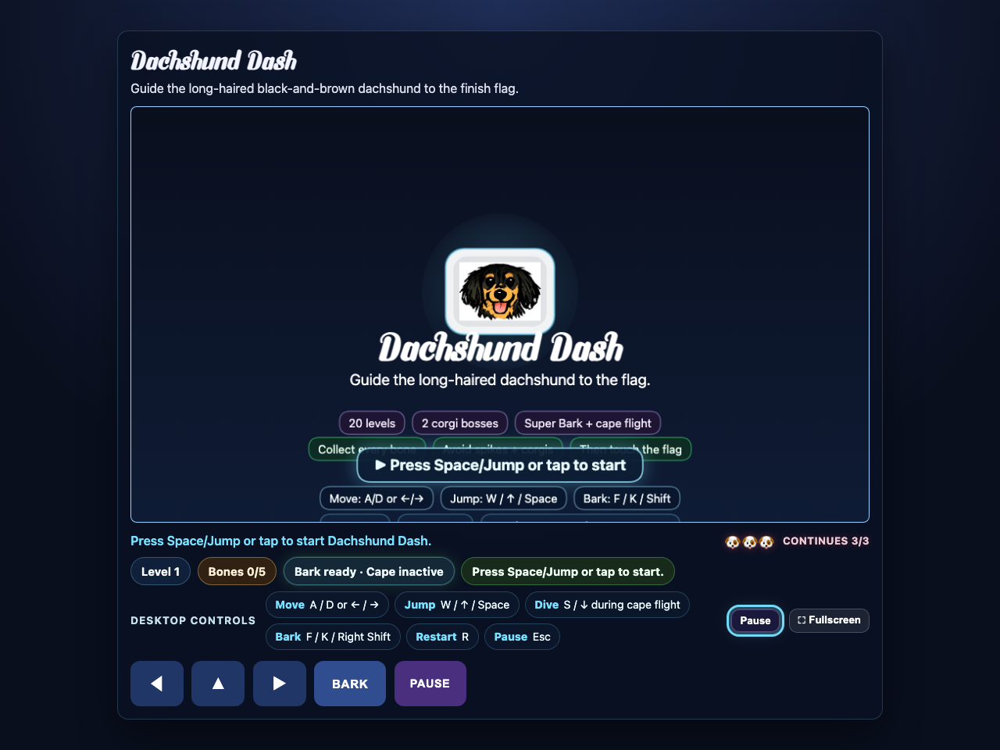

## 2026-05-28
### Daily improvement: touch-friendly pause menu controls
- Closed a real mobile pause-menu gap: touch players can now actually **navigate and use** the pause menu instead of only pausing and resuming.
- On the main pause screen, **◀/▶** now switch between **Continue** and **Options**, **▲** confirms the current choice, and the overlay teaches that **PAUSE** resumes immediately.
- Inside pause options, **BARK** switches between the Music and SFX rows, **◀/▶** adjusts the selected slider, and **▲** saves back to the main pause menu.

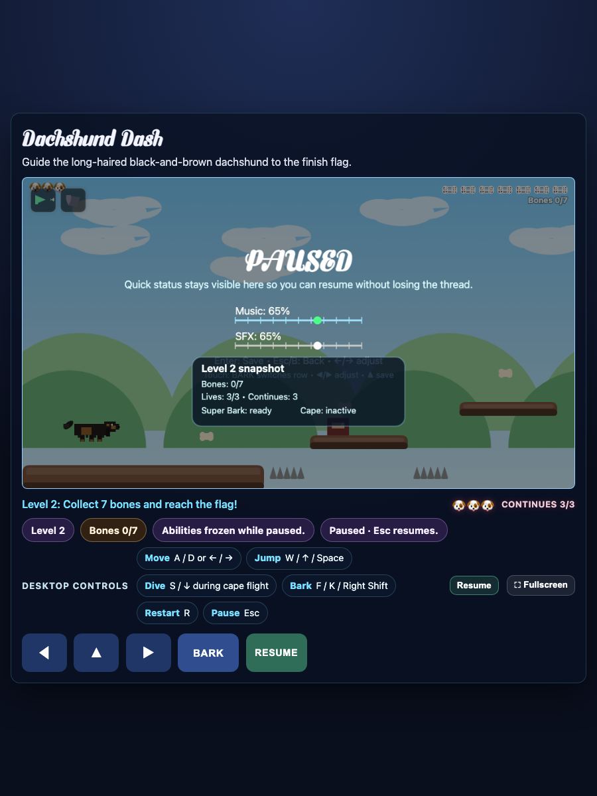

### Daily improvement: game-over touch restart guidance
- Clarified the **GAME OVER** overlay so it no longer looks keyboard-only once a run is out of continues.
- The screen now explicitly says **no continues are left**, keeps the **keyboard restart** keys visible, and adds a dedicated **touch restart** line for tapping **▲**.
- Also synced the run-summary restart hint and game-over status copy to mention the same touch restart path, so the messaging stays consistent across the page.

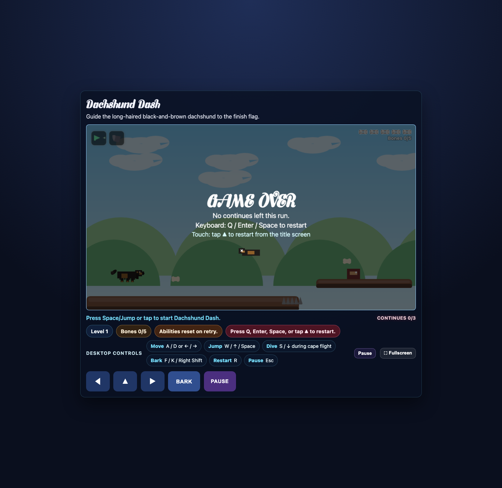

## 2026-05-27
### Daily improvement: boss intro summary goal copy
- Fixed the **run summary goal pill** on boss-level intro screens so it no longer implies the flag is enough once players leave the title overlay.
- Levels 10 and 20 now explicitly say players must **collect the bones**, **defeat the boss**, and **then touch the flag**, matching the real win condition already used elsewhere.
- This keeps the summary strip truthful during the exact moment players are deciding what the level expects before they start moving.

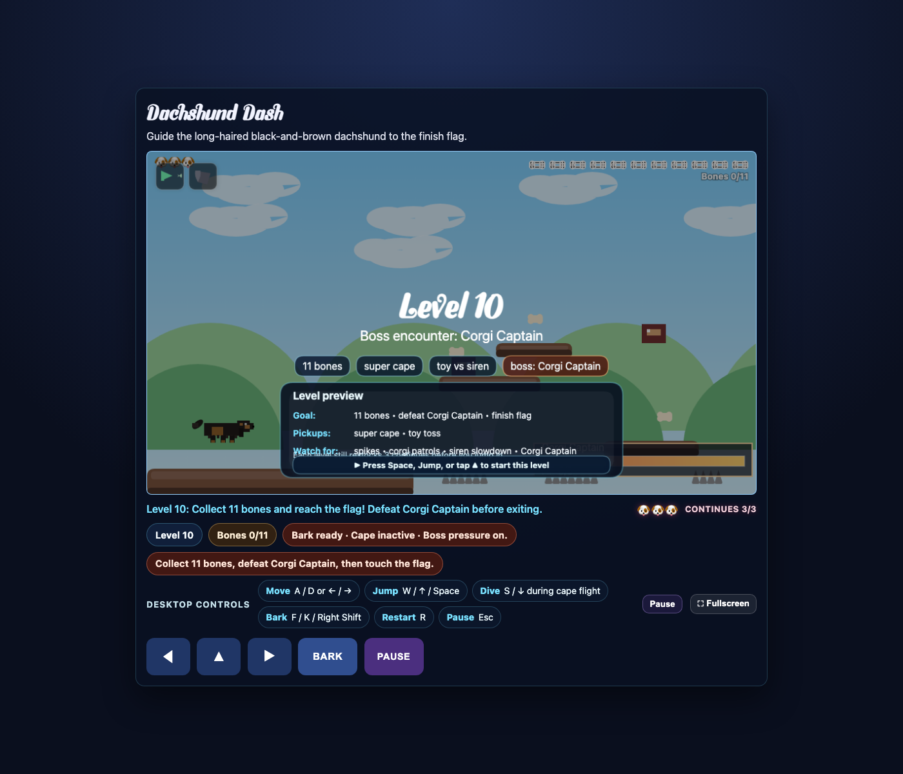

### Daily improvement: desktop controls shortcut chips
- Replaced the dense **desktop controls** sentence below the canvas with a quick-scan strip of **shortcut chips** for Move, Jump, Dive, Bark, Restart, and Pause.
- This keeps the keyboard help visible but makes it much easier to read at a glance before starting a run or after a quick reset.
- Kept the existing **Pause** and **Fullscreen** utility buttons in place so the layout is clearer without changing gameplay behavior.

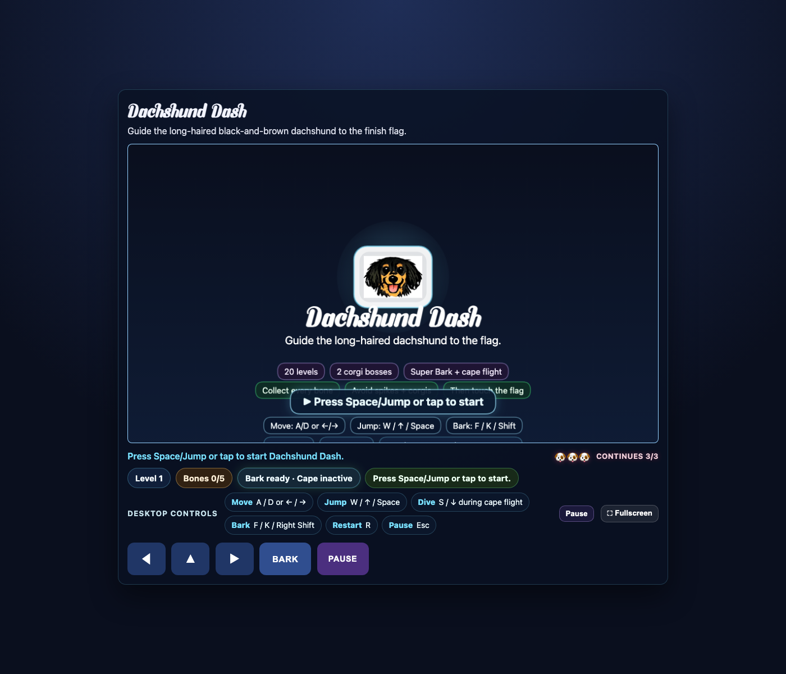

## 2026-05-26
### Daily improvement: pause snapshot boss status
- Expanded the **pause snapshot card** on boss stages so it now shows the live boss objective instead of dropping that context the moment players pause.
- During boss fights, the card now displays the boss name and current **HP remaining**, making it much easier to decide whether to resume aggressively or reset.
- If the boss is already beaten, the same line flips to a **defeated / flag-ready** reminder so the pause overlay still reflects the actual win condition.

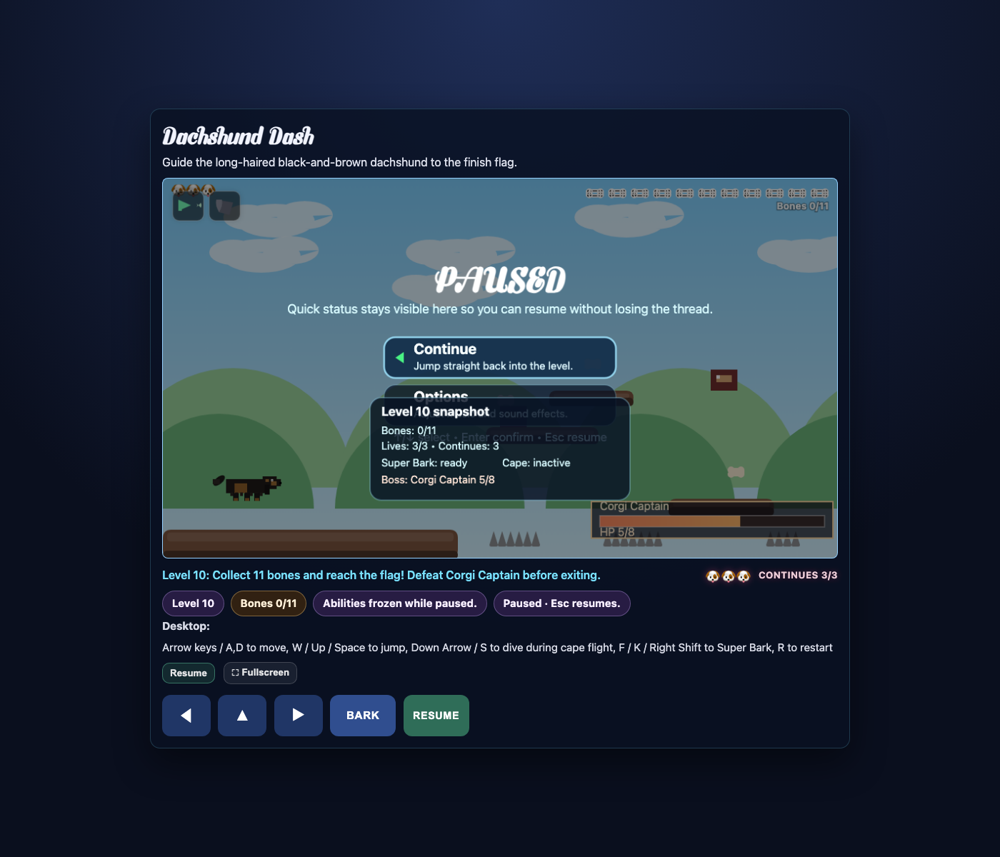

### Daily improvement: boss-level preview goal copy
- Updated the **Level preview** card on boss stages so the **Goal** row no longer implies the flag alone is enough.
- Boss levels now explicitly say players must collect the bones, **defeat the boss**, and then reach the finish flag, which makes the win condition clearer before the run starts.
- This is a small copy-only polish change, but it removes a real moment of confusion right before Levels 10 and 20.

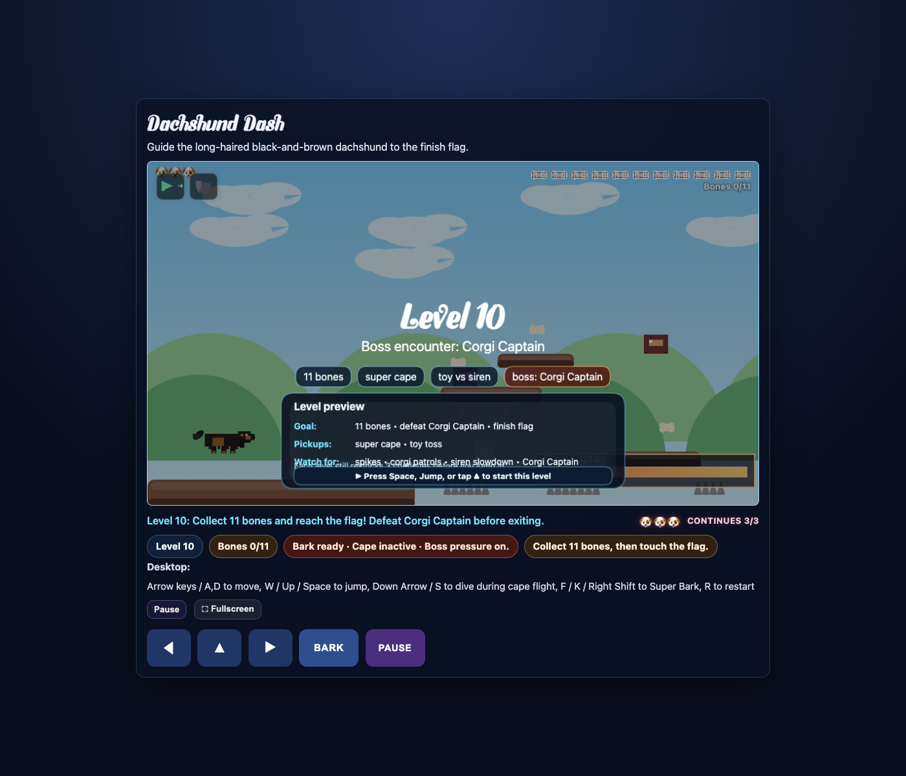

## 2026-05-25
### Daily improvement: level intro start prompt
- Added a visible **start prompt bar** inside the new level-intro preview card so players no longer have to guess how to leave the intro overlay and begin the level.
- The prompt explicitly calls out **Space**, **jump**, and **touch ▲** input paths, which makes the transition from reading the preview to actually playing much clearer.
- Kept the prompt animated and integrated with the existing preview card so the instruction feels like part of the game UI instead of a stray status line.

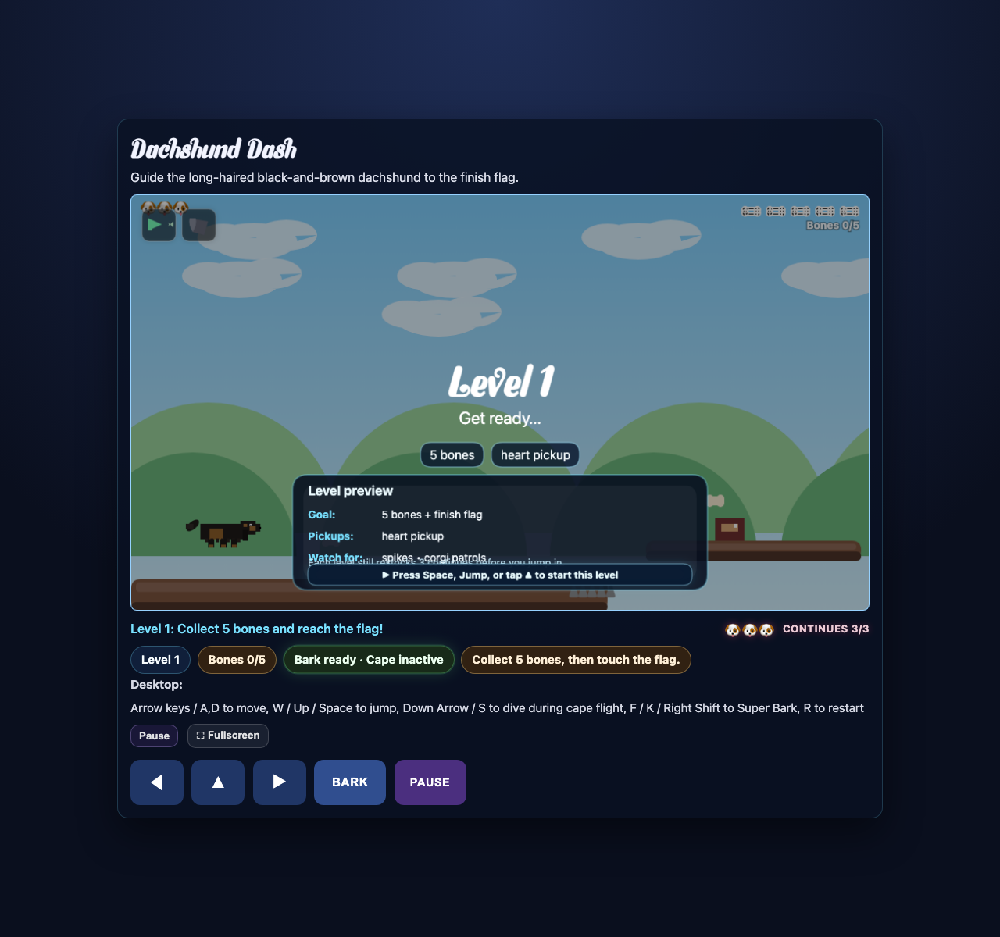

### Daily improvement: level intro preview card
- Added a new **Level preview** card to the level-intro overlay so players get a readable summary before they start moving.
- The card now spells out the current level's **goal**, available **pickups**, and the main **threats** waiting in the run, instead of leaving that context split across small badges.
- Also surfaced a quick **continues restock** reminder there, which makes each level start feel more intentional for quick retries.

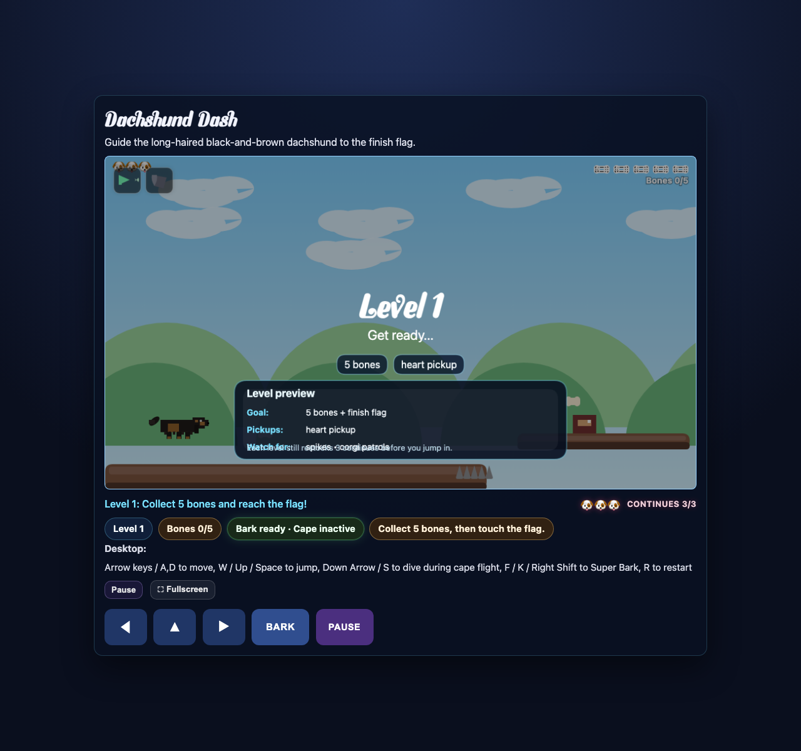

## 2026-05-24
### Daily improvement: pause menu keyboard selection
- Fixed a real pause-menu UX gap: the overlay already told players to use **↑/↓ to select**, but those keys did not actually move between **Continue** and **Options**.
- The pause menu cards now support proper **Up/Down selection** and **Enter/Space confirmation**, so the on-screen hint finally matches the controls.
- This makes the pause overlay feel intentional instead of misleading, especially for keyboard-first players stopping mid-run.

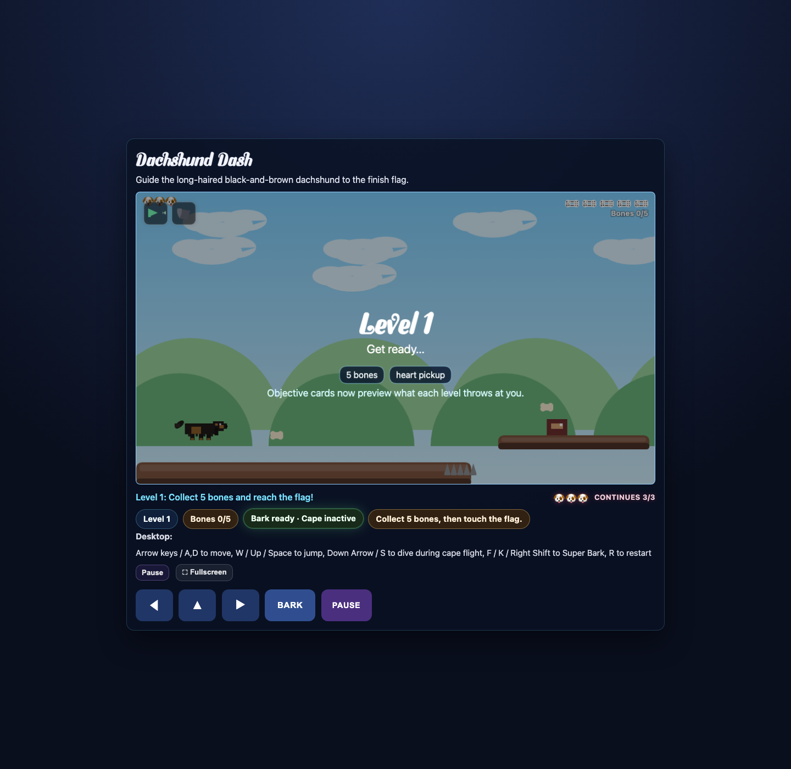

### Daily improvement: run summary ability pill
- Added a new **run summary ability pill** below the canvas so players can read core power state without relying on the in-canvas HUD alone.
- The pill now reports **Super Bark ready vs cooldown**, **toy held** for siren levels, and **cape active vs inactive** in one glanceable line.
- This keeps moment-to-moment ability status visible in the page chrome, which is especially helpful on quick restarts and for players scanning below the playfield.

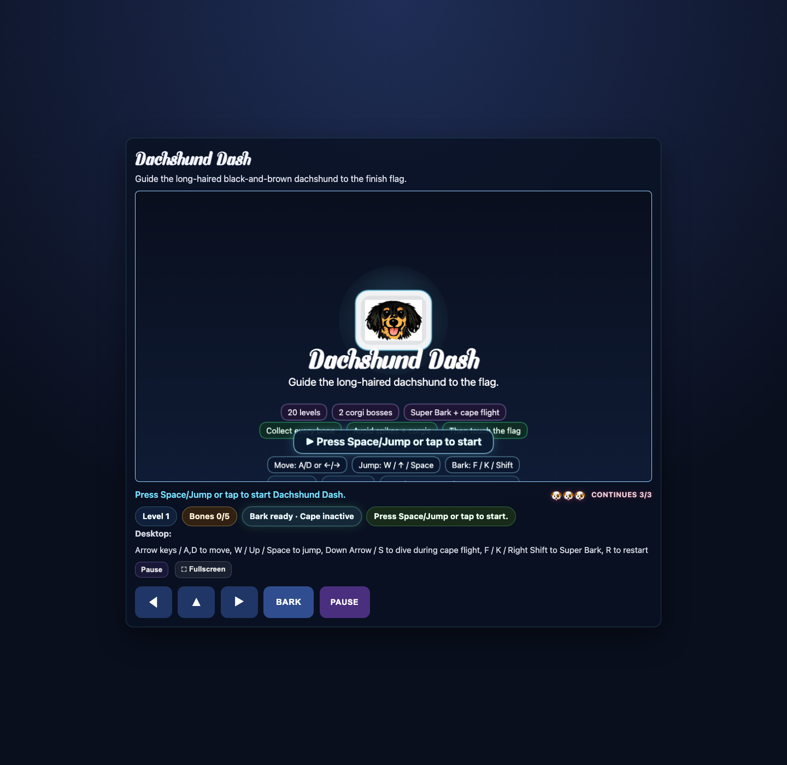

## 2026-05-23
### Daily improvement: stateful run summary strip
- Upgraded the new **run summary strip** so each pill now changes color with its current state instead of reading like static chrome.
- The strip now highlights **bone collection** in amber, **boss objectives** in warm danger tones, **paused / continue / restart** states in distinct warning colors, and **flag-ready / clear** states in bright green.
- This makes the summary easier to scan peripherally during quick resets and mid-run pauses without adding new gameplay complexity.

### Daily improvement: live run summary strip
- Added a visible **run summary strip** below the canvas that mirrors the current **level**, **bone count**, and **next objective** outside the canvas-only HUD.
- The goal pill now updates with context like **start prompt**, **bones remaining**, **boss defeat required**, **touch the flag**, and **paused / restart** states, making progress easier to read at a glance.
- This is especially helpful for accessibility and quick scanning because the key objective no longer lives only inside the animated playfield.

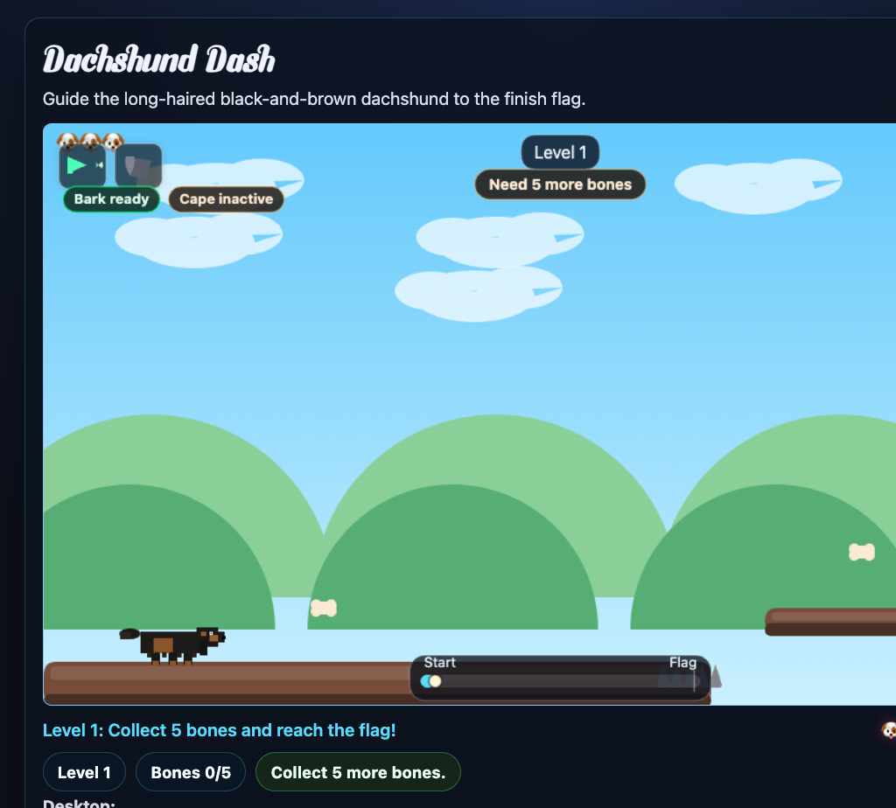

## 2026-05-22
### Daily improvement: start prompt call-to-action card
- Replaced the plain start-screen **"Press Space/Jump or tap to start"** line with a more readable **rounded call-to-action card** so the first input prompt stands out immediately.
- Added a subtle glow pulse and play-arrow treatment to make the starting action easier to spot without changing any gameplay rules.

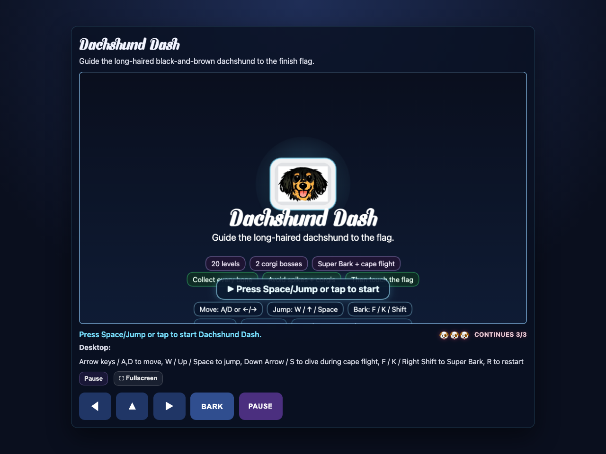

### Daily improvement: pause menu option cards
- Reworked the pause overlay's main menu from plain text into readable **selection cards** for **Continue** and **Options**, making the current choice easier to scan when stopping mid-run.
- Added short helper subtitles and a clear active chevron/highlight so the pause flow feels more like an intentional game menu than a debug overlay.

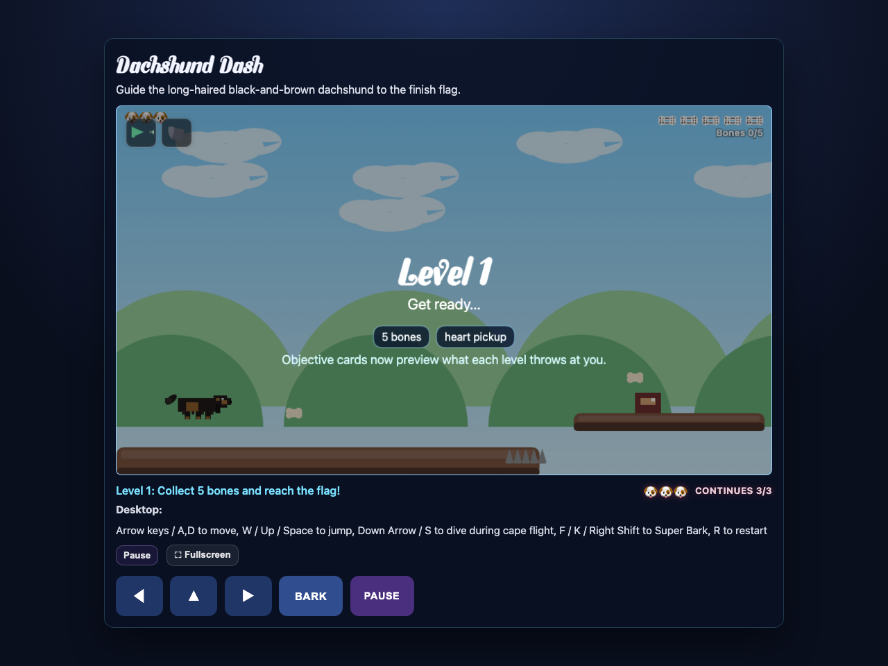

## 2026-05-21
### Daily improvement: start-screen objective chips
- Added a highlighted **goal chip row** to the title screen that spells out the real win condition: **collect every bone**, **survive hazards**, and **then touch the flag**.
- This gives first-time players the objective before they begin, instead of learning mid-run that the flag alone is not enough.

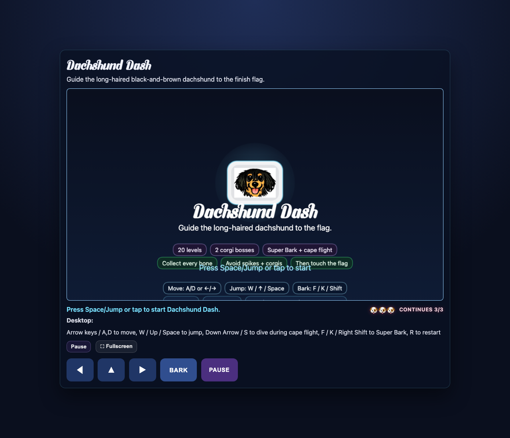

### Daily improvement: start-screen Henry portal hint
- Added a visible **secret hint** to the start screen that tells players to type **`HENRY`** for the level-select portal, so the existing cheat unlock is discoverable without needing the README or source.
- Kept the hint small and in-theme so it helps curious players without crowding the core start prompt.

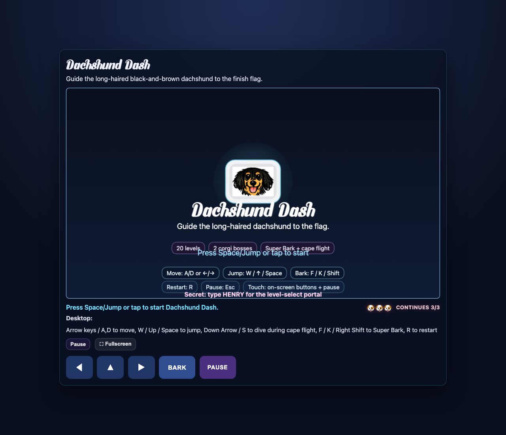

## 2026-05-20
### Daily improvement: readable continues counter
- Upgraded the shell HUD's lives area from emoji-only output to a clearer **Continues X/Y** counter alongside the dog icons, so players can tell how many retries remain without counting symbols.
- Added matching accessibility text on the lives widget so screen readers announce the same retry state explicitly.

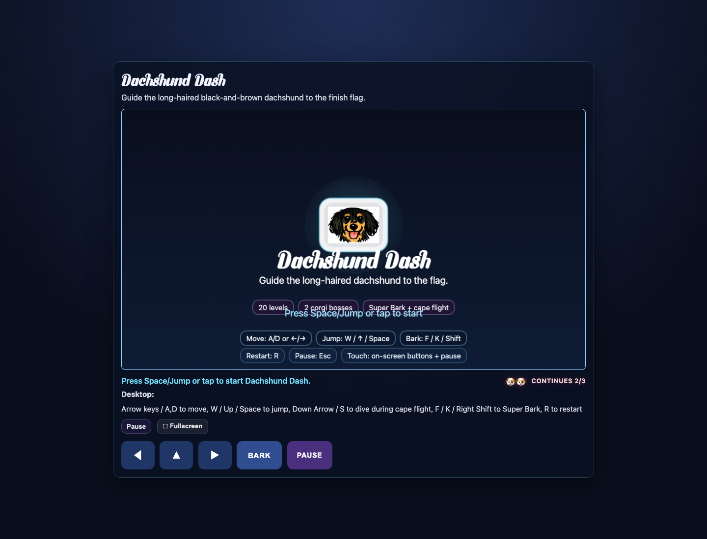

### Daily improvement: desktop pause button
- Added a visible **Pause / Resume** button beside **Fullscreen** in the desktop controls row so mouse-first players can stop and restart a run without remembering keyboard shortcuts.
- Wired the button into the existing pause system and matching paused styling, so it flips to **Resume** while the overlay is active.

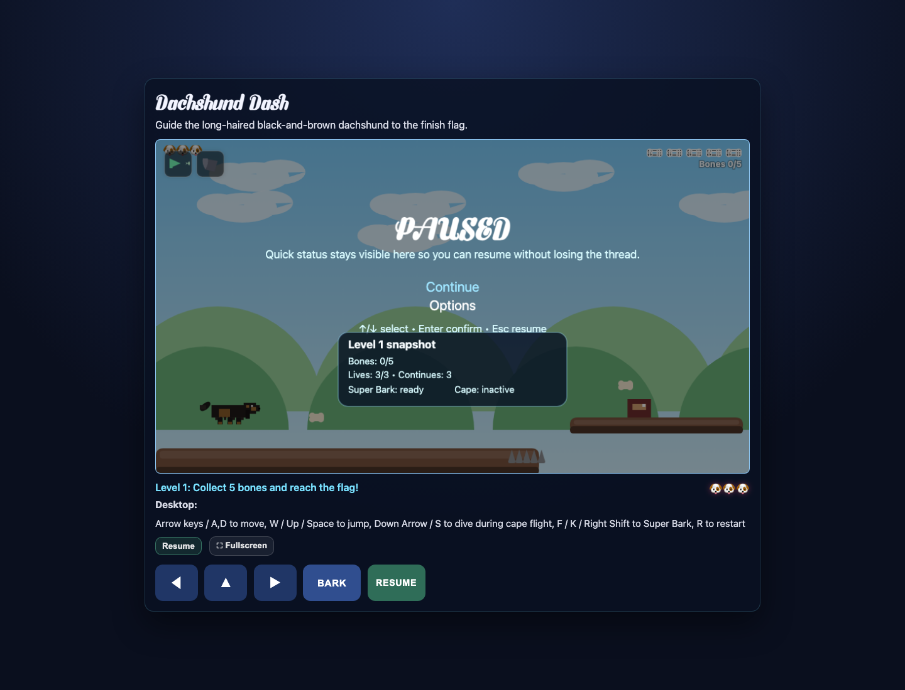

## 2026-05-19
### Daily improvement: touch faint-screen recovery
- Fixed a mobile recovery gap on the **YOU FAINTED** screen: touch players can now tap **▲** to continue from a lost life or **BARK** to quit back out, instead of getting stranded behind keyboard-only controls.
- Updated the death status copy and overlay hint so the touch path is visible right where players need it.

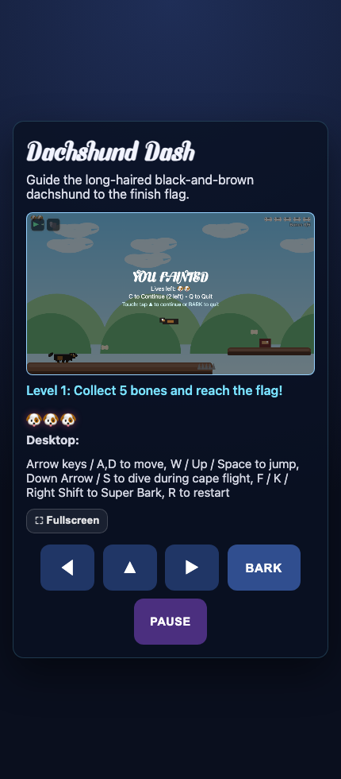

### Daily improvement: touch pause button
- Added a dedicated **PAUSE / RESUME** button to the on-screen touch controls so mobile players can stop and restart a run without needing a keyboard.
- Updated the start-screen touch hint to mention the new pause control, keeping the feature discoverable before the first level begins.

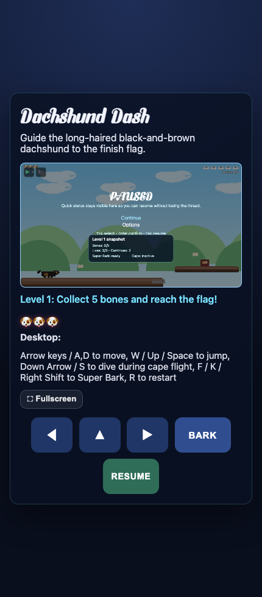

## 2026-05-18
### Daily improvement: title screen feature badges
- Added a compact **feature-badge row** to the title screen that calls out **20 levels**, **2 corgi bosses**, and **Super Bark + cape flight** before the run starts.
- This gives first-time players a quick read on the game's scale and signature mechanics without making them dig through the README.

### Daily improvement: start screen logo badge
- Styled the start screen's dachshund portrait as a **framed logo badge** with a soft glow, rounded card, and border so it feels intentional against the dark title backdrop.
- This keeps the existing art asset but makes the opening screen read more like a polished game menu instead of a floating rectangular image.

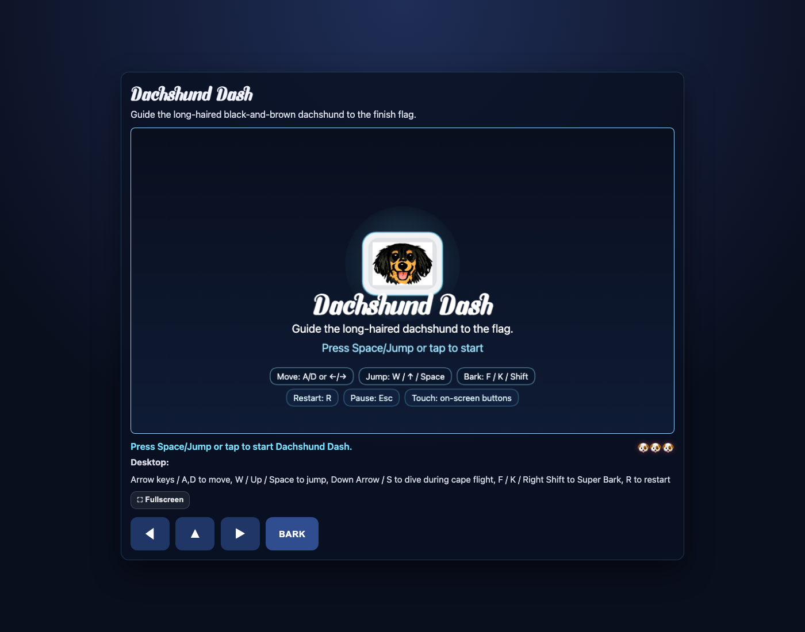

## 2026-05-17
### Daily improvement: in-run ability status strip
- Added a compact **top-left ability status strip** during gameplay so players can read **Super Bark** and **cape** state without decoding the icons alone.
- The new pills show **`Bark ready`** vs a live cooldown countdown, plus **`Cape inactive`** vs remaining cape time when flight is active.
- Kept the treatment small and color-coded so it stays readable without pulling focus away from jumps and hazards.

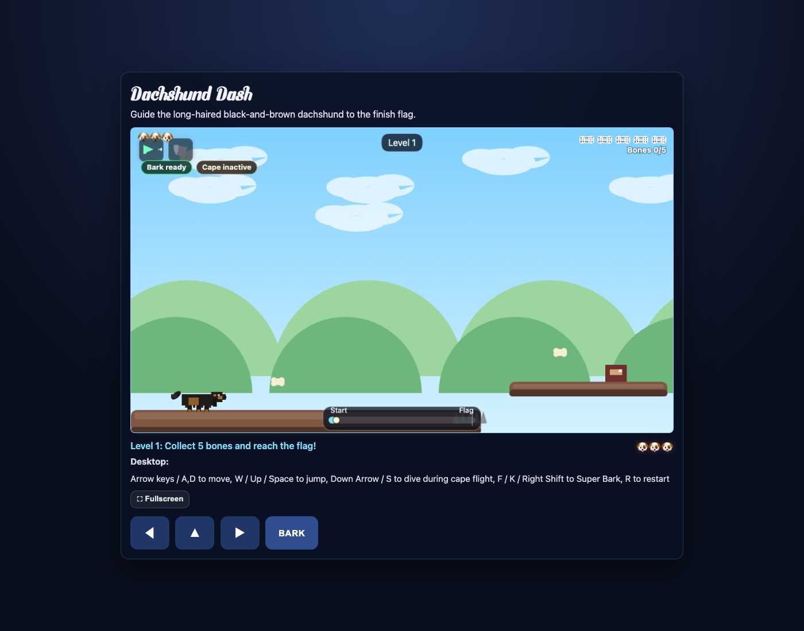

### Daily improvement: objective guidance chip
- Added a compact **top-center objective guidance chip** during gameplay so the next win condition stays explicit instead of living only in the status line.
- The chip now updates dynamically to show **bones remaining**, **boss defeat required**, or **`Flag ready!`** once the exit conditions are met.
- This keeps mid-level goals readable during movement-heavy sections and makes long runs easier to parse at a glance.

## 2026-05-16
### Daily improvement: in-run level progress tracker
- Added a compact **bottom-center progress tracker** during gameplay so players can see how far they are through the current level at a glance.
- The tracker shows the dachshund marker moving from **Start** toward the **Flag**, which makes long levels and quick restarts easier to read without opening menus.
- Kept it lightweight and translucent so it adds orientation without blocking platforming visibility.

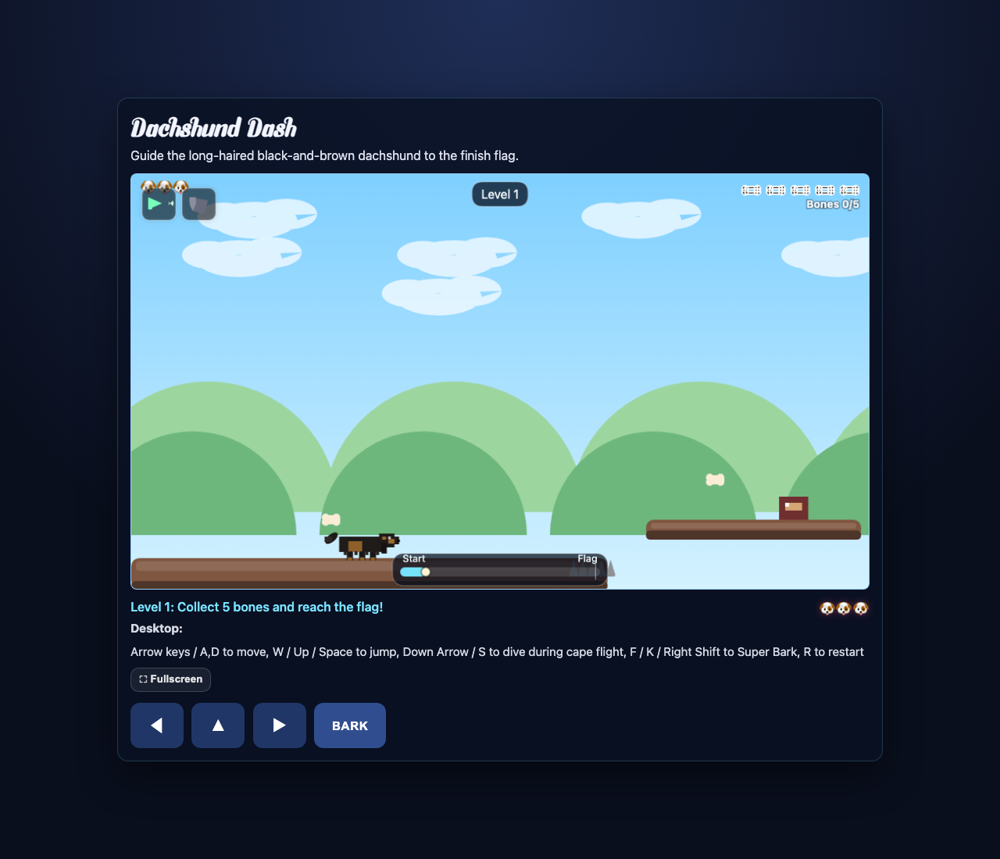

### Daily improvement: pause overlay status snapshot
- Added a compact **status snapshot card** to the pause overlay so players can quickly check level progress before resuming.
- The pause screen now shows the current level, bones collected, hearts, continues, and whether **Super Bark** or the **cape** are ready or still active.
- Also added a small pause-controls hint line so the overlay is easier to use at a glance.

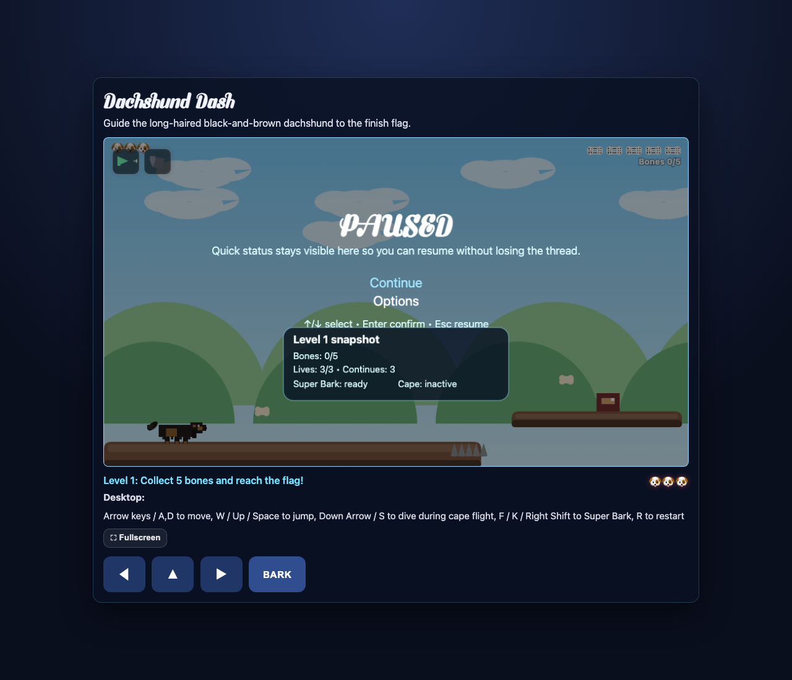

## 2026-05-15
### Daily improvement: restored centered game shell layout
- Fixed a CSS regression where the page background and layout styles were sitting outside the `body` rule and getting ignored by the browser.
- The game now loads inside its intended centered shell again, with the dark gradient backdrop and breathing room around the canvas.

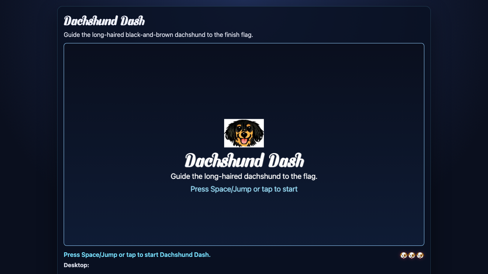

### Daily improvement: start screen controls legend
- Added a compact two-row **controls legend** to the title screen so desktop and touch players see the core inputs before the first jump.
- The new chips call out movement, jump, bark, restart, pause, and touch controls without adding a separate menu.

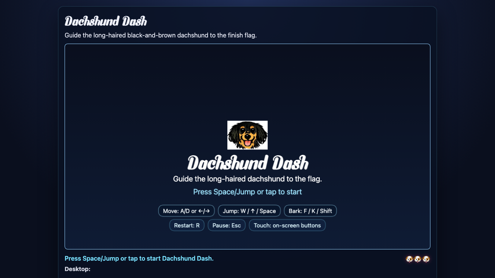

## 2026-05-14
- Improved jump feel with **coyote time** and **jump buffering**.
- Ground jumps now still trigger for a brief moment after stepping off a platform, and slightly-early jump presses now fire on landing.
- Jump SFX now plays when the jump actually happens, so timing stays consistent across keyboard and touch.

### Daily improvement: level objective cards
- Added **objective cards** to the in-level title overlay so each stage previews its key goals and threats before play begins.
- The intro card now calls out collectible count plus special features like **heart pickups**, **super cape**, **toy vs siren**, and **boss encounters**.
- Boss badges get a warmer highlight so high-stakes stages read faster at a glance.

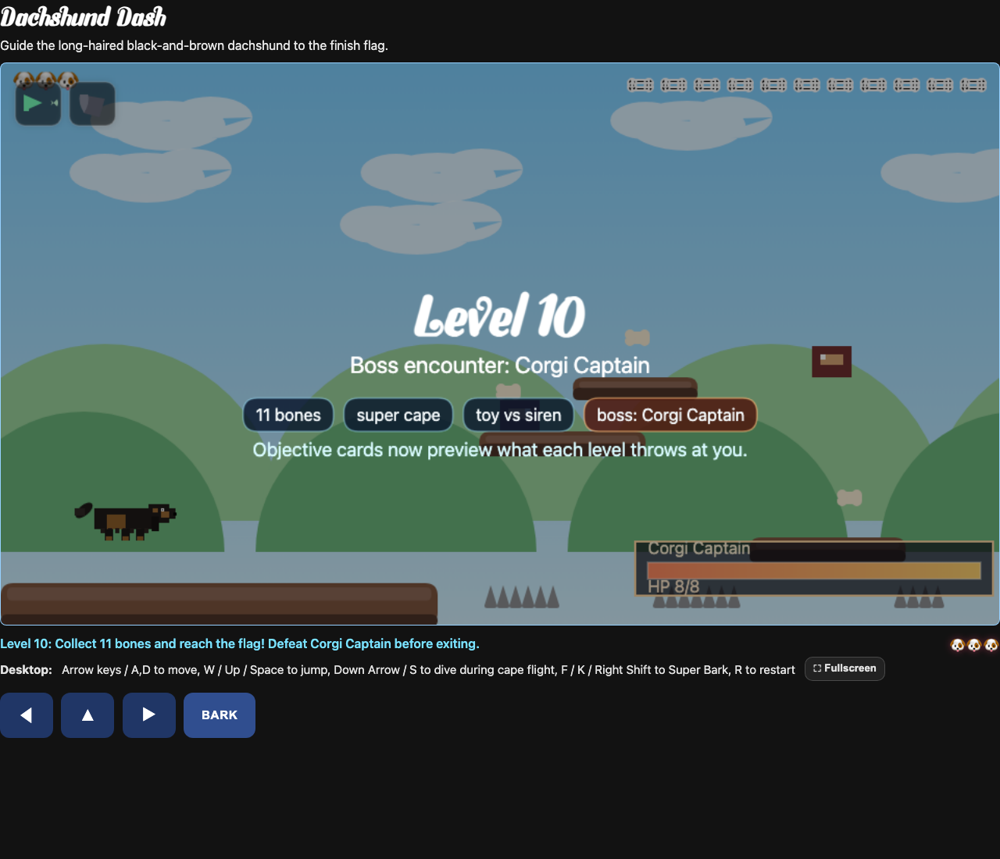

### Daily improvement: persistent in-run level chip
- Added a small **top-center level chip** during gameplay so the current stage stays visible without relying on the larger intro overlay or status text below the canvas.
- This makes quick restarts and mid-level context a little clearer, especially on mobile-sized layouts.

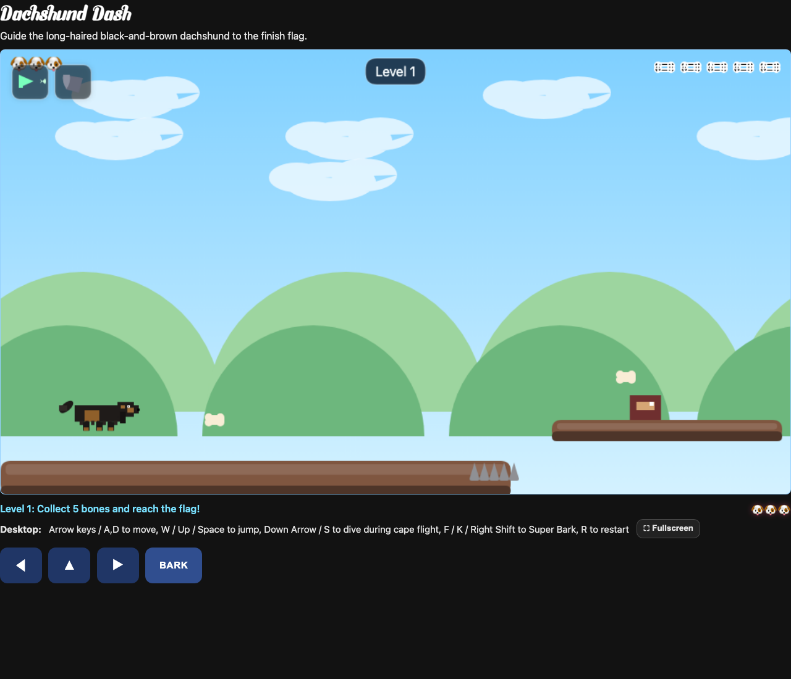

### Daily improvement: readable bone counter text
- Added a clear **`Bones X/Y`** label beneath the bone icons in the top-right HUD during gameplay.
- This keeps collectible progress readable at a glance, especially on later levels where icon-only counting gets harder.

